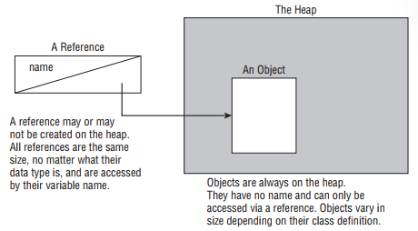

- A variable is a name for a piece of memory that stores data. After we’ve declared a variable, we can give it a value. This is called initializing a variable.

- As you should expect, three variables were declared: i1, i2, and i3. However, only one of those values was initialized: i3. The other two remain declared but not yet initialized. That’s the trick. Each snippet separated by a comma is a little declaration of its own. The initialization of i3 only applies to i3. It doesn’t have anything to do with i1 or i2 despite being in the same statement.
```
int i1, i2, i3 = 0;
```

- This code doesn’t compile because it tries to declare multiple variables of different types in the same statement. The shortcut to declare multiple variables in the same statement only works when they share a type.
```
int num, String value; // DOES NOT COMPILE
```

- It probably comes as no surprise that Java has precise rules about *identifier names*. Luckily, the same rules for identifiers apply to anything you are free to name, including variables, methods, classes, and fields. There are only three rules to remember for legal identifiers:
   - The name must begin with a letter or the symbol $ or _.
   - Subsequent characters may also be numbers.
   - You cannot use the same name as a Java *reserved word*. As you might imagine, a reserved word is a keyword that Java has reserved so that you are not allowed to use it. Remember that Java is case sensitive, so you can use versions of the keywords that only differ in case. Please don’t, though.

- The following is a list of all the reserved words in Java. const and goto aren’t actually used in Java. They are reserved so that people coming from other languages don’t use them by accident—and in theory, in case Java wants to use them one day.
| Keywords         | Keywords         | Keywords         | Keywords         |
|------------------|------------------|------------------|------------------|
| abstract         | assert           | boolean          | break            |
| byte             | case             | catch            | char             |
| class            | const*           | continue         | default          |
| do               | double           | else             | enum             |
| extends          | false            | final            | finally          |
| float            | for              | goto*            | if               |
| implements       | import           | instanceof       | int              |
| interface        | long             | native           | new              |
| null             | package          | private          | protected        |
| public           | return           | short            | static           |
| strictfp         | super            | switch           | synchronized     |
| this             | throw            | throws           | transient        |
| true             | try              | void             | volatile         |
| while            |                  |                  |                  |

- When you see a nonstandard identifier, be sure to check if it is legal. If not, you get to mark the answer “does not compile” and skip analyzing everything else in the question.

- Most Java developers follow these conventions for identifier names:
   - Method and variables names begin with a lowercase letter followed by CamelCase.
   - Class names begin with an uppercase letter followed by CamelCase. Don’t start any identifiers with $. The compiler uses this symbol for some files.

- Also, know that valid letters in Java are not just characters in the English alphabet. Java supports the Unicode character set, so there are more than 45,000 characters that can start a legal Java identifier. A few hundred more are non-Arabic numerals that may appear after the first character in a legal identifier. Luckily, you don’t have to worry about memorizing those for the exam. If you are in a country that doesn’t use the English alphabet, this is useful to know for a job.

- A local variable is a variable defined within a method. Local variables must be initialized before use. They do not have a default value and contain garbage data until initialized. The compiler will not let you read an uninitialized value. 

- Until a local variable is assigned a value, it cannot appear within an expression, and the compiler will gladly remind you of this rule. The compiler knows your code has control of what happens inside the method and can be expected to initialize values.

- Variables that are not local variables are known as instance variables or class variables. Instance variables are also called fields. Class variables are shared across multiple objects. You can tell a variable is a class variable because it has the keyword static before it. 

- Instance and class variables do not require you to initialize them. As soon as you declare these variables, they are given a default value. You’ll need to memorize everything in table below except the default value of char. To make this easier, remember that the compiler doesn’t know what value to use and so wants the simplest type it can give the value: null for an object and 0/false for a primitive.
| Variable type                     | Default initialization value                  |
|-----------------------------------|----------------------------------------------|
| boolean                            | false                                        |
| byte, short, int, long            | 0 (in the type’s bit-length)                |
| float, double                     | 0.0 (in the type’s bit-length)              |
| char                               | '\u0000' (NUL)                             |
| All object references (everything else) | null                                   |

- Local variables can never have a scope larger than the method they are defined in. However, they can have a smaller scope. 

- When you see a set of braces ({ }) in the code, it means you have entered a new block of code. Each block of code has its own scope. When there are multiple blocks, you match them from the inside out.

- Remember that blocks can contain other blocks. These smaller contained blocks can reference variables defined in the larger scoped blocks, but not vice versa. 

- All that was for local variables. Luckily the rule for instance variables is easier: they are available as soon as they are defined and last for the entire lifetime of the object itself. The rule for class (static) variables is even easier: they go into scope when declared like the other variables types. However, they stay in scope for the entire life of the program.

- In this class, we have one class variable (MAX_LENGTH), one instance variable (length), and two local variables (inches and newSize.) MAX_LENGTH is a class variable because it has the static keyword in its declaration. MAX_LENGTH goes into scope on line 2 where it is declared. It stays in scope until the program ends. length goes into scope on line 3 where it is declared. It stays in scope as long as this Mouse object exists. inches goes into scope where it is declared on line 4. It goes out of scope at the end of the method on line 9. newSize goes into scope where it is declared on line 6. Since it is defined inside the if statement block, it goes out of scope when that block ends on line 8.
```
1: public class Mouse {
2:    static int MAX_LENGTH = 5;
3:    int length;
4:    public void grow(int inches) {
5:       if (length < MAX_LENGTH) {
6:          int newSize = length + inches;
7:          length = newSize;
8:       }
9:    }
10: }
```

- Got all that? Let’s review the rules on scope:
   - Local variables—in scope from declaration to end of block
   - Instance variables—in scope from declaration until object garbage collected
   - Class variables—in scope from declaration until program ends

- Comments can go anywhere in the code. Beyond that, you
need to memorize the rules in table below.
| Element            | Example                  | Required? | Where does it go                  |
|--------------------|--------------------------|-----------|-----------------------------------|
| Package declaration | `package abc;`          | No        | First line in the file            |
| Import statements   | `import java.util.*;`    | No        | Immediately after the package     |
| Class declaration   | `public class C`        | Yes       | Immediately after the import      |
| Field declarations  | `int value;`            | No        | Anywhere inside a class           |
| Method declarations | `void method()`          | No        | Anywhere inside a class           |

- We can put comments anywhere, and imports are optional. In the next example, we have a problem:
```
import java.util.*;
package structure; // DOES NOT COMPILE
String name; // DOES NOT COMPILE
public class Meerkat { }
```

- There are two problems here. One is that the package and import statements are reversed. Though both are optional, package must come before import if present. The other issue is that a field attempts declaration outside a class. This is not allowed. Fields and methods must be within a class. Fields and methods are easier to remember because they merely have to be inside of a class.

- You need to know one more thing about class structure for the OCA exam: multiple classes can be defined in the same file, but only one of them is allowed to be public. The public class matches the name of the file. For example, these two classes must be in a file named Meerkat.java:
```
1: public class Meerkat { }
2: class Paw { }
```

- A file is also allowed to have neither class be public. As long as there isn’t more than one public class in a file, it is okay. On the OCP exam, you’ll also need to understand inner classes, which are classes within a class.

- Destroying Objects: 
1. Now that we’ve played with our objects, it is time to put them away. Luckily, Java automatically takes care of that for you. Java provides a garbage collector to automatically look for objects that aren’t needed anymore.
2. All Java objects are stored in your program memory’s heap. The heap, which is also referred to as the free store, represents a large pool of unused memory allocated to your Java application. The heap may be quite large, depending on your environment, but there is always a limit to its size. If your program keeps instantiating objects and leaving them on the heap, eventually it will run out of memory.

- Garbage collection refers to the process of automatically freeing memory on the heap by deleting objects that are no longer reachable in your program. There are many different algorithms for garbage collection, but you don’t need to know any of them for the exam. You do need to know that System.gc() is not guaranteed to run, and you should be able to recognize when objects become eligible for garbage collection.

- Let’s start with the first one. Java provides a method called System.gc(). Now you might think from the name that this tells Java to run garbage collection. Nope! It meekly suggests that now might be a good time for Java to kick off a garbage collection run. Java is free to ignore the request.

- The more interesting part of garbage collection is when the memory belonging to an object can be reclaimed. Java waits patiently until the code no longer needs that memory. An object will remain on the heap until it is no longer reachable. An object is no longer reachable when one of two situations occurs:
   - The object no longer has any references pointing to it.
   - All references to the object have gone out of scope.

- Do not confuse a reference with the object that it refers to; they are two different entities. The reference is a variable that has a name and can be used to access the contents of an object. A reference can be assigned to another reference, passed to a method, or returned from a method. All references are the same size, no matter what their type is.

- An object sits on the heap and does not have a name. Therefore, you have no way to access an object except through a reference. Objects come in all different shapes and sizes and consume varying amounts of memory. An object cannot be assigned to another object, nor can an object be passed to a method or returned from a method. It is the object that gets garbage collected, not its reference.

<div align="center">



</div>

- Realizing the difference between a reference and an object goes a long way toward understanding garbage collection, the new operator, and many other facets of the Java language. Look at this code and see if you can figure out when each object first becomes eligible for garbage collection:
```
1: public class Scope {
2:    public static void main(String[] args) {
3:       String one, two;
4:       one = new String("a");
5:       two = new String("b");
6:       one = two;
7:       String three = one;
8:       one = null;
9: } }
```

- *__finalize()__*: Java allows objects to implement a method called finalize() that might get called. This method gets called if the garbage collector tries to collect the object. If the garbage collector doesn’t run, the method doesn’t get called. If the garbage collector fails to collect the object and tries to run it again later, the method doesn’t get called a second time.

- In practice, this means you are highly unlikely to use it in real projects. Luckily, there isn’t much to remember about finalize() for the exam. Just keep in mind that it might not get called and that it definitely won’t be called twice. With that said, this call produces no output when we run it:
```
public class Finalizer {
   protected void finalize() {
      System.out.println("Calling finalize");
   }
   public static void main(String[] args) {
      Finalizer f = new Finalizer();
   }
}
```

- The reason is that the program exits before there is any need to run the garbage collector. While f is eligible for garbage collection, Java has better things to do than take out the trash constantly. For the exam, you need to know that this finalize() call could run zero or one time. Now for a more interesting example:
```
public class Finalizer {
   private static List objects = new ArrayList();
   protected void finalize() {
      objects.add(this); // Don't do this
   }
}
```

- Remember, finalize() is only run when the object is eligible for garbage collection. The problem here is that by the end of the method, the object is no longer eligible for garbage collection because a static variable is referring to it and static variables stay in scope until the program ends. Java is smart enough to realize this and aborts the attempt to throw out the object. Now suppose later in the program objects is set to null. Oh, good, we can finally remove the object from memory. Java remembers already running finalize() on this object and will not do so again. The lesson is that the finalize() call could run zero or one time. This is the exact same lesson as the simple example—that’s why it’s so easy to remember.

- Benefits of Java: Java has some key benefits that you’ll need to know for the exam
1. __Object Oriented__ Java is an object-oriented language, which means all code is defined in classes and most of those classes can be instantiated into objects. We’ll discuss this more throughout the book. Many languages before Java were procedural, which meant there were routines or methods but no classes. Another common approach is functional programming. Java allows for functional programming within a class, but object oriented is still the main organization of code.
2. __Encapsulation__ Java supports access modifiers to protect data from unintended access and modification. Most people consider encapsulation to be an aspect of object-oriented languages. Since the exam objectives call attention to it specifically, so do we.
3. __Platform Independent__ Java is an interpreted language because it gets compiled to bytecode. A key benefit is that Java code gets compiled once rather than needing to be recompiled for different operating systems. This is known as “write once, run everywhere.” On the OCP exam, you’ll learn that it is possible to write code that does not run everywhere. For example, you might refer to a file in a specific directory. If you get asked on the OCA exam, the answer is that the same class files run everywhere.
4. __Robust__ One of the major advantages of Java over C++ is that it prevents memory leaks. Java manages memory on its own and does garbage collection automatically. Bad memory management in C++ is a big source of errors in programs.
5. __Simple__ Java was intended to be simpler than C++. In addition to eliminating pointers, it got rid of operator overloading. In C++, you could write a + b and have it mean almost anything.
6. __Secure__ Java code runs inside the JVM. This creates a sandbox that makes it hard for Java code to do evil things to the computer it is running on.