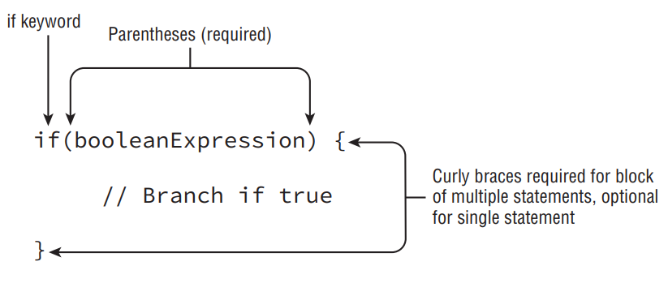

- __Logical Operators__: The logical operators, (&), (|), and (^), may be applied to both numeric and boolean data types. When they’re applied to boolean data types, they’re referred to as logical operators. Alternatively, when they’re applied to numeric data types, they’re referred to as bitwise operators, as they perform bitwise comparisons of the bits that compose the number.

- Finally, we present the conditional operators, && and ||, which are often referred to as short-circuit operators. The short-circuit operators are nearly identical to the logical operators, & and |, respectively, except that the right-hand side of the expression may never be evaluated if the final result can be determined by the left-hand side of the expression. For example, consider the following statement:
```
boolean x = true || (y < 4);
```

- Referring to the truth tables, the value x can only be false if both sides of the expression are false. Since we know the left-hand side is true, there’s no need to evaluate the right-hand side, since no value of y will ever make the value of x anything other than true.

- A more common example of where short-circuit operators are used is checking for null objects before performing an operation, such as this:
```
if(x != null && x.getValue() < 5) {
   // Do something
}
```

- In this example, if x was null, then the short-circuit prevents a NullPointerException from ever being thrown, since the evaluation of x.getValue() < 5 is never reached. Alternatively, if we used a logical &, then both sides would always be evaluated and when x was null this would throw an exception:
```
if(x != null & x.getValue() < 5) { // Throws an exception if x is null
   // Do something
}
```

- Be wary of short-circuit behavior on the exam, as questions are known to alter a variable on the right-hand side of the expression that may never be reached. For example, what is the output of the following code?
```
int x = 6;
boolean y = (x >= 6) || (++x <= 7);
System.out.println(x);
```

- Because x >= 6 is true, the increment operator on the right-hand side of the expression is never evaluated, so the output is 6.

- __Equality Operators__: Determining equality in Java can be a nontrivial endeavor as there’s a semantic difference between “two objects are the same” and “two objects are equivalent.” It is further complicated by the fact that for numeric and boolean primitives, there is no such distinction.

- Let’s start with the basics, the *equals* operator == and not equals operator !=. Like the relational operators, they compare two operands and return a boolean value about whether the expressions or values are equal, or not equal, respectively. 

- The equality operators are used in one of three scenarios:
1.  Comparing two numeric primitive types. If the numeric values are of different data types, the values are automatically promoted as previously described. For example, 5 == 5.00 returns true since the left side is promoted to a double.
2. Comparing two boolean values.
3. Comparing two objects, including null and String values.

- The comparisons for equality are limited to these three cases, so you cannot mix and match types. For example, each of the following would result in a compiler error:
```
boolean x = true == 3; // DOES NOT COMPILE
boolean y = false != "Giraffe"; // DOES NOT COMPILE
boolean z = 3 == "Kangaroo"; // DOES NOT COMPILE
```

- For object comparison, the equality operator is applied to the references to the objects, not the objects they point to. Two references are equal if and only if they point to the same object, or both point to null. Let’s take a look at some examples:
```
File x = new File("myFile.txt");
File y = new File("myFile.txt");
File z = x;
System.out.println(x == y); // Outputs false
System.out.println(x == z); // Outputs true
```

- In Chapter 3, “Core Java APIs,” we’ll continue the discussion of object equality by introducing what it means for two different objects to be equivalent. We’ll also cover String equality and show how this can be a nontrivial topic.

- Often, we only want to execute a block of code under certain circumstances. The if-then statement, as shown in Figure below, accomplishes this by allowing our application to execute a particular block of code if and only if a boolean expression evaluates to true at runtime.

<div align="center">



</div>

- The block allows multiple statements to be executed based on the if-then evaluation. Notice that the first statement didn’t contain a block around the print section, but it easily could have. For readability, it is considered good coding practice to put blocks around the execution component of if-then statements, as well as many other control fl ow statements, although it is not required.

- __Watch Indentation and Braces__: One area that the exam writers will try to trip you up is on if-then statements without braces ({}). For example, take a look at this slightly modified form of our example:
```
if(hourOfDay < 11)
   System.out.println("Good Morning");
   morningGreetingCount++;
```

- Based on the indentation, you might be inclined to think the variable morningGreetingCount is only going to be incremented if the hourOfDay is less than 11, but that’s not what this code does. It will execute the print statement only if the condition is met, but it will always execute the increment operation.

- Remember that in Java, unlike some other programming languages, tabs are just whitespace and are not evaluated as part of the execution. When you see a control fl ow statement in a question, be sure to trace the open and close braces of the block and ignore any indentation you may come across.

- __The if-then-else Statement__: 

<div align="center">


</div>

```
if(hourOfDay < 11) {
   System.out.println("Good Morning");
} else if(hourOfDay < 15) {
   System.out.println("Good Afternoon");
} else {
   System.out.println("Good Evening");
}
```

- In this example, the Java process will continue execution until it encounters an if-then statement that evaluates to true. If neither of the first two expressions are true, it will execute the final code of the else block. One thing to keep in mind in creating complex if-then-else statements is that order is important. For example, see what happens if we reorder the previous snippet of code as follows:
```
if(hourOfDay < 15) {
   System.out.println("Good Afternoon");
} else if(hourOfDay < 11) {
   System.out.println("Good Morning"); // UNREACHABLE CODE
} else {
   System.out.println("Good Evening");
}
```

- __Verifying the if Statement Evaluates to a Boolean Expression__: Another common place the exam may try to lead you astray is by providing code where the boolean expression inside the if-then statement is not actually a boolean expression. For example, take a look at the following lines of code:
```
int x = 1;
if(x) { // DOES NOT COMPILE
   ...
}
```

- This statement may be valid in some other programming and scripting languages, but not in Java, where 0 and 1 are not considered boolean values. Also, be wary of assignment operators being used as if they were equals == operators in if-then statements:
```
int x = 1;
if(x = 5) { // DOES NOT COMPILE
   ...
}
```

- The conditional operator, ? :, otherwise known as the ternary operator, is the only operator that takes three operands and is of the form:
```
booleanExpression ? expression1 : expression2
```

- The first operand must be a boolean expression, and the second and third can be any expression that returns a value. The ternary operation is really a condensed form of an ifthen-else statement that returns a value.

- Note that it is often helpful for readability to add parentheses around the expressions in ternary operations, although it is certainly not required.

- There is no requirement that second and third expressions in ternary operations have the same data types, although it may come into play when combined with the assignment operator. Compare the following two statements:
```
System.out.println((y > 5) ? 21 : "Zebra");
int animal = (y < 91) ? 9 : "Horse"; // DOES NOT COMPILE
```

-  Both expressions evaluate similar boolean values and return an int and a String, although only the first line will compile. The System.out.println() does not care that the statements are completely different types, because it can convert both to String. On the other hand, the compiler does know that "Horse" is of the wrong data type and cannot be assigned to an int; therefore, it will not allow the code to be compiled.

- __Ternary Expression Evaluation__: As of Java 7, only one of the right-hand expressions of the ternary operator will be evaluated at runtime. In a manner similar to the short-circuit operators, if one of the two righthand expressions in a ternary operator performs a side effect, then it may not be applied at runtime. Let’s illustrate this principle with the following example:
```
int y = 1;
int z = 1;
final int x = y<10 ? y++ : z++;
System.out.println(y+","+z); // Outputs 2,1
```

- Notice that since the left-hand boolean expression was true, only y was incremented. Contrast the preceding example with the following modification:
```
int y = 1;
int z = 1;
final int x = y>=10 ? y++ : z++;
System.out.println(y+","+z); // Outputs 1,2
```

- Now that the left-hand boolean expression evaluates to false, only z was incremented. In this manner, we see how the expressions in a ternary operator may not be applied if the particular expression is not used.