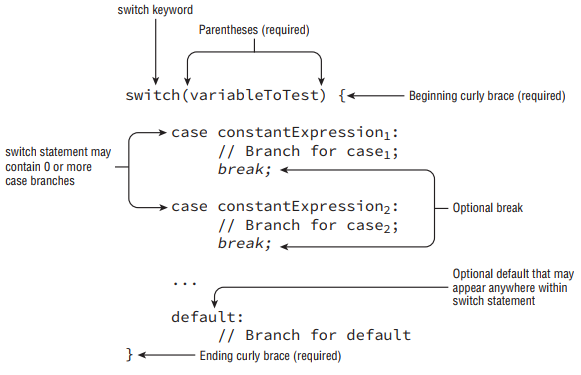

- A switch statement, as shown in Figure below, is a complex decision-making structure in which a single value is evaluated and flow is redirected to the first matching branch, known as a case statement. If no such case statement is found that matches the value, an optional default statement will be called. If no such default option is available, the entire switch statement will be skipped.

<div align="center">



</div>

- __Supported Data Types__: As shown in Figure above, a switch statement has a target variable that is not evaluated until runtime. Prior to Java 5.0, this variable could only be int values or those values that could be promoted to int, specifically byte, short, char, or int. When enum was added in Java 5.0, support was added to switch statements to support enum values. In Java 7, switch statements were further updated to allow matching on String values. Finally, the switch statement also supports any of the primitive numeric wrapper classes, such as Byte, Short, Character, or Integer.

- Data types supported by switch statements include the following:
   - int and Integer
   - byte and Byte
   - short and Short
   - char and Character
   - int and Integer
   - String
   - enum values

- For the exam, we recommend you memorize this list. Note that boolean and long, and their associated wrapper classes, are not supported by switch statements.

- __Compile-time Constant Values__: The values in each case statement must be compile-time constant values of the same data type as the switch value. This means you can use only literals, enum constants, or final. constant variables of the same data type. By final constant, we mean that the variable must be marked with the final modifier and initialized with a literal value in the same expression in which it is declared. Let’s look at a simple example using the day of the week, with 0 for Sunday, 1 for Monday, and so on:
```
int dayOfWeek = 5;
switch(dayOfWeek) {
  default:
    System.out.println("Weekday");
    break;
  case 0:
    System.out.println("Sunday");
    break;
  case 6:
    System.out.println("Saturday");
    break;
}
```

- The first thing you may notice is that there is a break statement at the end of each case and default section. We’ll discuss break statements in detail when we discuss loops, but for now all you need to know is that they terminate the switch statement and return flow control to the enclosing statement. As we’ll soon see, if you leave out the break statement, flow will continue to the next proceeding case or default block automatically.

- Another thing you might notice is that the default block is not at the end of the switch statement. There is no requirement that the case or default statements be in a particular order, unless you are going to have pathways that reach multiple sections of the switch block in a single execution. To illustrate both of the preceding points, consider the following variation:
int dayOfWeek = 5;
switch(dayOfWeek) {
  case 0:
    System.out.println("Sunday");
  default:
    System.out.println("Weekday");
  case 6:
    System.out.println("Saturday");
    break;
}

- This code looks a lot like the previous example except two of the break statements have been removed and the order has been changed. This means that for the given value of dayOfWeek, 5, the code will jump to the default block and then execute all of the proceeding case statements in order until it finds a break statement or finishes the structure.

- What if the value of dayOfWeek was 6 in this example? Would the default block still be executed? The output of this example with dayOfWeek set to 6 would be:
```
Saturday
```

- Even though the default block was before the case block, only the case block was executed. If you recall the definition of the default block, it is only branched to if there is no matching case value for the switch statement, regardless of its position within the switch statement.

- Finally, if the value of dayOfWeek was 0, all three statements would be output:
```
Sunday
Weekday
Saturday
```

- Notice that in this last example, the default is executed since there was no break statement at the end of the preceding case block. While the code will not branch to the default statement if there is a matching case value within the switch statement, it will execute the default statement if it encounters it after a case statement for which there is no terminating break statement.

- We conclude our discussion on switch statements by acknowledging that the data type for case statements must all match the data type of the switch variable. As already discussed, the case statement value must also be a literal, enum constant, or final constant variable. For example, given the following switch statement, notice which case statements will compile and which will not:
```
private int getSortOrder(String firstName, final String lastName) {
    String middleName = "Patricia";
    final String suffix = "JR";
    int id = 0;

    switch (firstName) {
        case "Test":
            return 52; 
        case middleName: // DOES NOT COMPILE
            id = 5;
            break;
        case suffix:
            id = 0;
            break;
        case lastName: // DOES NOT COMPILE
            id = 8;
            break;
        case 5: // DOES NOT COMPILE
            id = 7;
            break;
        case 'J': // DOES NOT COMPILE
            id = 10;
            break;
        case java.time.DayOfWeek.SUNDAY: // DOES NOT COMPILE
            id = 15;
            break;
    }
    
    return id;
}
```

- The first case statement compiles without issue using a String literal and is a good example of how a return statement, like a break statement, can be used to exit the switch statement early. The second case statement does not compile because middleName is not a final variable, despite having a known value at this particular line of execution. The third case statement compiles without issue because suffix is a final constant variable.

- In the fourth case statement, despite lastName being final, it is not constant as it is passed to the function; therefore, this line does not compile as well. Finally, the last three case statements don’t compile because none of them have a matching type of String; the last one is an enum value.