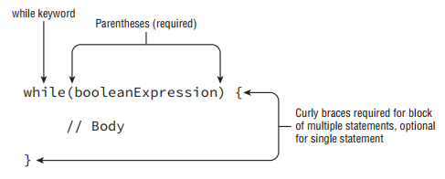
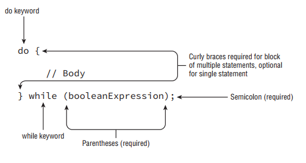
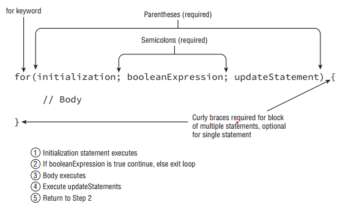

- __The while Statement__: A repetition control structure, which we refer to as a loop, executes a statement of code multiple times in succession. By using nonconstant variables, each repetition of the statement may be different.

<div align="center">



</div>

-  It is important to note that a while loop may terminate after its first evaluation of the boolean expression. In this manner, the statement block may never be executed.

- __Infinite Loops__: Infinite loops are something you should be aware of any time you create a loop in your application. You should be absolutely certain that the loop will eventually terminate under some condition. First, make sure the loop variable is modified. Then, ensure that the termination condition will be eventually reached in all circumstances. As you’ll see in the upcoming section “Understanding Advanced Flow Control,” a loop may also exit under other conditions such as a break statement.

- __The do-while Statement__: Unlike a while loop, though, a do-while loop guarantees that the statement or block will be executed at least once.

<div align="center">



</div>

- The primary difference between the syntactic structure of a do-while loop and a while loop is that a do-while loop purposely orders the statement or block of statements before the conditional expression, in order to reinforce that the statement will be executed before the expression is ever evaluated. For example, take a look at the output of the following statements:
```
int x = 0;
do {
  x++;
} while(false);
System.out.println(x); // Outputs 1
```

- Java will execute the statement block first, and then check the loop condition. Even though the loop exits right away, the statement block was still executed once and the program outputs a 1.

- __When to Use while vs. do-while Loops__: In practice, it might be difficult to determine when you should use a while loop and when you should use a do-while loop. The short answer is that it does not actually matter. Any while loop can be converted to a do-while loop, and vice versa. Though one of the loops is certainly easier to read, they are functionally equivalent. Java recommends you use a while loop when a loop might not be executed at all and a dowhile loop when the loop is executed at least once. But determining whether you should use a while loop or a do-while loop in practice is sometimes about personal preference and code readability.

- __The for Statement__: Starting in Java 5.0, there are now two types of for statements. The first is referred to as the basic for loop, and the second is often called the enhanced for loop. For clarity, we’ll refer to the enhanced for loop as the for-each statement throughout the book.

- __The Basic for Statement__: A basic for loop has the same conditional boolean expression and statement, or block of statements, as the other loops you have seen, as well as two new sections: an initialization block and an update statement. Figure below shows how these components are laid out.

<div align="center">



</div>

- Although Figure above might seem a little confusing and almost arbitrary at first, the organization of the components and flow allow us to create extremely powerful statements in a very small amount of space that otherwise would take multiple lines with a standard while loop. Note that each section is separated by a semicolon. The initialization and update sections may contain multiple statements, separated by commas.

- Variables declared in the initialization block of a for loop have limited scope and are only accessible within the for loop. Be wary of any exam questions in which a variable declared within the initialization block of a for loop is available outside the loop. Alternatively, variables declared before the for loop and assigned a value in the initialization block may be used outside the for loop because their scope precedes the for loop creation.
```
for(int i = 0; i < 10; i++) {
  System.out.print(i + " ");
}
```

- The local variable i is initialized first to 0. The variable i is only in scope for the duration of the loop and is not available outside the loop once the loop has completed. Like a while loop, the boolean condition is evaluated on every iteration of the loop before the loop executes. Since it returns true, the loop executes and outputs the 0 followed by a space. Next, the loop executes the update section, which in this case increases the value of i to 1. The loop then evaluates the boolean expression a second time, and the process repeats multiple times, printing:
```
0 1 2 3 4 5 6 7 8 9
```

- On the 10th iteration of the loop, the value of i reaches 9 and is incremented by 1 to reach 10. On the 11th iteration of the loop, the boolean expression is evaluated and since (10 < 10) returns false, the loop terminates without executing the statement loop body. Although most for loops you are likely to encounter in practice will be well defined and similar to the previous example, there are a number of variations and edge cases you could see on the exam. You should familiarize yourself with the following five examples:
   - __Creating an Infinite Loop__: Although this for loop may look like it will throw a compiler error, it will in fact compile and run without issue. It is actually an infinite loop that will print the same statement repeatedly. This example reinforces the fact that the components of the for loop are each optional. Note that the semicolons separating the three sections are required, as for( ; ) and for( ) will not compile.
   ```
    for( ; ; ) {
     System.out.println("Hello World");
   }
   ```

   - __Adding Multiple Terms to the for Statement__: This code demonstrates three variations of the for loop you may not have seen. First, you can declare a variable, such as x in this example, before the loop begins and use it after it completes. Second, your initialization block, boolean expression, and update statements can include extra variables that may not reference each other. For example, z is defined in the initialization block and is never used. Finally, the update statement can modify multiple variables.
   ```
   int x = 0;
   for(long y = 0, z = 4; x < 5 && y < 10; x++, y++) {
     System.out.print(y + " ");
   }
   System.out.print(x);
   ```
   ```
   This code will print the following when executed:
   0 1 2 3 4
   ```

   - __Redeclaring a Variable in the Initialization Block__: This example looks similar to the previous one, but it does not compile because of the initialization block. The difference is that x is repeated in the initialization block after already being declared before the loop, resulting in the compiler stopping because of a duplicate variable declaration. 
   ```
   int x = 0;
   for(long y = 0, x = 4; x < 5 && y < 10; x++, y++) { // DOES NOT COMPILE
     System.out.print(x + " ");
   }
   ```
      We can fix this loop by changing the declaration of x and y as follows:
      int x = 0;
      long y = 10;
      for(y = 0, x = 4; x < 5 && y < 10; x++, y++) {
        System.out.print(x + " ");
      }

   - __Using Incompatible Data Types in the Initialization Block__: This example also looks a lot like our second example, but like the third example will not compile, although this time for a different reason. The variables in the initialization block must all be of the same type. In the first example, y and z were both long, so the code compiled without issue, but in this example they have differing types, so the code will not compile.
   ```
   for(long y = 0, int x = 4; x < 5 && y < 10; x++, y++) { // DOES NOT COMPILE
     System.out.print(x + " ");
   }
   ```

   - __Using Loop Variables Outside the Loop__: The final variation on the second example will not compile for a different reason than the previous examples. If you notice, x is defined in the initialization block of the loop, and then used after the loop terminates. Since x was only scoped for the loop, using it outside the loop will throw a compiler error.
   ```
   for(long y = 0, x = 4; x < 5 && y < 10; x++, y++) {
     System.out.print(y + " ");
   }
   System.out.print(x); // DOES NOT COMPILE
   ```