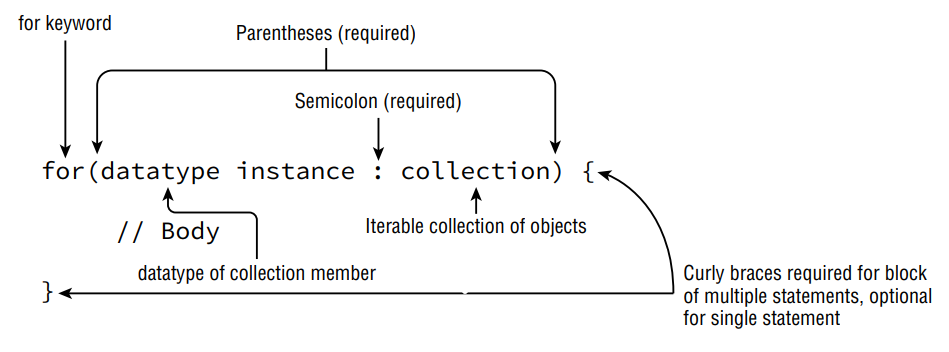
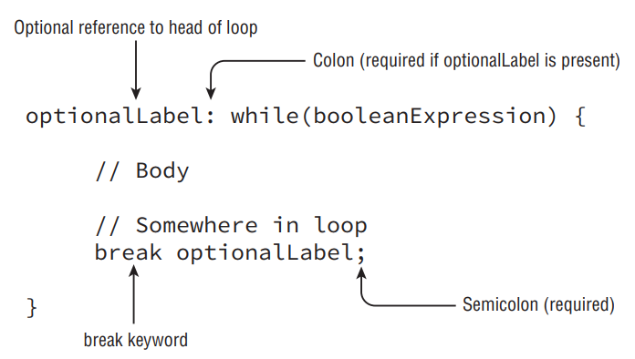

- __The for-each Statement__: Starting with Java 5.0, Java developers have had a new type of enhanced for loop at their disposal, one specifically designed for iterating over arrays and Collection objects. This enhanced for loop, which for clarity we’ll refer to as a for-each loop, is shown in Figure below.

<div align="center">



</div>

- The for-each loop declaration is composed of an initialization section and an object to be iterated over. The right-hand side of the for-each loop statement must be a built-in Java array or an object whose class implements java.lang.Iterable, which includes most of the Java Collections framework. The left-hand side of the for-each loop must include a declaration for an instance of a variable, whose type matches the type of a member of the array or collection in the right-hand side of the statement. On each iteration of the loop, the named variable on the left-hand side of the statement is assigned a new value from the array or collection on the right-hand side of the statement.

- For the OCA exam, the only members of the Collections framework that you need to be aware of are List and ArrayList. In this chapter, we’ll show how to iterate over List objects, and in Chapter 3 we’ll go into detail about how to create List objects and how they differ from traditional Java arrays.

- In this example, the String names is not an array, nor does it implement java.lang. Iterable, so the compiler will throw an exception since it does not know how to iterate over the String.
```
String names = "Lisa";
for(String name : names) { // DOES NOT COMPILE
  System.out.print(name + " ");
}
```

- This code below will fail to compile because the left-hand side of the for-each statement does not define an instance of String. Notice that in this last example, the array is initialized with three null pointer values. In and of itself, that will not cause the code to not compile, as a corrected loop would just output null three times.

- __Comparing for and for-each Loops__: Since for and for-each both use the same keyword, you might be wondering how they are related. While this discussion is out of scope for the exam, let’s take a moment to explore how for-each loops are converted to for loops by the compiler.

- When for-each was introduced in Java 5, it was added as a compile-time enhancement. This means that Java actually converts the for-each loop into a standard for loop during compilation. For example, assuming names is an array of String[] as we saw in the first example, the following two loops are equivalent:
```
for(String name : names) {
  System.out.print(name + ", ");
}
for(int i=0; i < names.length; i++) {
  String name = names[i];
  System.out.print(name + ", ");
}
```

- For objects that inherit java.lang.Iterable, there is a different, but similar, conversion. For example, assuming values is an instance of `List<Integer>`, as we saw in the second example, the following two loops are equivalent:
```
for(int value : values) {
  System.out.print(value + ", ");
}
for(java.util.Iterator<Integer> i = values.iterator(); i.hasNext(); ) {
  int value = i.next();
  System.out.print(value + ", ");
}
```

- Notice that in the second version, there is no update statement as it is not required when using the java.util.Iterator class.

- While the for-each statement is convenient for working with lists in many cases, it does hide access to the loop iterator variable.  If we wanted to print only the comma between names (not like above example: "Lisa, Kevin, Roger,"), we could convert the example into a standard for loop, as in the following example:
```
java.util.List<String> names = new java.util.ArrayList<String>();
names.add("Lisa");
names.add("Kevin");
names.add("Roger");
for(int i=0; i<names.size(); i++) {
  String name = names.get(i);
  if(i>0) {
    System.out.print(", ");
  }
  System.out.print(name);
}
```

- It is also common to use a standard for loop over a for-each loop if comparing multiple elements in a loop within a single iteration, as in the following example. Notice that we skip the first loop’s execution, since value[-1] is not defined and would throw an IndexOutOfBoundsException error.
```
int[] values = new int[3];
values[0] = 10;
values[1] = new Integer(5);
values[2] = 15;
for(int i=1; i<values.length; i++) {
  System.out.print(values[i]-values[i-1]);
}
```

- Despite these examples, enhanced for-each loops are quite useful in Java in a variety of circumstances. As a developer, though, you can always revert to a standard for loop if you need fine-grain control.

- __Nested Loops__: First off, loops can contain other loops.
```
int[][] myComplexArray = {{5,2,1,3},{3,9,8,9},{5,7,12,7}};
for(int[] mySimpleArray : myComplexArray) {
  for(int i=0; i<mySimpleArray.length; i++) {
    System.out.print(mySimpleArray[i]+"\t");
  }
  System.out.println();
}
```

- __Adding Optional Labels__: One thing we skipped when we presented if-then statements, switch statements, and loops is that they can all have optional labels. A label is an optional pointer to the head of a statement that allows the application flow to jump to it or break from it. It is a single word that is proceeded by a colon (:). For example, we can add optional labels to one of the previous examples:
```
int[][] myComplexArray = {{5,2,1,3},{3,9,8,9},{5,7,12,7}};
OUTER_LOOP: for(int[] mySimpleArray : myComplexArray) {
  INNER_LOOP: for(int i=0; i<mySimpleArray.length; i++) {
    System.out.print(mySimpleArray[i]+"\t");
  }
  System.out.println();
}
```

- When dealing with only one loop, they add no value, but as we’ll see in the next section, they are extremely useful in nested environments. Optional labels are often only used in loop structures. While this topic is not on the OCA exam, it is possible to add optional labels to control and block structures. That said, it is rarely considered good coding practice to do so.

- For formatting, labels follow the same rules for identifiers. For readability, they are commonly expressed in uppercase, with underscores between words, to distinguish them from regular variables.

- __The break Statement__: As you saw when working with switch statements, a break statement transfers the flow of control out to the enclosing statement. The same holds true for break statements that appear inside of while, do-while, and for loops, as it will end the loop early, as shown in Figure below.

<div align="center">



</div>

- Notice in Figure above that the break statement can take an optional label parameter. Without a label parameter, the break statement will terminate the nearest inner loop it is currently in the process of executing. The optional label parameter allows us to break out of a higher level outer loop.
```
if(list[i][j]==searchValue) {
  positionX = i;
  positionY = j;
  break PARENT_LOOP;
}
```
```
if(list[i][j]==searchValue) {
  positionX = i;
  positionY = j;
  break; // Only exit the inner loop when the condition is met
}
```
```
if(list[i][j]==searchValue) {
  positionX = i;
  positionY = j;
}
```

- You can see from this example that using a label on a break statement in a nested loop, or not using the break statement at all, can cause the loop structure to behave quite differently.