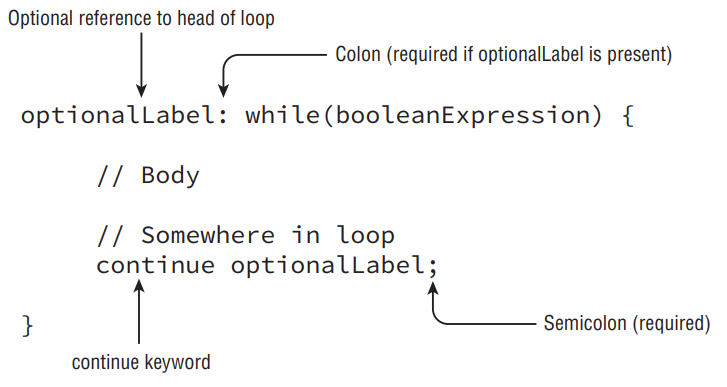

- __The continue Statement__: Let’s now complete our discussion of advanced loop control with the continue statement, a statement that causes flow to finish the execution of the current loop, as shown in Figure below.

- You may notice the syntax of the continue statement mirrors that of the break statement. In fact, the statements are similar in how they are used, but with different results. While the break statement transfers control to the enclosing statement, the continue statement transfers control to the boolean expression that determines if the loop should continue. In other words, it ends the current iteration of the loop. Also like the break statement, the continue statement is applied to the nearest inner loop under execution using optional label statements to override this behavior.

- Table below will help remind you when labels, break, and continue statements are permitted in Java. Although for illustrative purposes our examples have included using these statements in nested loops, they can be used inside single loops as well.

| Statement    | Allows Optional Labels | Allows Break Statement | Allows Continue Statement |
|--------------|------------------------|------------------------|---------------------------|
| `if`         | Yes `*`                   | No                      | No                        |
| `while`      | Yes                    | Yes                    | Yes                       |
| `do while`   | Yes                    | Yes                    | Yes                       |
| `for`        | Yes                    | Yes                    | Yes                       |
| `switch`     | Yes                    | Yes                    | No                        |

- `*` Labels are allowed for any block statement, including those that are preceded with an if-then statement.

- __Summary__:
   - This chapter covered a wide variety of topics, including dozens of Java operators, along with numerous control flow statements. Many of these operators and statements may have been new to you.
   - It is important that you understand how to use all of the required Java operators covered in this chapter and know how operator precedence influences the way a particular expression is interpreted. There will likely be numerous questions on the exam that appear to test one thing, such as StringBuilder or exception handling, when in fact the answer is related to the misuse of a particular operator that causes the application to fail to compile. When you see an operator on the exam, always check that the appropriate data types are used and that they match each other where applicable.
   - For statements, this chapter covered two types of control structures: decision-making controls structures, including if-then, if-then-else, and switch statements, as well as repetition control structures including for, for-each, while, and do-while. Remember that most of these structures require the evaluation of a particular boolean expression either for branching decisions or once per repetition. The switch statement is the only one that supports a variety of data types, including String variables as of Java 7.
   - With a for-each statement you don’t need to explicitly write a boolean expression, since the compiler builds them implicitly. For clarity, we referred to an enhanced for loop as a for-each loop, but syntactically they are written as a for statement.
   - We concluded this chapter by discussing advanced control options and how flow can be enhanced through nested loops, break statements, and continue statements. Be wary of questions on the exam that use nested statements, especially ones with labels, and verify they are being used correctly.
   - This chapter is especially important because at least one component of this chapter will likely appear in every exam question with sample code. Many of the questions on the exam focus on proper syntactic use of the structures, as they will be a large source of questions that end in “Does not compile.” You should be able to answer all of the review questions correctly or fully understand those that you answered incorrectly before moving on to later chapters.