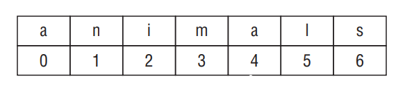

# Important String Methods: 
- You need to remember that a string is a sequence of characters and Java counts from 0 when indexed. Figure below shows how each character in the string "animals" is indexed.

<div align="center">



</div>

- __length()__: The method length() returns the number of characters in the String. The method signature is as follows:
```
int length()
```

- The following code shows how to use length():
```
String string = "animals";
System.out.println(string.length()); // 7
```

- Wait. It outputs 7? Didn’t we just tell you that Java counts from 0? The difference is that zero counting happens only when you’re using indexes or positions within a list. When determining the total size or length, Java uses normal counting again.

- __charAt()__: The method charAt() lets you query the string to find out what character is at a specific index. The method signature is as follows:
```
char charAt(int index)
```

- The following code shows how to use charAt():
```
String string = "animals";
System.out.println(string.charAt(0)); // a
System.out.println(string.charAt(6)); // s
System.out.println(string.charAt(7)); // throws exception
```

- Since indexes start counting with 0, charAt(0) returns the “first” character in the sequence. Similarly, charAt(6) returns the “seventh” character in the sequence. charAt(7) is a problem. It asks for the “eighth” character in the sequence, but there are only seven characters present. When something goes wrong that Java doesn’t know how to deal with, it throws an exception, as shown here:
```
java.lang.StringIndexOutOfBoundsException: String index out of range: 7
```

- __indexOf()__: The method indexOf()looks at the characters in the string and finds the first index that matches the desired value. indexOf can work with an individual character or a whole String as input. It can also start from a requested position. The method signatures are as follows:
```
int indexOf(char ch)
int indexOf(char ch, index fromIndex)
int indexOf(String str)
int indexOf(String str, index fromIndex)
```

- The following code shows how to use indexOf():
```
String string = "animals";
System.out.println(string.indexOf('a')); // 0
System.out.println(string.indexOf("al")); // 4
System.out.println(string.indexOf('a', 4)); // 4
System.out.println(string.indexOf("al", 5)); // -1
```

- Since indexes begin with 0, the first 'a' matches at that position. The second statement looks for a more specific string and so matches later on. The third statement says Java shouldn’t even look at the characters until it gets to index 4. The final statement doesn’t find anything because it starts looking after the match occurred. Unlike charAt(), the indexOf() method doesn’t throw an exception if it can’t find a match. indexOf() returns –1 when no match is found. Because indexes start with 0, the caller knows that –1 couldn’t be a valid index. This makes it a common value for a method to signify to the caller that no match is found.

- __substring()__: The method substring() also looks for characters in a string. It returns parts of the string. The first parameter is the index to start with for the returned string. As usual, this is a zero-based index. There is an optional second parameter, which is the end index you want to stop at.

- Notice we said “stop at” rather than “include.” This means the endIndex parameter is allowed to be 1 past the end of the sequence if you want to stop at the end of the sequence. That would be redundant, though, since you could omit the second parameter entirely in that case. In your own code, you want to avoid this redundancy. Don’t be surprised if the exam uses it though. The method signatures are as follows:
```
int substring(int beginIndex)
int substring(int beginIndex, int endIndex)
```

- The following code shows how to use substring():
```
String string = "animals";
System.out.println(string.substring(3)); // mals
System.out.println(string.substring(string.indexOf('m'))); // mals
System.out.println(string.substring(3, 4)); // m
System.out.println(string.substring(3, 7)); // mals
System.out.println(string.substring(3, 3)); // empty string
System.out.println(string.substring(3, 2)); // throws exception
System.out.println(string.substring(3, 8)); // throws exception
```

- In the 3 last examples, the first example in this set prints an empty string. The request is for the characters starting with index 3 until you get to index 3. Since we start and end with the same index, there are no characters in between. The second example in this set throws an exception because the indexes can be backward. Java knows perfectly well that it will never get to index 2 if it starts with index 3. The third example says to continue until the eighth character. There is no eighth position, so Java throws an exception. Granted, there is no seventh character either, but at least there is the “end of string” invisible position.

- Let’s review this one more time since substring() is so tricky. The method returns the string starting from the requested index. If an end index is requested, it stops right before that index. Otherwise, it goes to the end of the string.

- __toLowerCase() and toUpperCase()__: These methods make it easy to convert your data. The method signatures are as follows:
```
String toLowerCase(String str)
String toUpperCase(String str)
```

- The following code shows how to use these methods:
```
String string = "animals";
System.out.println(string.toUpperCase()); // ANIMALS
System.out.println("Abc123".toLowerCase()); // abc123
```

- These methods do what they say. toUpperCase() converts any lowercase characters to uppercase in the returned string. toLowerCase() converts any uppercase characters to lowercase in the returned string. These methods leave alone any characters other than letters. Also, remember that strings are immutable, so the original string stays the same.

- __equals() and equalsIgnoreCase()__: The equals() method checks whether two String objects contain exactly the same characters in the same order. The equalsIgnoreCase() method checks whether two String objects contain the same characters with the exception that it will convert the characters’ case if needed. The method signatures are as follows:
```
boolean equals(String str)
boolean equalsIgnoreCase(String str)
```

- The following code shows how to use these methods:
```
System.out.println("abc".equals("ABC")); // false
System.out.println("ABC".equals("ABC")); // true
System.out.println("abc".equalsIgnoreCase("ABC")); // true
```

- __startsWith() and endsWith()__: The startsWith() and endsWith() methods look at whether the provided value matches part of the String (case-sensitive check). The method signatures are as follows:
```
boolean startsWith(String prefix)
boolean endsWith(String suffix)
```

- The following code shows how to use these methods:
```
System.out.println("abc".startsWith("a")); // true
System.out.println("abc".startsWith("A")); // false
System.out.println("abc".endsWith("c")); // true
System.out.println("abc".endsWith("a")); // false
```

- __contains()__: The contains() method also looks for matches in the String. It isn’t as particular as startsWith() and endsWith()—the match can be anywhere in the String. The method signature is as follows:
```
boolean contains(String str)
```

- The following code shows how to use these methods:
```
System.out.println("abc".contains("b")); // true
System.out.println("abc".contains("B")); // false
```

- Again, we have a case-sensitive search in the String. The contains() method is a convenience method so you don’t have to write __str.indexOf(otherString) != -1.__

- __replace()__: The replace() method does a simple search and replace on the string. There’s a version that takes char parameters as well as a version that takes CharSequence parameters. A CharSequence is a general way of representing several classes, including String and StringBuilder. It’s called an interface, which we’ll cover in Chapter 5, “Class Design.” The method signatures are as follows:
```
String replace(char oldChar, char newChar)
String replace(CharSequence oldChar, CharSequence newChar)
```

- The following code shows how to use these methods:
```
System.out.println("abcabc".replace('a', 'A')); // AbcAbc
System.out.println("abcabc".replace("a", "A")); // AbcAbc
```

- The first example uses the first method signature, passing in char parameters. The second example uses the second method signature, passing in String parameters.

- __trim()__: You’ve made it through the all the String methods you need to know except one. We left the easy one for last. The trim() method removes whitespace from the beginning and end of a String. In terms of the exam, whitespace consists of spaces along with the \t (tab) and \n (newline) characters. Other characters, such as \r (carriage return), are also included in what gets trimmed. The method signature is as follows:
```
public String trim()
```

- The following code shows how to use this method:
```
System.out.println("abc".trim()); // abc
System.out.println("\t a b c\n".trim()); // a b c
```

# Method Chaining

- It is common to call multiple methods on the same String, as shown here:
```
String start = "AniMaL ";
String trimmed = start.trim(); // "AniMaL"
String lowercase = trimmed.toLowerCase(); // "animal"
String result = lowercase.replace('a', 'A'); // "Animal"
System.out.println(result);
```

- This is just a series of String methods. Each time one is called, the returned value is put in a new variable. There are four String values along the way, and Animal is output. However, on the exam there is a tendency to cram as much code as possible into a small space. You’ll see code using a technique called method chaining. Here’s an example:
```
String result = "AniMaL ".trim().toLowerCase().replace('a', 'A');
System.out.println(result);
```

- This code is equivalent to the previous example. It also creates four String objects and outputs Animal. To read code that uses method chaining, start at the left and evaluate the first method. Then call the next method on the returned value of the first method. Keep going until you get to the semicolon. Remember that String is immutable. What do you think the result of this code is?
```
5: String a = "abc";
6: String b = a.toUpperCase();
7: b = b.replace("B", "2").replace('C', '3');
8: System.out.println("a=" + a);
9: System.out.println("b=" + b);
```

- On line 5, we set a to point to "abc" and never pointed a to anything else. Since we are dealing with an immutable object, none of the code on lines 6 or 7 changes a.
b is a little trickier. Line 6 has b pointing to "ABC", which is straightforward. On line 7, we have method chaining. First, “ABC".replace("B", "2") is called. This returns "A2C". Next, "A2C".replace("'C', '3') is called. This returns "A23". Finally, b changes to point to this returned String. When line 9 executes, b is "A23".

# Using the StringBuilder Class

- A small program can create a lot of String objects very quickly. For example, how many do you think this piece of code creates?
```
10: String alpha = "";
11: for(char current = 'a'; current <= 'z'; current++)
12: alpha += current;
13: System.out.println(alpha);
```

- The empty String on line 10 is instantiated, and then line 12 appends an "a". However, because the String object is immutable, a new String object is assigned to alpha and the “” object becomes eligible for garbage collection. The next time through the loop, alpha is assigned a new String object, "ab", and the "a" object becomes eligible for garbage collection. The next iteration assigns alpha to "abc" and the "ab" object becomes eligible for garbage collection, and so on. 

- This sequence of events continues, and after 26 iterations through the loop, a total of 27 objects are instantiated, most of which are immediately eligible for garbage collection.

- This is very inefficient. Luckily, Java has a solution. The StringBuilder class creates a String without storing all those interim String values. Unlike the String class, StringBuilder is not immutable.
```
15: StringBuilder alpha = new StringBuilder();
16: for(char current = 'a'; current <= 'z'; current++)
17: alpha.append(current);
18: System.out.println(alpha);
```

- On line 15, a new StringBuilder object is instantiated. The call to append() on line 17 adds a character to the StringBuilder object each time through the for loop and appends the value of current to the end of alpha. This code reuses the same StringBuilder without creating an interim String each time.

- __Mutability and Chaining__: We’re sure you noticed this from the previous example, but StringBuilder is not immutable. In fact, we gave it 27 different values in the example (blank plus adding each letter in the alphabet). The exam will likely try to trick you with respect to String and StringBuilder being mutable.

- Chaining makes this even more interesting. When we chained String method calls, the result was a new String with the answer. Chaining StringBuilder objects doesn’t work this way. Instead, the StringBuilder changes its own state and returns a reference to itself! Let’s look at an example to make this clearer:
```
4: StringBuilder sb = new StringBuilder("start");
5: sb.append("+middle"); // sb = "start+middle"
6: StringBuilder same = sb.append("+end"); // "start+middle+end"
```

- Line 5 adds text to the end of sb. It also returns a reference to sb, which is ignored. Line 6 also adds text to the end of sb and returns a reference to sb. This time the reference is stored in same—which means sb and same point to the exact same object and would print out the same value.