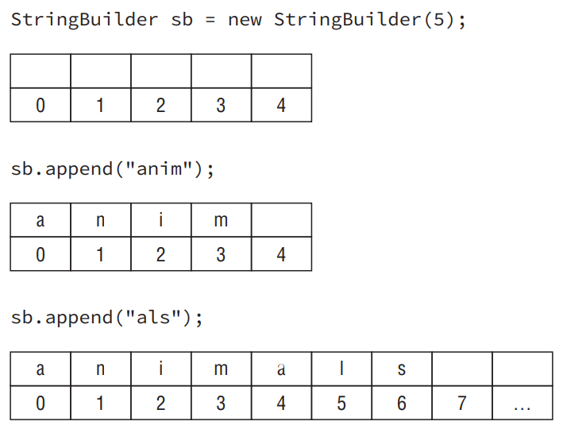

# Creating a StringBuilder

- There are three ways to construct a StringBuilder:
```
StringBuilder sb1 = new StringBuilder();
StringBuilder sb2 = new StringBuilder("animal");
StringBuilder sb3 = new StringBuilder(10);
```

- The first says to create a StringBuilder containing an empty sequence of characters and assign sb1 to point to it. The second says to create a StringBuilder containing a specific value and assign sb2 to point to it. For the first two, it tells Java to manage the implementation details. The final example tells Java that we have some idea of how big the eventual value will be and would like the StringBuilder to reserve a certain number of slots for characters.

- __Size vs. Capacity__: Size is the number of characters currently in the sequence, and capacity is the number of characters the sequence can currently hold. Since a String is immutable, the size and capacity are the same. The number of characters appearing in the String is both the size and capacity. 

- For StringBuilder, Java knows the size is likely to change as the object is used. When StringBuilder is constructed, it may start at the default capacity (which happens to be 16) or one of the programmer’s choosing. In the example, we request a capacity of 5. At this point, the size is 0 since no characters have been added yet, but we have space for 5. Next we add four characters. At this point, the size is 4 since four slots are taken. The capacity is still 5. Then we add three more characters. The size is now 7 since we have used up seven slots. Because the capacity wasn’t large enough to store seven characters, Java automatically increased it for us.

<div align="center">



</div>

# Important StringBuilder Methods

- __charAt(), indexOf(), length(), and substring()__: These four methods work exactly the same as in the String class. Notice that substring() returns a String rather than a StringBuilder. That is why sb is not changed. substring() is really just a method that inquires about where the substring happens to be.
```java
StringBuilder sb = new StringBuilder("animals");
String sub = sb.substring(sb.indexOf("a"), sb.indexOf("al"));
```

- __append()__: The append() method is by far the most frequently used method in StringBuilder. In fact, it is so frequently used that we just started using it without comment. Luckily, this method does just what it sounds like: it adds the parameter to the StringBuilder and returns a reference to the current StringBuilder. One of the method signatures is as follows:
```
StringBuilder append(String str)
```

- Notice that we said one of the method signatures. There are more than 10 method signatures that look similar but that take different data types as parameters. All those methods are provided so you can write code like this:
```
StringBuilder sb = new StringBuilder().append(1).append('c');
sb.append("-").append(true);
System.out.println(sb); // 1c-true
```

- __insert()__: The insert() method adds characters to the StringBuilder at the requested index and returns a reference to the current StringBuilder. Just like append(), there are lots of method signatures for different types. Here’s one:
```
StringBuilder insert(int offset, String str)
```

- Pay attention to the offset in these examples. It is the index where we want to insert the requested parameter.
```
3: StringBuilder sb = new StringBuilder("animals");
4: sb.insert(7, "-"); // sb = animals-
5: sb.insert(0, "-"); // sb = -animals-
6: sb.insert(4, "-"); // sb = -ani-mals
7: sb.insert(8, "-"); // java.lang.StringIndexOutOfBoundsException: String index out of range: 8
8: System.out.println(sb);
```

- __delete() and deleteCharAt()__: The delete() method is the opposite of the insert() method. It removes characters from the sequence and returns a reference to the current StringBuilder. The deleteCharAt() method is convenient when you want to delete only one character. The method signatures are as follows:
```
StringBuilder delete(int start, int end)
StringBuilder deleteCharAt(int index)
```

- The following code shows how to use these methods:
```
StringBuilder sb = new StringBuilder("abcdef");
sb.delete(1, 3); // sb = adef
sb.deleteCharAt(5); // throws an exception
```

- __reverse()__: After all that, it’s time for a nice, easy method. The reverse() method does just what it sounds like: it reverses the characters in the sequences and returns a reference to the current StringBuilder. The method signature is as follows:
```
StringBuilder reverse()
```

- The following code shows how to use this method:
```
StringBuilder sb = new StringBuilder("ABC");
sb.reverse();
System.out.println(sb); // CBA
```

- __toString()__: The last method converts a StringBuilder into a String. The method signature is as follows:
```
String toString()
```

- Often StringBuilder is used internally for performance purposes but the end result needs to be a String. For example, maybe it needs to be passed to another method that is expecting a String.

# StringBuilder vs. StringBuffer

- When writing new code that concatenates a lot of String objects together, you should use StringBuilder. StringBuilder was added to Java in Java 5. If you come across older code, you will see StringBuffer used for this purpose. StringBuffer does the same thing but more slowly because it is thread safe. You’ll learn about threads for the OCP exam. In theory, you don’t need to know about StringBuffer on the exam at all. However, we bring this up anyway, since an older question might still be left on the exam.

# Understanding Equality

- In Chapter 2, you learned how to use == to compare numbers and that object references refer to the same object.
```
StringBuilder one = new StringBuilder();
StringBuilder two = new StringBuilder();
StringBuilder three = one.append("a");
System.out.println(one == two); // false
System.out.println(one == three); // true
```

- Since this example isn’t dealing with primitives, we know to look for whether the references are referring to the same object. one and two are both completely separate StringBuilders, giving us two objects. Therefore, the first print statement gives us false. three is more interesting. Remember how StringBuilder methods like to return the current reference for chaining? This means one and three both point to the same object and the second print statement gives us true.

- Let’s now visit the more complex and confusing scenario, String equality, made so in part because of the way the JVM reuses String literals:
```
String x = "Hello World";
String y = "Hello World";
System.out.println(x == y); // true
```

- Remember that Strings are immutable and literals are pooled. The JVM created only one literal in memory. x and y both point to the same location in memory; therefore, the statement outputs true. It gets even trickier. Consider this code:
```
String x = "Hello World";
String z = " Hello World".trim();
System.out.println(x == z); // false
```

- In this example, we don’t have two of the same String literal. Although x and z happen to evaluate to the same string, one is computed at runtime. Since it isn’t the same at compile-time, a new String object is created.

- You can even force the issue by creating a new String:
```
String x = new String("Hello World");
String y = "Hello World";
System.out.println(x == y); // false
```

- Since you have specifically requested a different String object, the pooled value isn’t shared.

- The lesson is to never use == to compare String objects. The only time you should have to deal with == for Strings is on the exam.

- You saw earlier that you can say you want logical equality rather than object equality for String objects:
```
String x = "Hello World";
String z = " Hello World".trim();
System.out.println(x.equals(z)); // true
```

- This works because the authors of the String class implemented a standard method
called equals to check the values inside the String rather than the String itself. If a class doesn’t have an equals method, Java determines whether the references point to the same object—which is exactly what == does. In case you are wondering, the authors of StringBuilder did not implement equals(). If you call equals() on two StringBuilder instances, it will check reference equality.
```
1: public class Tiger {
2:   String name;
3:   public static void main(String[] args) {
4:     Tiger t1 = new Tiger();
5:     Tiger t2 = new Tiger();
6:     Tiger t3 = t1;
7:     System.out.println(t1 == t1); // true
8:     System.out.println(t1 == t2); // false
9:     System.out.println(t1.equals(t2)); // false
10: } }
```

# Understanding Java Arrays

- Up to now, we’ve been referring to the String and StringBuilder classes as a “sequence of characters.” This is true. They are implemented using an array of characters. An array is an area of memory on the heap with space for a designated number of elements. A String is implemented as an array with some methods that you might want to use when dealing with characters specifically. A StringBuilder is implemented as an array where the array object is replaced with a new bigger array object when it runs out of space to store all the characters. A big difference is that an array can be of any other Java type. If we didn’t want to use a String for some reason, we could use an array of char primitives directly:
```
char[] letters;
```

- This wouldn’t be very convenient because we’d lose all the special properties String gives us, such as writing “Java”. Keep in mind that letters is a reference variable and not a primitive. char is a primitive. But char is what goes into the array and not the type of the array itself. The array itself is of type char[]. You can mentally read the brackets ([]) as “array.”. In other words, an array is an ordered list. It can contain duplicates.

# Creating an Array of Primitives

- The most common way to create an array looks like this:
```
int[] numbers1 = new int[3];
```

<div align="center">


</div>

- When using this form to instantiate an array, set all the elements to the default value for that type. As you learned in Chapter 1, the default value of an int is 0. Since numbers1 is a reference variable, it points to the array object, as shown in Figure below. As you can see, the default value for all the elements is 0. Also, the indexes start with 0 and count up, just as they did for a String. 

<div align="center">


</div>

- Another way to create an array is to specify all the elements it should start out with. In this example, we also create an int array of size 3. This time, we specify the initial values of those three elements instead of using the defaults. Figure below shows what this array looks like.

<div align="center">


</div>

- Java recognizes that this expression is redundant. Since you are specifying the type of the array on the left side of the equal sign, Java already knows the type. And since you are specifying the initial values, it already knows the size. As a shortcut, Java lets you write this:
```
int[] numbers2 = {42, 55, 99};
```

- This approach is called an anonymous array. It is anonymous because you don’t specify the type and size. Finally, you can type the [] before or after the name, and adding a space is optional. This means that all four of these statements do the exact same thing:
```
int[] numAnimals;
int [] numAnimals2;
int numAnimals3[];
int numAnimals4 [];
```

- __Multiple “Arrays” in Declarations__: The below example is two variables of type int[]. This seems logical enough. After all, int a, b; created two int variables.
```
int[] ids, types;
```

- What about this example?
```
int ids[], types;
```

- All we did was move the brackets, but it changed the behavior. This time we get one variable of type int[] and one variable of type int. Java sees this line of code and thinks something like this: “They want two variables of type int. The first one is called ids[]. This one is a int[] called ids. The second one is just called types. No brackets, so it is a regular integer.”

- __Creating an Array with Reference Variables__: You can choose any Java type to be the type of the array. This includes classes you create yourself. Let’s take a look at a built-in type with String:
```
public class ArrayType {
  public static void main(String args[]) {
    String [] bugs = { "cricket", "beetle", "ladybug" };
    String [] alias = bugs;
    System.out.println(bugs.equals(alias)); // true
    System.out.println(bugs.toString()); // [Ljava.lang.String;@160bc7c0
} }
```

- We can call equals() because an array is an object. It returns true because of reference equality. The equals() method on arrays does not look at the elements of the array. Remember, this would work even on an int[] too. int is a primitive; int[] is an object. The second print statement is even more interesting. What on earth is [Ljava.lang.String;@160bc7c0? You don’t have to know this for the exam, but [L means it is an array, java.lang.String is the reference type, and 160bc7c0 is the hash code.

- Since Java 5, Java has provided a method that prints an array nicely: java .util.Arrays.toString(bugs) would print [cricket, beetle, ladybug]. The exam tends not to use it because most of the questions on arrays were written a long time ago. Regardless, this is a useful method when testing your own code.

- Make sure you understand Figure below. The array does not allocate space for the String objects. Instead, it allocates space for a reference to where the objects are really stored.

<div align="center">


</div>

- As a quick review, what do you think this array points to?
```
class Names {
  String names[];
}
```

- You got us. It was a review of Chapter 1 and not our discussion on arrays. The answer is null. The code never instantiated the array so it is just a reference variable to null. Let’s try that again—what do you think this array points to?
```
class Names {
  String names[] = new String[2];
}
```

- It is an array because it has brackets. It is an array of type String since that is the type mentioned in the declaration. It has two elements because the length is 2. Each of those two slots currently is null, but has the potential to point to a String object.

- Remember casting from the previous chapter when you wanted to force a bigger type into a smaller type? You can do that with arrays too:
```
3: String[] strings = { "stringValue" };
4: Object[] objects = strings;
5: String[] againStrings = (String[]) objects;
6: againStrings[0] = new StringBuilder(); // DOES NOT COMPILE
7: objects[0] = new StringBuilder(); // careful!
```

- Line 3 creates an array of type String. Line 4 doesn’t require a cast because Object is a broader type than String. On line 5, a cast is needed because we are moving to a more specific type. Line 6 doesn’t compile because a String[] only allows String objects and StringBuilder is not a String.

- Line 7 is where this gets interesting. From the point of view of the compiler, this is just fine. A StringBuilder object can clearly go in an Object[]. The problem is that we don’t actually have an Object[]. We have a String[] referred to from an Object[] variable. At runtime, the code throws an ArrayStoreException. You don’t need to memorize the name of this exception, but you do need to know that the code will throw an exception.

# Using an Array

- To make sure you understand how length works, what do you think this prints?
```
String[] birds = new String[6];
System.out.println(birds.length);
```

- The answer is 6. Even though all 6 elements of the array are null, there are still 6 of them. length does not consider what is in the array; it only considers how many slots have been allocated.

# Sorting

- Arrays is the first class provided by Java we have used that requires an import. To use it, you must have either of the following two statements in your class:
```
import java.util.* // import whole package including Arrays
import java.util.Arrays; // import just Arrays
```

- There is one exception, although it doesn’t come up often on the exam. You can write java.util.Arrays every time it is used in the class instead of specifying it as an import.

- Remember that if you are shown a code snippet with a line number that doesn’t begin with 1, you can assume the necessary imports are there. Similarly, you can assume the imports are present if you are shown a snippet of a method.

- Try sort with String types:
```
String[] strings = { "10", "9", "100" };
Arrays.sort(strings);
for (String string : strings)
  System.out.print(string + " ");
```

- This time the result might not be what you expect. This code outputs 10 100 9. The problem is that String sorts in alphabetic order, and 1 sorts before 9. (Numbers sort before letters and uppercase sorts before lowercase, in case you were wondering.) For the OCP exam, you’ll learn how to create custom sort orders using something called a comparator.

# Searching

- Java also provides a convenient way to search—but only if the array is already sorted. The table below covers the rules for binary search. 

| Scenario                                   | Result                                                                                                                   |
|--------------------------------------------|--------------------------------------------------------------------------------------------------------------------------|
| Target element found in sorted array       | Index of match                                                                                                          |
| Target element not found in sorted array   | Negative value showing one smaller than the negative of index, where a match needs to be inserted to preserve sorted order |
| Unsorted array                             | A surprise—this result isn’t predictable                                                                                |

- Let’s try out these rules with an example:
```
3: int[] numbers = {2,4,6,8};
4: System.out.println(Arrays.binarySearch(numbers, 2)); // 0
5: System.out.println(Arrays.binarySearch(numbers, 4)); // 1
6: System.out.println(Arrays.binarySearch(numbers, 1)); // -1
7: System.out.println(Arrays.binarySearch(numbers, 3)); // -2
8: System.out.println(Arrays.binarySearch(numbers, 9)); // -5
```

- Take note of the fact that line 3 is a sorted array. If it weren’t, we couldn’t apply either of the other rules. Line 4 searches for the index of 2. The answer is index 0. Line 5 searches for the index of 4, which is 1. Line 5 searches for the index of 1. Although 1 isn’t in the list, the search can determine that it should be inserted at element 0 to preserve the sorted order. Since 0 already means something for array indexes, Java needs to subtract 1 to give us the answer of –1. Line 7 is similar. Although 3 isn’t in the list, it would need to be inserted at element 1 to preserve the sorted order. We negate and subtract 1 for consistency, getting –1 –1, also known as –2. Finally, line 8 wants to tell us that 9 should be inserted at index 4. We again negate and subtract 1, getting –4 –1, also known as –5.

- What do you think happens in this example?
```
5: int numbers = new int[] {3,2,1};
6: System.out.println(Arrays.binarySearch(numbers, 2));
7: System.out.println(Arrays.binarySearch(numbers, 3));
```

- Note that on line 5, the array isn’t sorted. This means the output will not be predictable. When testing this example, line 6 correctly gave 1 as the output. However, line 3 gave the wrong answer. The exam creators will not expect you to know what incorrect values come out. As soon as you see the array isn’t sorted, look for an answer choice about unpredictable output.

- On the exam, you need to know what a binary search returns in various scenarios. Oddly, you don’t need to know why “binary” is in the name. In case you are curious, a binary search splits the array into two equal pieces (remember 2 is binary) and determines which half the target it is. It repeats this process until only one element is left.

# Varargs

- When creating an array yourself, it looks like what we’ve seen thus far. When one is passed to your method, there is another way it can look. Here are three examples with a main() method:
```
public static void main(String[] args)
public static void main(String args[])
public static void main(String... args) // varargs
```

- The third example uses a syntax called varargs (variable arguments), which you saw in Chapter 1. For now, all you need to know is that you can use a variable defined using varargs as if it were a normal array. For example args.length and args[0] are legal.

# Multidimensional Arrays

- Arrays are objects, and of course array components can be objects. It doesn’t take much time, rubbing those two facts together, to wonder if arrays can hold other arrays, and of course they can. 

- __Creating a Multidimensional Array__: Multiple array separators are all it takes to declare arrays with multiple dimensions. You can locate them with the type or variable name in the declaration, just as before:
```
int[][] vars1; // 2D array
int vars2 [][]; // 2D array
int[] vars3[]; // 2D array
int[] vars4 [], space [][]; // a 2D AND a 3D array
```

- You can specify the size of your multidimensional array in the declaration if you like: 
```
String [][] rectangle = new String[3][2];
```

- The result of this statement is an array rectangle with three elements, each of which refers to an array of two elements. You can think of the addressable range as [0][0] through [2][1], but don’t think of it as a structure of addresses like [0,0] or [2,1].

- Now suppose we set one of these values:
```
rectangle[0][1] = "set"; 
```

- You can visualize the result as shown in Figure below. This array is sparsely populated because it has a lot of null values. You can see that rectangle still points to an array of three elements and that we have three arrays of two elements. You can also follow the trail from reference to the one value pointing to a String. First you start at index 0 in the top array. Then you go to index 1 in the next array.

<div align="center">


</div>

- An asymmetric multidimensional array:
```
int[][] differentSize = {{1, 4}, {3}, {9,8,7}};
```

- Another way to create an asymmetric array is to initialize just an array’s first dimension, and define the size of each array component in a separate statement. This technique reveals what you really get with Java: arrays of arrays that, properly managed, offer a multidimensional effect. 
```
int [][] args = new int[4][];
args[0] = new int[5];
args[1] = new int[3];
```

- __Using a Multidimensional Array__: The most common operation on a multidimensional array is to loop through it. This example prints out a 2D array:
```
int[][] twoD = new int[3][2];
for (int i = 0; i < twoD.length; i++) {
  for (int j = 0; j < twoD[i].length; j++)
    System.out.print(twoD[i][j] + " "); // print element
  System.out.println(); // time for a new row
}
```

- This entire exercise would be easier to read with the enhanced for loop.
```
for (int[] inner : twoD) {
  for (int num : inner)
    System.out.print(num + " ");
  System.out.println();
}
```