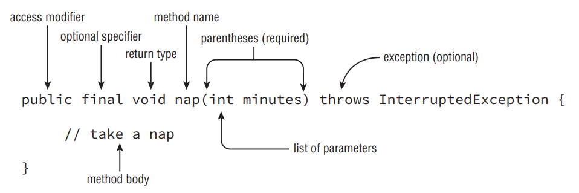

24. C (Converting from an array to an ArrayList uses Arrays.asList(names). There is no asList() method on an array instance. If this code were corrected to compile, the answer would be option A.)
25. D
26. A, B, D (Lines 5 and 7 use autoboxing to convert an int to an Integer. Line 6 does not because valueOf() returns an Integer. Line 8 does not because null is not an int. The code does not compile. However, when the for loop tries to unbox null into an int, it fails and throws a NullPointerException.)
27. B
28. D F
29. D
30. F
31. B (The date starts out as April 30, 2018. Since dates are immutable and the plus methods have their return values ignored, the result is unchanged. Therefore, option B is correct.)
32. E (Even though d has both date and time, the formatter only outputs time.)
33. B (Period does not allow chaining. Only the last Period method called counts, so only the two years are subtracted.)

# Designing Methods

- Every interesting Java program we’ve seen has had a main() method. We can write other methods, too. For example, we can write a basic method to take a nap, as shown in Figure below.

<div align="center">



</div>

- This is called a method declaration, which specifies all the information needed to call the method. There are a lot of parts, and we’ll cover each one in more detail. Table below is a brief reference to the elements of a method declaration.

| Element                   | Value                         | Required?                     |
|---------------------------|-------------------------------|-------------------------------|
| Access modifier           | public                        | No                            |
| Optional specifier        | final                         | No                            |
| Return type               | void                          | Yes                           |
| Method name               | nap                           | Yes                           |
| Parameter list            | (int minutes)                | Yes, but can be empty braces  |
| Optional exception list    | throws InterruptedException    | No                            |
| Method body               | { // take a nap }            | Yes, but can be empty braces  |

# Access Modifiers

- Java offers four choices of access modifier:
   - __public__ The method can be called from any class.
   - __private__ The method can only be called from within the same class.
   - __protected__ The method can only be called from classes in the same package or subclasses.
   - __Default (Package Private) Access__ The method can only be called from classes in the same package. This one is tricky because there is no keyword for default access. You simply omit the access modifier.

- There’s a default keyword in Java. You saw it in the switch statement in Chapter 2, “Operators and Statements,” and you’ll see it again in the next chapter when we discuss interfaces. It’s not used for access control.

```
public void walk1() {}
default void walk2() {} // DOES NOT COMPILE
void public walk3() {} // DOES NOT COMPILE
void walk4() {}
```

- walk1() is a valid method declaration with public access. walk4() is a valid method declaration with default access. walk2() doesn’t compile because default is not a valid access modifier. walk3() doesn’t compile because the access modifier is specified after the return type.

# Optional Specifiers

- There are a number of optional specifiers, but most of them aren’t on the exam. Optional specifiers come from the following list. Unlike with access modifiers, you can have multiple specifiers in the same method (although not all combinations are legal). When this happens, you can specify them in any order. And since it is optional, you can’t have any of them at all. This means you can have zero or more specifiers in a method declaration.
   - __static__ Covered later in this chapter. Used for class methods.
   - __abstract__ Covered in Chapter 5. Used when not providing a method body.
   - __final__ Covered in Chapter 5. Used when a method is not allowed to be overridden by a subclass.
   - __synchronized__ On the OCP but not the OCA exam. 
   - __native__ Not on the OCA or OCP exam. Used when interacting with code written in another language such as C++
   - __strictfp__ Not on the OCA or OCP exam. Used for making floating-point calculations portable.

```
public void walk1() {}
public final void walk2() {}
public static final void walk3() {}
public final static void walk4() {}
public modifier void walk5() {} // DOES NOT COMPILE
public void final walk6() {} // DOES NOT COMPILE
final public void walk7() {}
```

- walk1() is a valid method declaration with no optional specifier. This is okay; it is optional, after all. walk2() is a valid method declaration, with final as the optional specifier. walk3() and walk4() are valid method declarations with both final and static as optional specifiers. The order of these two keywords doesn’t matter. walk5() doesn’t compile because modifier is not a valid optional specifier. walk6() doesn’t compile because the optional specifier is after the return type.

- walk7() does compile. Java allows the optional specifiers to appear before the access modifier. This is a weird case and not one you need to know for the exam. We are mentioning it so you don’t get confused when practicing.