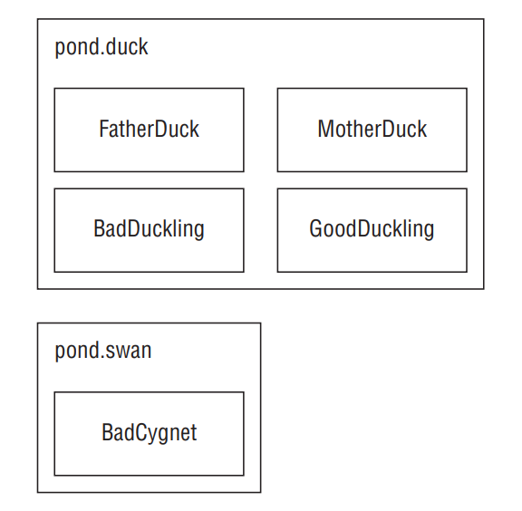

# Return Type

- The return type might be an actual Java type such as String or int. If there is no return type, the void keyword is used. This special return type comes from the English language: void means without contents. In Java, we have no type there. Remember that a method must have a return type. If no value is returned, the return type is void. You cannot omit the return type.

- When checking return types, you also have to look inside the method body. Methods with a return type other than void are required to have a return statement inside the method body. This return statement must include the primitive or object to be returned. Methods that have a return type of void are permitted to have a return statement with no value returned or omit the return statement entirely.

```
public void walk1() { }
public void walk2() { return; }
public String walk3() { return ""; }
public String walk4() { } // DOES NOT COMPILE
public walk5() { } // DOES NOT COMPILE
String walk6(int a) { if (a == 4) return ""; } // DOES NOT COMPILE
```

- walk6() is a little tricky. There is a return statement, but it doesn’t always get run. If a is 6, the return statement doesn’t get executed. Since the String always needs to be returned, the compiler complains.

# Method Name

- Method names follow the same rules as we practiced with variable names: An identifier may only contain letters, numbers, $, or _. Also, the first character is not allowed to be a number, and reserved words are not allowed. By convention, methods begin with a lowercase letter but are not required to.

```
public void walk1() { }
public void 2walk() { } // DOES NOT COMPILE
public walk3 void() { } // DOES NOT COMPILE
public void Walk_$() { }
public void() { } // DOES NOT COMPILE
```

# Parameter List

- Although the parameter list is required, it doesn’t have to contain any parameters. This means you can just have an empty pair of parentheses after the method name, such as void nap(){}. If you do have multiple parameters, you separate them with a comma. There are a couple more rules for the parameter list that you’ll see when we cover varargs shortly. For now, let’s practice looking at method signatures with “regular” parameters:

```
public void walk1() { }
public void walk2 { } // DOES NOT COMPILE
public void walk3(int a) { }
public void walk4(int a; int b) { } // DOES NOT COMPILE
public void walk5(int a, int b) { }
```

# Optional Exception List

- In Java, code can indicate that something went wrong by throwing an exception. Exception is optional and where in the method signature it goes if present. In the example, InterruptedException is a type of Exception. You can list as many types of exceptions as you want in this clause separated by commas. For example:

```
public void zeroExceptions() { }
public void oneException() throws IllegalArgumentException { }
public void twoExceptions() throws IllegalArgumentException, InterruptedException { }
```

# Method Body

- The final part of a method declaration is the method body (except for abstract methods and interfaces, but you don’t need to know about either of those until next chapter). A method body is simply a code block. It has braces that contain zero or more Java statements. We’ve spent several chapters looking at Java statements by now, so you should fi nd it easy to figure out why these compile or don’t:

```
public void walk1() { }
public void walk2; // DOES NOT COMPILE
public void walk3(int a) { int name = 5; }
```

# Working with Varargs

- As you saw in the previous chapter, a method may use a vararg parameter (variable argument) as if it is an array. It is a little different than an array, though. A vararg parameter must be the last element in a method’s parameter list. This implies you are only allowed to have one vararg parameter per method.

```
public void walk1(int... nums) { }
public void walk2(int start, int... nums) { }
public void walk3(int... nums, int start) { } // DOES NOT COMPILE
public void walk4(int... start, int... nums) { } // DOES NOT COMPILE
```

- When calling a method with a vararg parameter, you have a choice. You can pass in an array, or you can list the elements of the array and let Java create it for you. You can even omit the vararg values in the method call and Java will create an array of length zero for you.

```
15: public static void walk(int start, int... nums) {
16:   System.out.println(nums.length);
17: }
18: public static void main(String[] args) {
19:   walk(1); // 0
20:   walk(1, 2); // 1
21:   walk(1, 2, 3); // 2
22:   walk(1, new int[] {4, 5}); // 2
23: }
```

- Line 19 passes 1 as start but nothing else. This means Java creates an array of length 0 for nums. Line 20 passes 1 as start and one more value. Java converts this one value to an array of length 1. Line 21 passes 1 as start and two more values. Java converts these two values to an array of length 2. Line 22 passes 1 as start and an array of length 2 directly as nums.

- You’ve seen that Java will create an empty array if no parameters are passed for a vararg. However, it is still possible to pass null explicitly:

```
walk(1, null); // throws a NullPointerException
```

- Since null isn’t an int, Java treats it as an array reference that happens to be null. It just passes on the null array object to walk. Then the walk() method throws an exception because it tries to determine the length of null.

- Accessing a vararg parameter is also just like accessing an array. It uses array indexing. For example:

```
16: public static void run(int... nums) {
17:   System.out.println(nums[1]);
18: }
19: public static void main(String[] args) {
20:   run(11, 22); // 22
21: }
```

# Applying Access Modifiers

- You already saw that there are four access modifiers: public, private, protected, and default access. We are going to discuss them in order from most restrictive to least restrictive:
   - private: Only accessible within the same class
   - default (package private) access: private and other classes in the same package
   - protected: default access and child classes
   - public: protected and classes in the other packages

# Private Access

- Only code in the same class can call private methods or access private fields. The figure below shows the classes we’ll use to explore private and default access. The big boxes are the names of the packages. The smaller boxes inside them are the classes in each package. You can refer back to this figure if you want to quickly see how the classes relate.

<div align="center">



</div>

- This is perfectly legal code because everything is one class:

```
1: package pond.duck;
2: public class FatherDuck {
3:   private String noise = "quack";
4:   private void quack() {
5:     System.out.println(noise); // private access is ok
6: }
7:   private void makeNoise() {
8:     quack(); // private access is ok
9:   } }
```

- Now we add another class:

```
1: package pond.duck;
2: public class BadDuckling {
3:   public void makeNoise() {
4:     FatherDuck duck = new FatherDuck();
5:     duck.quack(); // DOES NOT COMPILE
6:     System.out.println(duck.noise); // DOES NOT COMPILE
7:   } }
```

- BadDuckling is trying to access members it has no business touching. On line 5, it tries to access a private method in another class. On line 6, it tries to access a private instance variable in another class. Both generate compiler errors. Bad duckling! You know that accessing private members of other classes is not allowed and you need to use a different type of access.

# Default (Package Private) Access

- Luckily, MotherDuck is more accommodating about what her ducklings can do. She allows classes in the same package to access her members. When there is no access modifier, Java uses the default, which is package private access. This means that the member is “private” to classes in the same package. In other words, only classes in the package may access it.

```
package pond.duck;
public class MotherDuck {
 String noise = "quack";
 void quack() {
   System.out.println(noise); // default access is ok
 }
 private void makeNoise() {
   quack(); // default access is ok
 } }
```

- MotherDuck can call quack() and refer to noise. After all, members in the same class are certainly in the same package. The big difference is MotherDuck lets other classes in the same package access members (due to being package private) whereas FatherDuck doesn’t (due to being private). GoodDuckling has a much better experience than BadDuckling:

```
package pond.duck;
public class GoodDuckling {
 public void makeNoise() {
  MotherDuck duck = new MotherDuck();
  duck.quack(); // default access
  System.out.println(duck.noise); // default access
 } }
```

- GoodDuckling succeeds in learning to quack() and make noise by copying its mother. Notice that all the classes we’ve covered so far are in the same package pond.duck. This allows default (package private) access to work.

- In this same pond, a swan just gave birth to a baby swan. A baby swan is called a cygnet. The cygnet sees the ducklings learning to quack and decides to learn from MotherDuck as well.

```
package pond.swan;
import pond.duck.MotherDuck; // import another package

public class BadCygnet {
 public void makeNoise() {
  MotherDuck duck = new MotherDuck();
  duck.quack(); // DOES NOT COMPILE
  System.out.println(duck.noise); // DOES NOT COMPILE
 } }
```

- Oh no! MotherDuck only allows lessons to other ducks by restricting access to the pond .duck package. Poor little BadCygnet is in the pond.swan package and the code doesn’t compile. Remember that when there is no access modifier, only classes in the same package can access it.