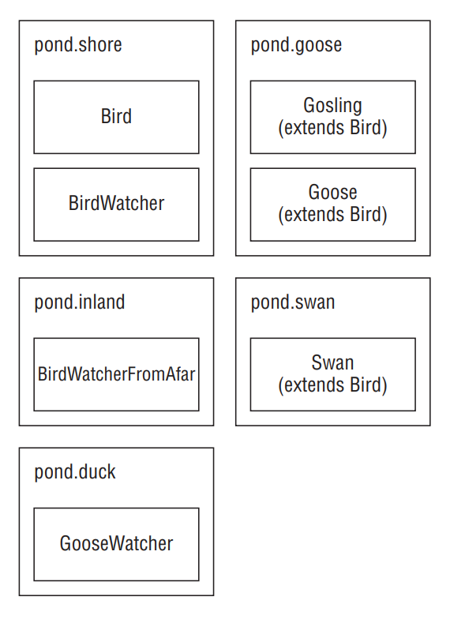

# Protected Access

- Protected access allows everything that default (package private) access allows and more. The protected access modifier adds the ability to access members of a parent class.

- Figure below shows the many classes we’ll create in this section. 

<div align="center">



</div>

- First, we create a Bird class and give protected access to its members:

```
package pond.shore;
public class Bird {
 protected String text = "floating"; // protected access
 protected void floatInWater() { // protected access
   System.out.println(text);
 } }
```

- Next we create a subclass:
```
package pond.goose;
import pond.shore.Bird; // in a different package
public class Gosling extends Bird { // extends means create subclass
 public void swim() {
 floatInWater(); // calling protected member
   System.out.println(text); // calling protected member
 } }
```

- This is a very simple subclass. It extends the Bird class. Extending means creating a subclass that has access to any protected or public members of the parent class. Running this code prints floating twice: once from calling floatInWater() and once from the print statement in swim(). Since Gosling is a subclass of Bird, it can access these members even though it is in a different package.

- Remember that protected also gives us access to everything that default access does. This means that a class in the same package as Bird can access its protected members.

```
package pond.shore; // same package as Bird
public class BirdWatcher {
 public void watchBird() {
 Bird bird = new Bird();
 bird.floatInWater(); // calling protected member
 System.out.println(bird.text); // calling protected member
 } }
```

- Since Bird and BirdWatcher are in the same package, BirdWatcher can access members
of the bird variable. The definition of protected allows access to subclasses and classes in the same package. This example uses the same package part of that definition.

- Now let’s try the same thing from a different package:

```
package pond.inland;
import pond.shore.Bird; // different package than Bird
public class BirdWatcherFromAfar {
 public void watchBird() {
 Bird bird = new Bird();
 bird.floatInWater(); // DOES NOT COMPILE
 System.out.println(bird.text); // DOES NOT COMPILE
} }
```

- BirdWatcherFromAfar is not in the same package as Bird and it doesn’t inherit from Bird. This means that it is not allowed to access protected members of Bird.

- Got that? Subclasses and classes in the same package are the only ones allowed to access protected members. There is one gotcha for protected access. Consider this class:

```
1: package pond.swan;
2: import pond.shore.Bird; // in different package than Bird
3: public class Swan extends Bird { // but subclass of bird
4:   public void swim() {
5:     floatInWater(); // package access to superclass
6:     System.out.println(text); // package access to superclass
7: }
8:   public void helpOtherSwanSwim() {
9:     Swan other = new Swan();
10:    other.floatInWater(); // package access to superclass
11:    System.out.println(other.text);// package access to superclass
12: }
13:  public void helpOtherBirdSwim() {
14:    Bird other = new Bird();
15:    other.floatInWater(); // DOES NOT COMPILE
16:    System.out.println(other.text); // DOES NOT COMPILE
17:  }
18: }
```

- Take a deep breath. This is interesting. Swan is not in the same package as Bird, but does extend it—which implies it has access to the protected members of Bird since it is a subclass. And it does. Lines 5 and 6 refer to protected members via inheriting them. 

- Lines 10 and 11 also successfully use protected members of Bird. This is allowed because these lines refer to a Swan object. Swan inherits from Bird so this is okay. It is sort of a two-phase check. The Swan class is allowed to use protected members of Bird and we are referring to a Swan object. Granted, it is a Swan object created on line 9 rather than an inherited one, but it is still a Swan object.

- Lines 15 and 16 do not compile. Wait a minute. They are almost exactly the same as lines 10 and 11! There’s one key difference. This time a Bird reference is used. It is created on line 14. Bird is in a different package, and this code isn’t inheriting from Bird, so it doesn’t get to use protected members. Say what now? We just got through saying repeatedly that Swan inherits from Bird. And it does. However, the variable reference isn’t a Swan. The code just happens to be in the Swan class.

- It’s okay to be confused. This is arguably one of the most confusing points on the exam. Looking at it a different way, the protected rules apply under two scenarios:
   - A member is used without referring to a variable. This is the case on lines 5 and 6. In this case, we are taking advantage of inheritance and protected access is allowed.
   - A member is used through a variable. This is the case on lines 10, 11, 15, and 16. In this case, the rules for the reference type of the variable are what matter. If it is a subclass, protected access is allowed. This works for references to the same class or a subclass.

```
package pond.goose;
import pond.shore.Bird;
public class Goose extends Bird {
 public void helpGooseSwim() {
  Goose other = new Goose();
  other.floatInWater();
  System.out.println(other.text);
 }
 public void helpOtherGooseSwim() {
  Bird other = new Goose();
  other.floatInWater(); // DOES NOT COMPILE
  System.out.println(other.text); // DOES NOT COMPILE
 } }
```

- The first method is fine. In fact, it is equivalent to the Swan example. Goose extends Bird. Since we are in the Goose subclass and referring to a Goose reference, it can access protected members. The second method is a problem. Although the object happens to be a Goose, it is stored in a Bird reference. We are not allowed to refer to members of the Bird class since we are not in the same package and Bird is not a subclass of Bird.

```
package pond.duck;
import pond.goose.Goose;
public class GooseWatcher {
 public void watch() {
   Goose goose = new Goose();
   goose.floatInWater(); // DOES NOT COMPILE
 } }
```

- This code doesn’t compile because we are not in the Goose class. The floatInWater() method is declared in Bird. GooseWatcher is not in the same package as Bird, nor does it extend Bird. Goose extends Bird. That only lets Goose refer to floatInWater() and not callers of Goose.