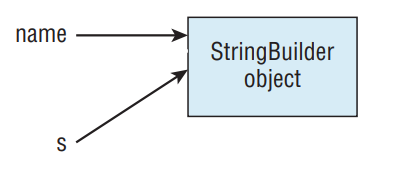

# Passing Data Among Methods

- Java is a “pass-by-value” language. This means that a copy of the variable is made and the method receives that copy. Assignments made in the method do not affect the caller. Let’s look at an example:

```
2: public static void main(String[] args) {
3:  int num = 4;
4:  newNumber(5);
5:  System.out.println(num); // 4
6: }
7: public static void newNumber(int num) {
8:  num = 8;
9: }
```

- On line 3, num is assigned the value of 4. On line 4, we call a method. On line 8, the num parameter in the method gets set to 8. Although this parameter has the same name as the variable on line 3, this is a coincidence. The name could be anything. The exam will often use the same name to try to confuse you. The variable on line 3 never changes because no assignments are made to it.

```
public static void main(String[] args) {
 String name = "Webby";
 speak(name);
 System.out.println(name);
}
public static void speak(String name) {
 name = "Sparky";
}
```

- The correct answer is Webby. Just as in the primitive example, the variable assignment is only to the method parameter and doesn’t affect the caller.

- Notice how we keep talking about variable assignments. This is because we can call methods on the parameters. As an example, we have code that calls a method on the StringBuilder passed into the method:

```
public static void main(String[] args) {
 StringBuilder name = new StringBuilder();
 speak(name);
 System.out.println(name); // Webby
}
public static void speak(StringBuilder s) {
 s.append("Webby");
}
```

- In this case, the output is Webby because the method merely calls a method on the parameter. It doesn’t reassign name to a different object. In Figure below, you can see how pass-by-value is still used. s is a copy of the variable name. Both point to the same StringBuilder, which means that changes made to the StringBuilder are available to both references.

<div align="center">



</div>

- __Pass-by-Value vs. Pass-by-Reference__: Different languages handle parameters in different ways. Pass-by-value is used by many languages, including Java. In this example, the swap method does not change the original values. It only changes a and b within the method.

```
public static void main(String[] args) {
 int original1 = 1;
 int original2 = 2;
 swap(original1, original2);
 System.out.println(original1); // 1
 System.out.println(original2); // 2
}
public static void swap(int a, int b) {
 int temp = a;
 a = b;
 b = temp;
}
```

- The other approach is pass-by-reference. It is used by default in a few languages, such as Perl. We aren't going to show you Perl code here because you are studying for the Java exam and we don't want to confuse you. The following example is in a made-up language that shows pass-by-reference:

```
original1 = 1;
original2 = 2;
swapByReference(original1, original2);
print(original1); // 2 (not in Java)
print(original2); // 1 (not in Java)
swapByReference(a, b) {
 temp = a;
 a = b;
 b = temp;
}
```

- To review, Java uses pass-by-value to get data into a method. Assigning a new primitive or reference to a parameter doesn’t change the caller. Calling methods on a reference to an object does affect the caller.

- Getting data back from a method is easier. A copy is made of the primitive or reference and returned from the method. Most of the time, this returned value is used. For example, it might be stored in a variable. If the returned value is not used, the result is ignored. Watch for this on the exam. Ignored returned values are tricky.

```
1: public class ReturningValues {
2:  public static void main(String[] args) {
3:   int number = 1; // 1
4:   String letters = "abc"; // abc
5:   number(number); // 1
6:   letters = letters(letters); // abcd
7:   System.out.println(number + letters); // 1abcd
8: }
9: public static int number(int number) {
10:   number++;
11:   return number;
12: }
13: public static String letters(String letters) {
14:   letters += "d";
15:   return letters;
16:  }
17: }
```

- This is a tricky one because there is a lot to keep track of. When you see such questions on the exam, write down the values of each variable. Lines 3 and 4 are straightforward assignments. Line 5 calls a method. Line 10 increments the method parameter to 2 but leaves the numbers variable in the main() method as 1. While line 11 returns the value, the caller ignores it. The method call on line 6 doesn’t ignore the result so letters becomes "abcd". Remember that this is happening because of the returned value and not the method parameter.