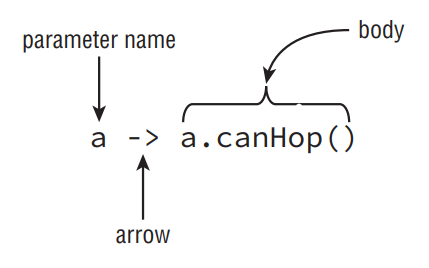
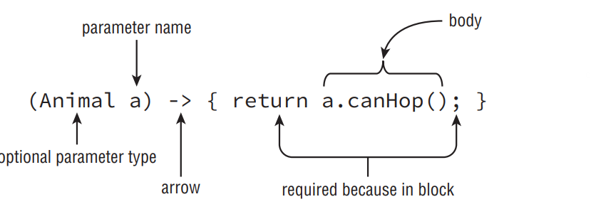

# Writing Simple Lambdas

- Java is an object-oriented language at heart. You’ve seen plenty of objects by now. In Java 8, the language added the ability to write code using another style. Functional programming is a way of writing code more declaratively. You specify what you want to do rather than dealing with the state of objects. You focus more on expressions than loops.

- Functional programming uses lambda expressions to write code. A lambda expression is a block of code that gets passed around. You can think of a lambda expression as an anonymous method. It has parameters and a body just like full-fledged methods do, but it doesn’t have a name like a real method. Lambda expressions are often referred to as lambdas for short. You might also know them as closures if Java isn’t your first language. If you had a bad experience with closures in the past, don’t worry. They are far simpler in Java.

- In other words, a lambda expression is like a method that you can pass as if it were a variable. For example, there are different ways to calculate age. One human year is equivalent to seven dog years. You want to write a method that that takes an age() method as input. To do this in an object-oriented program, you’d need to define a Human subclass and a Dog subclass. With lambdas, you can just pass in the relevant expression to calculate age.

- Lambdas allow you to write powerful code in Java. Only the simplest lambda expressions are on the OCA exam. The goal is to get you comfortable with the syntax and the concepts. This means you aren’t truly doing functional programming yet. You’ll see lambdas again on the OCP exam.

## Lambda Example

- Our goal is to print out all the animals in a list according to some criteria. We’ll show you how to do this without lambdas to illustrate how lambdas are useful. We start out with the Animal class:

```
public class Animal {
 private String species;
 private boolean canHop;
 private boolean canSwim;
 public Animal(String speciesName, boolean hopper, boolean swimmer) {
  species = speciesName;
  canHop = hopper;
  canSwim = swimmer;
 }
 public boolean canHop() { return canHop; }
 public boolean canSwim() { return canSwim; }
 public String toString() { return species; }
}
```

- The Animal class has three instance variables, which are set in the constructor. It has two methods that get the state of whether the animal can hop or swim. It also has a toString() method so we can easily identify the Animal in programs.

- We plan to write a lot of different checks, so we want an interface. You’ll learn more about interfaces in the next chapter. For now, it is enough to remember that an interface specifies the methods that our class needs to implement:

```
public interface CheckTrait {
 boolean test(Animal a);
}
```

- The first thing we want to check is whether the Animal can hop. We provide a class that can check this:

```
public class CheckIfHopper implements CheckTrait {
 public boolean test(Animal a) {
  return a.canHop();
 }
}
```

- This class may seem simple—and it is. This is actually part of the problem that lambdas solve. Just bear with us for a bit. Now we have everything that we need to write our code to find the Animals that hop:

```
1: public class TraditionalSearch {
2:  public static void main(String[] args) {
3:   List<Animal> animals = new ArrayList<Animal>(); // list of animals
4:   animals.add(new Animal("fish", false, true));
5:   animals.add(new Animal("kangaroo", true, false));
6:   animals.add(new Animal("rabbit", true, false));
7:   animals.add(new Animal("turtle", false, true));
8:
9:   print(animals, new CheckIfHopper()); // pass class that does check
10:  }
11:  private static void print(List<Animal> animals, CheckTrait checker) {
12:   for (Animal animal : animals) {
13:    if (checker.test(animal)) // the general check
14:     System.out.print(animal + " ");
15:   }
16:   System.out.println();
17:  }
18: }
```

- The print() method on line 11 method is very general—it can check for any trait. This is good design. It shouldn’t need to know what specifically we are searching for in order to print a list of animals.

- Now what happens if we want to print the Animals that swim? Sigh. We need to write another class CheckIfSwims. Granted, it is only a few lines. Then we need to add a new line under line 9 that instantiates that class. That’s two things just to do another check.

- Why can’t we just specify the logic we care about right here? Turns out that we can with lambda expressions. We could repeat that whole class here and make you find the one line that changed. Instead, we’ll just show you. We could replace line 9 with the following, which uses a lambda:

```
9: print(animals, a -> a.canHop());
```

- It doesn’t take much imagination to figure how we would add logic to get the Animals that can swim. We only have to add one line of code—no need for an extra class to do something simple. Here’s that other line:

```
print(animals, a -> a.canSwim());
```

- How about Animals that cannot swim?

```
print(animals, a -> ! a.canSwim());
```

- The point here is that it is really easy to write code that uses lambdas once you get the basics in place. This code uses a concept called deferred execution. Deferred execution means that code is specified now but will run later. In this case, later is when the print() method calls it.

## Lambda Syntax

- One of the simplest lambda expressions you can write is the one you just saw:

```
a -> a.canHop();
```

- This means that Java should call a method with an Animal parameter that returns a boolean value that’s the result of a.canHop(). We know all this because we wrote the code. But how does Java know?

- Java replies on context when figuring out what lambda expressions mean. We are passing this lambda as the second parameter of the print() method. That method expects a CheckTrait as the second parameter. Since we are passing a lambda instead, Java tries to map our lambda to that interface:

```
boolean test(Animal a);
```

- Since that interface’s method takes an Animal, that means the lambda parameter has to be an Animal. And since that interface’s method returns a boolean, we know the lambda returns a boolean.

- The syntax of lambdas is tricky because many parts are optional. These two lines do the exact same thing:

```
a -> a.canHop()
(Animal a) -> { return a.canHop(); }
```

- Let’s look at what is going on here. The first example, shown in Figure below, has three parts:
   - Specify a single parameter with the name a
   - The arrow operator to separate the parameter and body
   - A body that calls a single method and returns the result of that method

<div align="center">



</div>

- The second example also has three parts; it’s just more verbose (see figure below):
   - Specify a single parameter with the name a and stating the type is Animal
   - The arrow operator to separate the parameter and body
   - A body that has one or more lines of code, including a semicolon and a return statement

<div align="center">



</div>

- The parentheses can only be omitted if there is a single parameter and its type is not explicitly stated. Java does this because developers commonly use lambda expressions this way and they can do as little typing as possible.

- It shouldn’t be news to you that we can omit braces when we only have a single statement. We did this with if statements and loops already. What is different here is that the rules change when you omit the braces. Java doesn’t require you to type return or use a semicolon when no braces are used. This special shortcut doesn’t work when we have two or more statements. At least this is consistent with using {} to create blocks of code elsewhere.

- Let’s look at some examples of valid lambdas. Pretend that there are valid interfaces that can consume a lambda with zero, one, or two String parameters.

```
3: print(() -> true); // 0 parameters
4: print(a -> a.startsWith("test")); // 1 parameter
5: print((String a) -> a.startsWith("test")); // 1 parameter
6: print((a, b) -> a.startsWith("test")); // 2 parameters
7: print((String a, String b) -> a.startsWith("test")); // 2 parameters
```

- Notice that all of these examples have parentheses around the parameter list except the one that takes only one parameter and doesn’t specify the type. Line 3 takes 0 parameters and always returns the Boolean true. Line 4 takes one parameter and calls a method on it, returning the result. Line 5 does the same except that it explicitly defines the type of the variable. Lines 6 and 7 take two parameters and ignore one of them—there isn’t a rule that says you must use all defined parameters.

- Now let’s make sure you can identify invalid syntax. Do you see what’s wrong with each of these?

```
print(a, b -> a.startsWith("test")); // DOES NOT COMPILE
print(a -> { a.startsWith("test"); }); // DOES NOT COMPILE
print(a -> { return a.startsWith("test") }); // DOES NOT COMPILE
```

- The first line needs parentheses around the parameter list. Remember that the parentheses are only optional when there is one parameter and it doesn’t have a type declared. The second line is missing the return keyword. The last line is missing the semicolon.

- You might have noticed all of our lambdas return a boolean. That is because the scope for the OCA exam limits what you need to learn.

- __What Variables Can My Lambda Access?__: Lambdas are allowed to access variables. This topic isn’t on the OCA exam, but you may come across it when practicing. Lambdas are allowed to access variables. Here’s an example:

```
boolean wantWhetherCanHop = true;
print(animals, a -> a.canHop() == wantWhetherCanHop);
```

- The trick is that they cannot access all variables. Instance and static variables are okay. Method parameters and local variables are fine if they are not assigned new values.

- There is one more issue you might see with lambdas. We’ve been defining an argument list in our lambda expressions. Since Java doesn’t allow us to redeclare a local variable, the following is an issue:

```
(a, b) -> { int a = 0; return 5;} // DOES NOT COMPILE
```

- We tried to redeclare a, which is not allowed. By contrast, the following line is okay because it uses a different variable name:

```
(a, b) -> { int c = 0; return 5;}
```