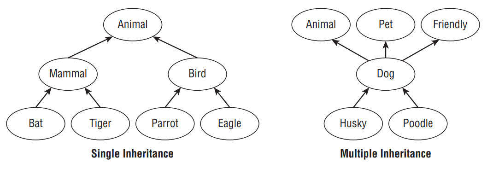
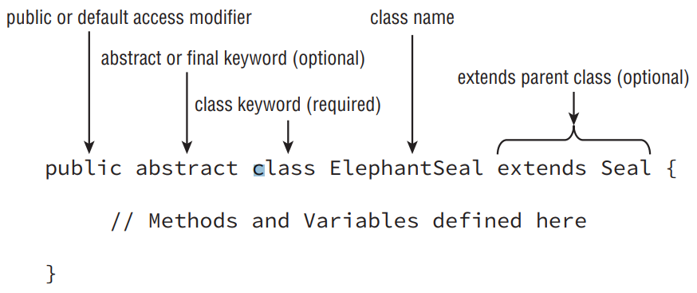
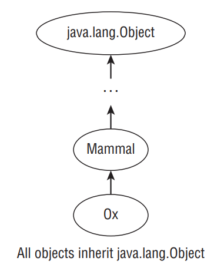

22. E
23. A
24. B C E
25. A E
26. A
27. C. The interface takes two int parameters. The code on line 7 attempts to use them as if one is a StringBuilder. It is tricky to use types in a lambda when they are implicitly specified. Remember to check the interface for the real type.
28. A D F
29. A F

- At its core, proper Java class design is about code reusability, increased functionality, and standardization. For example, by creating a new class that extends an existing class, you may gain access to a slew of inherited primitives, objects, and methods. Alternatively, by designing a standard interface for your application, you ensure that any class that implements the interface has certain required methods defined. Finally, by creating abstract class definitions, you’re defining a platform that other developers can extend and build on top of.

# Introducing Class Inheritance

- When creating a new class in Java, you can define the class to inherit from an existing class. Inheritance is the process by which the new child subclass automatically includes any public or protected primitives, objects, or methods defined in the parent class.

- For illustrative purposes, we refer to any class that inherits from another class as a child class, or a descendent of that class. Alternatively, we refer to the class that the child inherits from as the parent class, or an ancestor of the class. If child X inherits from class Y, which in turn inherits from class Z, then X would be considered an indirect child, or descendent, of class Z.

- Java supports single inheritance, by which a class may inherit from only one direct parent class. Java also supports multiple levels of inheritance, by which one class may extend another class, which in turn extends another class. You can extend a class any number of times, allowing each descendent to gain access to its ancestor’s members.

- To truly understand single inheritance, it may helpful to contrast it with multiple inheritance, by which a class may have multiple direct parents. By design, Java doesn’t support multiple inheritance in the language because studies have shown that multiple inheritance can lead to complex, often difficult-to-maintain code. Java does allow one exception to the single inheritance rule: classes may implement multiple interfaces, as you’ll see later in this chapter.

- Figure below illustrates the various types of inheritance models. The items on the left are considered single inheritance because each child has exactly one parent. You may notice that single inheritance doesn’t preclude parents from having multiple children. The right side shows items that have multiple inheritance. For example, a dog object has multiple parent designations. Part of what makes multiple inheritance complicated is determining which parent to inherit values from in case of a conflict. For example, if you have an object or method defined in all of the parents, which one does the child inherit? There is no natural ordering for parents in this example, which is why Java avoids these issues by disallowing multiple inheritance altogether.

<div align="center">



</div>

- It is possible in Java to prevent a class from being extended by marking the class with the final modifier. If you try to define a class that inherits from a final class, the compiler will throw an error and not compile. Unless otherwise specified, throughout this chapter you can assume the classes we work with are not marked as final.

## Extending a Class

- In Java, you can extend a class by adding the parent class name in the definition using the extends keyword. The syntax of defining and extending a class is shown in Figure below.

<div align="center">



</div>

- Because Java allows only one public class per file, we can create two files, Animal.java and Lion.java, in which the Lion class extends the Animal class. Assuming they are in the same package, an import statement is not required in Lion.java to access the Animal class.

- Here are the contents of Animal.java:

```java
public class Animal {
 private int age;
 public int getAge() {
  return age;
 }
 public void setAge(int age) {
  this.age = age;
 }
}
```

- And here are the contents of Lion.java:

```java
public class Lion extends Animal {
 private void roar() {
  System.out.println("The "+getAge()+" year old lion says: Roar!");
 }
}
```

- Notice the use of the extends keyword in Lion.java to indicate that the Lion class extends from the Animal class. In this example, we see that getAge() and setAge() are accessible by subclass Lion, because they are marked as public in the parent class. The primitive age is marked as private and therefore not accessible from the subclass Lion, as the following would not compile:

```java
public class Lion extends Animal {
 private void roar() {
  System.out.println("The "+age+" year old lion says: Roar!");
 // DOES NOT COMPILE
 }
}
```

- Despite the fact that age is inaccessible by the child class, if we have an instance of a Lion object, there is still an age value that exists within the instance. The age value just cannot be directly referenced by the child class nor any instance of the class. In this manner, the Lion object is actually “bigger” than the Animal object in the sense that it includes all the properties of the Animal object (although not all of those properties may be directly accessible) along with its own set of Lion attributes.

## Applying Class Access Modifiers

- As discussed in Chapter 4, you can apply access modifiers (public, private, protected, default) to both class methods and variables. It probably comes as no surprise that you can also apply access modifiers to class definitions, since we have been adding the public access modifier to nearly every class up to now.

- For the OCA exam, you should only be familiar with public and default package-level class access modifiers, because these are the only ones that can be applied to top-level classes within a Java file. The protected and private modifiers can only be applied to inner classes, which are classes that are defined within other classes, but this is well out of scope for the OCA exam.

- The public access modifier applied to a class indicates that it can be referenced and used in any class. The default package private modifier, which is the lack of any access modifier, indicates the class can be accessed only by a subclass or class within the same package.

- As you know, a Java file can have many classes but at most one public class. In fact, it may have no public class at all. One feature of using the default package private modifier is that you can define many classes within the same Java file. For example, the following definition could appear in a single Java file named Groundhog.java, since it contains only one public class:

```java
class Rodent {}
public class Groundhog extends Rodent {}
```

- If we were to update the Rodent class with the public access modifier, the Groundhog.java file would not compile unless the Rodent class was moved to its own Rodent.java file.

- The rules for applying class access modifiers are identical for interfaces. There can be at most one public class or interface in a Java file. Like classes, top-level interfaces can also be declared with the public or default modifiers. We’ll discuss interfaces in detail later in this chapter.

- For simplicity, any time you see multiple public classes or interfaces defined in the same code block in this chapter, assume each class is defined in its own Java file.

## Creating Java Objects

- Throughout our discussion of Java in this book, we have thrown around the word object numerous times—and with good reason. In Java, all classes inherit from a single class, java.lang.Object. Furthermore, java.lang.Object is the only class that doesn’t have any parent classes.

- You might be wondering, “None of the classes I’ve written so far extend java.lang .Object, so how do all classes inherit from it?” The answer is that the compiler has been automatically inserting code into any class you write that doesn’t extend a specific class. For example, consider the following two equivalent class definitions:

```java
public class Zoo {
}

public class Zoo extends java.lang.Object {
}
```

- The key is that when Java sees you define a class that doesn’t extend another class, it immediately adds the syntax extends java.lang.Object to the class definition.

- If you define a new class that extends an existing class, Java doesn’t add this syntax, although the new class still inherits from java.lang.Object. Since all classes inherit from java.lang.Object, extending an existing class means the child automatically inherits from java.lang.Object by construction. This means that if you look at the inheritance structure of any class, it will always end with java.lang.Object on the top of the tree, as shown in Figure below.

<div align="center">



</div>