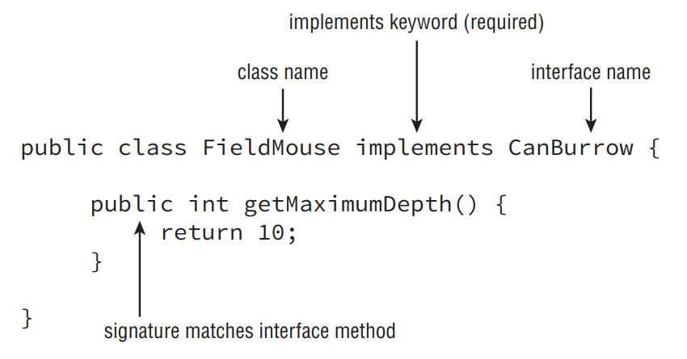

### Creating final methods

- We conclude our discussion of method inheritance with a somewhat self-explanatory rule: final methods cannot be overridden. If you recall our discussion of modifiers from Chapter 4, you can create a method with the final keyword. By doing so, though, you forbid a child class from overriding this method. This rule is in place both when you override a method and when you hide a method. In other words, you cannot hide a static method in a parent class if it is marked as final.

```java
public class Bird {
 public final boolean hasFeathers() {
  return true;
 }
}
public class Penguin extends Bird {
 public final boolean hasFeathers() { // DOES NOT COMPILE
  return false;
 }
}
```

- In this example, the method hasFeathers() is marked as final in the parent class Bird, so the child class Penguin cannot override the parent method, resulting in a compiler error. Note that whether or not the child method used the final keyword is irrelevant—the code will not compile either way.

- __Why Mark a Method as final?__: Although marking methods as final prevents them from being overridden, it does have advantages in practice. For example, you’d mark a method as final when you’re defining a parent class and want to guarantee certain behavior of a method in the parent class, regardless of which child is invoking the method.

- For example, in the previous example with Birds, the author of the parent class may want to ensure the method hasFeathers() always returns true, regardless of the child class instance on which it is invoked. The author is confident that there is no example of a Bird in which feathers are not present.

- The reason methods are not commonly marked as final in practice, though, is that it may be difficult for the author of a parent class method to consider all of the possible ways her child class may be used. For example, although all adult birds have feathers, a baby chick doesn’t; therefore, if you have an instance of a Bird that is a chick, it would not have feathers. In short, the final modifier is only used on methods when the author of the parent method wants to guarantee very precise behavior.

## Inheriting Variables

- As you saw with method overriding, there were a lot of rules when two methods have the same signature and are defined in both the parent and child classes. Luckily, the rules for variables with the same name in the parent and child classes are a lot simpler, because Java doesn’t allow variables to be overridden but instead hidden.

### Hiding Variables

- When you hide a variable, you define a variable with the same name as a variable in a parent class. This creates two copies of the variable within an instance of the child class: one instance defined for the parent reference and another defined for the child reference.

- As when hiding a static method, you can’t override a variable; you can only hide it. Also similar to hiding a static method, the rules for accessing the parent and child variables are quite similar. If you’re referencing the variable from within the parent class, the variable defined in the parent class is used. Alternatively, if you’re referencing the variable from within a child class, the variable defined in the child class is used. Likewise, you can reference the parent value of the variable with an explicit use of the super keyword. Consider the following example:

```java
public class Rodent {
 protected int tailLength = 4;
 public void getRodentDetails() {
  System.out.println("[parentTail="+tailLength+"]");
 }
}

public class Mouse extends Rodent {
 protected int tailLength = 8;
 public void getMouseDetails() {
  System.out.println("[tail="+tailLength +",parentTail="+super.tailLength+"]");
 }
 public static void main(String[] args) {
  Mouse mouse = new Mouse();
  mouse.getRodentDetails();
  mouse.getMouseDetails();
 }
}
```

- This code compiles without issue and outputs the following when executed:

```
[parentTail=4]
[tail=8,parentTail=4]
```

- Notice that the instance of Mouse contains two copies of the tailLength variables: one defined in the parent and one defined in the child. These instances are kept separate from each other, allowing our instance of Mouse to reference both tailLength values independently. In the first method call, getRodentDetails(), the parent method outputs the parent value of the tailLength variable. In the second method call, getMouseDetails(), the child method outputs both the child and parent version of the tailLength variables, using the super keyword to access the parent variable’s value.

- The important thing to remember is that there is no notion of overriding a member variable. For example, there is no code change that could be made to cause Java to override the value of tailLength, making it the same in both parent and child. These rules are the same regardless of whether the variable is an instance variable or a static variable.

- __Don’t Hide Variables in Practice__: Although Java allows you to hide a variable defined in a parent class with one defined in a child class, it is considered an extremely poor coding practice. For example, take a look at the following code, which uses a hidden variable length, marked as public in both parent and child classes.

```java
public class Animal {
 public int length = 2;
}
public class Jellyfish extends Animal {
 public int length = 5;
 public static void main(String[] args) {
  Jellyfish jellyfish = new Jellyfish();
  Animal animal = new Jellyfish();
  System.out.println(jellyfish.length);
  System.out.println(animal.length);
 }
}
```

- This code compiles without issue. Here’s the output:

```
5
2
```

- Notice the same type of object was created twice, but the reference to the object determines which value is seen as output. If the object Jellyfish was passed to a method by an Animal reference, as you’ll see in the section “Understanding Polymorphism,” later in this chapter, the wrong value might be used.

- Hiding variables makes the code very confusing and difficult to read, especially if you start modifying the value of the variable in both the parent and child methods, since it may not be clear which variable you’re updating.

- When defining a new variable in a child class, it is considered good coding practice to select a name for the variable that is not already a public, protected, or default variable in use in a parent class. Hiding private variables is considered less problematic because the child class did not have access to the variable in the parent class to begin with.

# Creating Abstract Classes

- Let’s say you want to define a parent class that other developers are going to subclass. Your goal is to provide some reusable variables and methods to developers in the parent class, whereas the developers provide specific implementations or overrides of other methods in the child classes. Furthermore, let’s say you also don’t want an instance of the parent class to be instantiated unless it is an instance of the child class.

- For example, you might define an Animal parent class that a number of classes extend from and use but for which an instance of Animal itself cannot be instantiated. All subclasses of the Animal class, such as Swan, are required to implement a getName() method, but there is no implementation for the method in the parent Animal class. How do you ensure all classes that extend Animal provide an implementation for this method?

- In Java, you can accomplish this task by using an abstract class and abstract method. An abstract class is a class that is marked with the abstract keyword and cannot be instantiated. An abstract method is a method marked with the abstract keyword defined in an abstract class, for which no implementation is provided in the class in which it is declared.

- The following code is based on our Animal and Swan description:

```java
public abstract class Animal {
 protected int age;
 public void eat() {
  System.out.println("Animal is eating");
 }
 public abstract String getName();
}

public class Swan extends Animal {
 public String getName() {
  return "Swan";
 }
}
```

- The first thing to notice about this sample code is that the Animal class is declared abstract and Swan is not. Next, the member age and the method eat() are marked as protected and public, respectively; therefore, they are inherited in subclasses such as Swan. Finally, the abstract method getName() is terminated with a semicolon and doesn’t provide a body in the parent class Animal. This method is implemented with the same name and signature as the parent method in the Swan class.

## Defining an Abstract Class

- The previous sample code illustrates a number of important rules about abstract classes. For example, an abstract class may include nonabstract methods and variables, as you saw with the variable age and the method eat(). In fact, an abstract class is not required to include any abstract methods. For example, the following code compiles without issue even though it doesn’t define any abstract methods:

```java
public abstract class Cow {
}
```

- Although an abstract class doesn’t have to implement any abstract methods, an abstract method may only be defined in an abstract class. For example, the following code won’t compile because an abstract method is not defined within an abstract class:

```java
public class Chicken {
 public abstract void peck(); // DOES NOT COMPILE
}
```

- The exam creators are fond of questions like this one, which mixes nonabstract classes with abstract methods. They are also fond of questions with methods marked as abstract for which an implementation is also defined. For example, neither method in the following code will compile because the methods are marked as abstract:

```java
public abstract class Turtle {
 public abstract void swim() {} // DOES NOT COMPILE
 public abstract int getAge() { // DOES NOT COMPILE
  return 10;
 }
}
```

- The first method, swim(), doesn’t compile because two brackets are provided instead of a semicolon, and Java interprets this as providing a body to an abstract method. The second method, getAge(), doesn’t compile because it also provides a body to an abstract method. Pay close attention to swim(), because you’ll likely see a question like this on the exam.

- __Default Method Implementations in Abstract Classes__: Although you can’t provide a default implementation to an abstract method in an abstract class, you can still define a method with a body—you just can’t mark it as abstract. As long as you do not mark it as final, the subclass still has the option to override it, as explained in the previous section.

- Next, we note that an abstract class cannot be marked as final for a somewhat obvious reason. By definition, an abstract class is one that must be extended by another class to be instantiated, whereas a final class can’t be extended by another class. By marking an abstract class as final, you’re saying the class can never be instantiated, so the compiler refuses to process the code. For example, the following code snippet will not compile:

```java
public final abstract class Tortoise { // DOES NOT COMPILE
}
```

- Likewise, an abstract method may not be marked as final for the same reason that an abstract class may not be marked as final. Once marked as final, the method can never be overridden in a subclass, making it impossible to create a concrete instance of the abstract class.

```java
public abstract class Goat {
 public abstract final void chew(); // DOES NOT COMPILE
}
```

- Finally, a method may not be marked as both abstract and private. This rule makes sense if you think about it. How would you define a subclass that implements a required method if the method is not accessible by the subclass itself? The answer is you can’t, which is why the compiler will complain if you try to do the following:

```java
public abstract class Whale {
 private abstract void sing(); // DOES NOT COMPILE
}

public class HumpbackWhale extends Whale {
 private void sing() {
  System.out.println("Humpback whale is singing");
 }
}
```

- In this example, the abstract method sing() defined in the parent class Whale is not visible to the subclass HumpbackWhale. Even though HumpbackWhale does provide an implementation, it is not considered an override of the abstract method since the abstract method is unreachable. The compiler recognizes this in the parent class and throws an exception as soon as private and abstract are applied to the same method.

- If we changed the access modified from private to protected in the parent class Whale, would the code compile? Let’s take a look:

```java
public abstract class Whale {
 protected abstract void sing();
}

public class HumpbackWhale extends Whale {
 private void sing() { // DOES NOT COMPILE
  System.out.println("Humpback whale is singing");
 }
}
```

- In this modified example, the code will still not compile but for a completely different reason. If you remember the rules earlier in this chapter for overriding a method, the subclass cannot reduce the visibility of the parent method, sing(). Because the method is declared protected in the parent class, it must be marked as protected or public in the child class. Even with abstract methods, the rules for overriding methods must be followed.

## Creating a Concrete Class

- When working with abstract classes, it is important to remember that by themselves, they cannot be instantiated and therefore do not do much other than define static variables and methods. For example, the following code will not compile as it is an attempt to instantiate an abstract class.

```java
public abstract class Eel {
 public static void main(String[] args) {
  final Eel eel = new Eel(); // DOES NOT COMPILE
 }
}
```

- An abstract class becomes useful when it is extended by a concrete subclass. A concrete class is the first nonabstract subclass that extends an abstract class and is required to implement all inherited abstract methods. When you see a concrete class extending an abstract class on the exam, check that it implements all of the required abstract methods. Let’s review this with the following example.

```java
public abstract class Animal {
 public abstract String getName();
}

public class Walrus extends Animal { // DOES NOT COMPILE
}
```

- First, note that Animal is marked as abstract and Walrus is not. In this example, Walrus is considered the first concrete subclass of Animal. Second, since Walrus is the first concrete subclass, it must implement all inherited abstract methods, getName() in this example. Because it doesn’t, the compiler rejects the code.

- Notice that when we define a concrete class as the “first” nonabstract subclass, we include the possibility that another nonabstract class may extend an existing nonabstract class. The key point is that the first class to extend the nonabstract class must implement all inherited abstract methods. For example, the following variation will also not compile:

```java
public abstract class Animal {
 public abstract String getName();
}
public class Bird extends Animal { // DOES NOT COMPILE
}
public class Flamingo extends Bird {
 public String getName() {
  return "Flamingo";
 }
}
```

- Even though a second subclass Flamingo implements the abstract method getName(), the first concrete subclass Bird doesn’t; therefore, the Bird class will not compile.

## Extending an Abstract Class

- Let’s expand our discussion of abstract classes by introducing the concept of extending an abstract class with another abstract. We’ll repeat our previous Walrus example with one minor variation:

```java
public abstract class Animal {
 public abstract String getName();
}
public class Walrus extends Animal { // DOES NOT COMPILE
}
public abstract class Eagle extends Animal {
}
```

- In this example, we again have an abstract class Animal with a concrete subclass Walrus that doesn’t compile since it doesn’t implement a getName() method. We also have an abstract class Eagle, which like Walrus extends Animal and doesn’t provide an implementation for getName(). In this situation, Eagle does compile because it is marked as abstract. Be sure you understand why Walrus doesn’t compile and Eagle does in this example.

- As you saw in this example, abstract classes can extend other abstract classes and are not required to provide implementations for any of the abstract methods. It follows, then, that a concrete class that extends an abstract class must implement all inherited abstract methods. For example, the following concrete class Lion must implement two methods, getName() and roar():

```java
public abstract class Animal {
 public abstract String getName();
}
public abstract class BigCat extends Animal {
 public abstract void roar();
}
public class Lion extends BigCat {
 public String getName() {
  return "Lion";
 }
 public void roar() {
  System.out.println("The Lion lets out a loud ROAR!");
 }
}
```

- In this sample code, BigCat extends Animal but is marked as abstract; therefore, it is not required to provide an implementation for the getName() method. The class Lion is not marked as abstract, and as the first concrete subclass, it must implement all inherited abstract methods not defined in a parent class.

- There is one exception to the rule for abstract methods and concrete classes: a concrete subclass is not required to provide an implementation for an abstract method if an intermediate abstract class provides the implementation. For example, take a look at the following variation on our previous example:

```java
public abstract class Animal {
 public abstract String getName();
}
public abstract class BigCat extends Animal {
 public String getName() {
  return "BigCat";
 }
 public abstract void roar();
}
public class Lion extends BigCat {
 public void roar() {
  System.out.println("The Lion lets out a loud ROAR!");
 }
}
```

- In this example, BigCat provides an implementation for the abstract method getName() defined in the abstract Animal class. Therefore, Lion inherits only one abstract method, roar(), and is not required to provide an implementation for the method getName(). 

- Here’s one way to think about this: if an intermediate class provides an implementation for an abstract method, that method is inherited by subclasses as a concrete method, not as an abstract one. In other words, the subclasses do not consider it an inherited abstract method because it is no longer abstract by the time it reaches the subclasses.

- The following are lists of rules for abstract classes and abstract methods that we have covered in this section. Review and understand these rules before taking the exam.

- Abstract Class Definition Rules:
   - Abstract classes cannot be instantiated directly.
   - Abstract classes may be defined with any number, including zero, of abstract and nonabstract methods.
   - Abstract classes may not be marked as private or final.
   - An abstract class that extends another abstract class inherits all of its abstract methods as its own abstract methods.
   - The first concrete class that extends an abstract class must provide an implementation for all of the inherited abstract methods.

- Abstract Method Definition Rules:
   - Abstract methods may only be defined in abstract classes.
   - Abstract methods may not be declared private or final.
   - Abstract methods must not provide a method body/implementation in the abstract class for which is it declared.
   - Implementing an abstract method in a subclass follows the same rules for overriding a method. For example, the name and signature must be the same, and the visibility of the method in the subclass must be at least as accessible as the method in the parent class.

# Implementing Interfaces

- Although Java doesn’t allow multiple inheritance, it does allow classes to implement any number of interfaces. An interface is an abstract data type that defines a list of abstract public methods that any class implementing the interface must provide. An interface can also include a list of constant variables and default methods, which we’ll cover in this section. In Java, an interface is defined with the interface keyword, analogous to the class keyword used when defining a class. A class invokes the interface by using the implements keyword in its class definition. Refer to figures below for proper syntax usage.

<div align="center">


</div>

<div align="center">



</div>

- As you see in this example, an interface is not declared an abstract class, although it has many of the same properties of abstract class. Notice that the method modifiers in this example, abstract and public, are assumed. In other words, whether or not you provide them, the compiler will automatically insert them as part of the method definition.

- A class may implement multiple interfaces, each separated by a comma, such as in the following example:

```java
public class Elephant implements WalksOnFourLegs, HasTrunk, Herbivore {
}
```

- In the example, if any of the interfaces defined abstract methods, the concrete class Elephant would be required to implement those methods.

- New to Java 8 is the notion of default and static interface methods, which we’ll cover at the end of this section.

## Defining an Interface

- It may be helpful to think of an interface as a specialized kind of abstract class, since it shares many of the same properties and rules as an abstract class. The following is a list of rules for creating an interface, many of which you should recognize as adaptions of the rules for defining abstract classes.
   - Interfaces cannot be instantiated directly.
   - An interface is not required to have any methods.
   - An interface may not be marked as final.
   - All top-level interfaces are assumed to have public or default access, and they must include the abstract modifier in their definition. Therefore, marking an interface as private, protected, or final will trigger a compiler error, since this is incompatible with these assumptions.
   - All nondefault methods in an interface are assumed to have the modifiers abstract and public in their definition. Therefore, marking a method as private, protected, or final will trigger compiler errors as these are incompatible with the abstract and public keywords.

- The fourth rule doesn’t apply to inner interfaces, although inner classes and interfaces are not in scope for the OCA exam. The first three rules are identical to the first three rules for creating an abstract class. Imagine we have an interface WalksOnTwoLegs, defined as follows:

```java
public interface WalksOnTwoLegs {}
```

- It compiles without issue, since interfaces are not required to define any methods. Now consider the following two examples, which do not compile:

```java
public class TestClass {
 public static void main(String[] args) {
  WalksOnTwoLegs example = new WalksOnTwoLegs(); // DOES NOT COMPILE
  }
}

public final interface WalksOnEightLegs { // DOES NOT COMPILE
}
```

- The first example doesn’t compile, as WalksOnTwoLegs is an interface and cannot be instantiated directly. The second example, WalksOnEightLegs, doesn’t compile since interfaces may not be marked as final for the same reason that abstract classes cannot be marked as final. 

- The fourth and fifth rule about “assumed keywords” might be new to you, but you should think of these in the same light as the compiler inserting a default no-argument constructor or super() statement into your constructor. You may provide these modifiers yourself, although the compiler will insert them automatically if you do not. For example, the following two interface definitions are equivalent, as the compiler will convert them both to the second example:

```java
public interface CanFly {
 void fly(int speed);
 abstract void takeoff();
 public abstract double dive();
}
public abstract interface CanFly {
 public abstract void fly(int speed);
 public abstract void takeoff();
 public abstract double dive();
}
```

- In this example, the abstract keyword is first automatically added to the interface definition. Then, each method is prepended with abstract and public keywords. If the method already has either of these keywords, then no change is required. Let’s take a look at an example that violates the assumed keywords:

```java
private final interface CanCrawl { // DOES NOT COMPILE
 private void dig(int depth); // DOES NOT COMPILE
 protected abstract double depth(); // DOES NOT COMPILE
 public final void surface(); // DOES NOT COMPILE
}
```

- Every single line of this example doesn’t compile. The first line doesn’t compile for two reasons. First, it is marked as final, which cannot be applied to an interface since it conflicts with the assumed abstract keyword. Next, it is marked as private, which conflicts with the public or default required access for interfaces. The second and third line do not compile because all interface methods are assumed to be public and marking them as private or protected throws a compiler error. Finally, the last line doesn’t compile because the method is marked as final and since interface methods are assumed to be abstract, the compiler throws an exception for using both abstract and final keywords on a method.

- Adding the assumed keywords to an interface is a matter of personal、preference, although it is considered good coding practice to do so. Code with the assumed keywords written out tends to be easier and clearer to read, and leads to fewer potential conflicts, as you saw in the previous examples.

## Inheriting an Interface

- There are two inheritance rules you should keep in mind when extending an interface:
   - An interface that extends another interface, as well as an abstract class that implements an interface, inherits all of the abstract methods as its own abstract methods.
   - The first concrete class that implements an interface, or extends an abstract class that implements an interface, must provide an implementation for all of the inherited abstract methods.

- Like an abstract class, an interface may be extended using the extend keyword. In this manner, the new child interface inherits all the abstract methods of the parent interface. Unlike an abstract class, though, an interface may extend multiple interfaces. Consider the following example:

```java
public interface HasTail {
 public int getTailLength();
}
public interface HasWhiskers {
 public int getNumberOfWhiskers();
}
public interface Seal extends HasTail, HasWhiskers {
}
```

- Any class that implements the Seal interface must provide an implementation for all methods in the parent interfaces—in this case, getTailLength() and getNumberOfWhiskers().

- What about an abstract class that implements an interface? In this scenario, the abstract class is treated in the same way as an interface extending another interface. In other words, the abstract class inherits the abstract methods of the interface but is not required to implement them. That said, like an abstract class, the first concrete class to extend the abstract class must implement all the inherited abstract methods of the interface. We illustrate this in the following example:

```java
public interface HasTail {
 public int getTailLength();
}
public interface HasWhiskers {
 public int getNumberOfWhiskers();
}
public abstract class HarborSeal implements HasTail, HasWhiskers {
}
public class LeopardSeal implements HasTail, HasWhiskers { // DOES NOT COMPILE
}
```

- In this example, we see that HarborSeal is an abstract class and compiles without issue. Any class that extends HarborSeal will be required to implement all of the methods in the HasTail and HasWhiskers interface. Alternatively, LeopardSeal is not an abstract class, so it must implement all the interface methods within its definition. In this example, LeopardSeal doesn’t provide an implementation for the interface methods, so the code doesn’t compile.

### Classes, Interfaces, and Keywords

- The exam creators are fond of questions that mix class and interface terminology. Although a class can implement an interface, a class cannot extend an interface. Likewise, whereas an interface can extend another interface, an interface cannot implement another interface. The following examples illustrate these principles:

```java
public interface CanRun {}
public class Cheetah extends CanRun {} // DOES NOT COMPILE
public class Hyena {}
public interface HasFur extends Hyena {} // DOES NOT COMPILE
```

- The first example shows a class trying to extend an interface that doesn’t compile. The second example shows an interface trying to extend a class, which also doesn’t compile.

- Be wary of examples on the exam that mix class and interface definitions. Make sure the only connection between a class and an interface is with the class implements interface syntax.

### Abstract Methods and Multiple Inheritance

- Since Java allows for multiple inheritance via interfaces, you might be wondering what will happen if you define a class that inherits from two interfaces that contain the same abstract method:

```java
public interface Herbivore {
 public void eatPlants();
}
public interface Omnivore {
 public void eatPlants();
 public void eatMeat();
}
```

- In this scenario, the signatures for the two interface methods eatPlants() are compatible, so you can define a class that fulfills both interfaces simultaneously:

```java
public class Bear implements Herbivore, Omnivore {
 public void eatMeat() {
  System.out.println("Eating meat");
 }
 public void eatPlants() {
  System.out.println("Eating plants");
 }
}
```

- Why does this work? Remember that interface methods in this example are abstract and define the “behavior” that the class implementing the interface must have. If two abstract interface methods have identical behaviors—or in this case the same method signature— creating a class that implements one of the two methods automatically implements the second method. In this manner, the interface methods are considered duplicates since they have the same signature.

- What happens if the two methods have different signatures? If the method name is the same but the input parameters are different, there is no conflict because this is considered a method overload. We demonstrate this principle in the following example:

```java
public interface Herbivore {
 public int eatPlants(int quantity);
}
public interface Omnivore {
 public void eatPlants();
}
public class Bear implements Herbivore, Omnivore {
 public int eatPlants(int quantity) {
  System.out.println("Eating plants: "+quantity);
  return quantity;
 }
 public void eatPlants() {
  System.out.println("Eating plants");
 }
}
```

- In this example, we see that the class that implements both interfaces must provide implements of both versions of eatPlants(), since they are considered separate methods. Notice that it doesn’t matter if the return type of the two methods is the same or different, because the compiler treats these methods as independent.

- Unfortunately, if the method name and input parameters are the same but the return types are different between the two methods, the class or interface attempting to inherit both interfaces will not compile. The reason the code doesn’t compile has less to do with interfaces and more to do with class design, as discussed in Chapter 4. It is not possible in Java to define two methods in a class with the same name and input parameters but different return types. Given the following two interface definitions for Herbivore and Omnivore, the following code will not compile:

```java
public interface Herbivore {
 public int eatPlants();
}
public interface Omnivore {
 public void eatPlants();
}
public class Bear implements Herbivore, Omnivore {
 public int eatPlants() { // DOES NOT COMPILE
  System.out.println("Eating plants: 10");
  return 10;
 }
 public void eatPlants() { // DOES NOT COMPILE
  System.out.println("Eating plants");
 }
}
```

- The code doesn’t compile, as the class defines two methods with the same name and input parameters but different return types. If we were to remove either definition of eatPlants(), the compiler would stop because the definition of Bear would be missing one of the required methods. In other words, there is no implementation of the Bear class that inherits from Herbivore and Omnivore that the compiler would accept.

- The compiler would also throw an exception if you define an interface or abstract class that inherits from two conflicting interfaces, as shown here:

```java
public interface Herbivore {
 public int eatPlants();
}
public interface Omnivore {
 public void eatPlants();
}
public interface Supervore extends Herbivore, Omnivore {} // DOES NOT COMPILE
public abstract class AbstractBear implements Herbivore, Omnivore {} // DOES NOT COMPILE
```

- Even without implementation details, the compiler detects the problem with the abstract definition and prevents compilation.

## Interface Variables

- Let’s expand our discussion of interfaces to include interface variables, which can be defined within an interface. Like interface methods, interface variables are assumed to be public. Unlike interface methods, though, interface variables are also assumed to be static and final.

- Here are two interface variables rules:
   - Interface variables are assumed to be public, static, and final. Therefore, marking a variable as private or protected will trigger a compiler error, as will marking any variable as abstract. 
   - The value of an interface variable must be set when it is declared since it is marked as final.

- In this manner, interface variables are essentially constant variables defined on the interface level. Because they are assumed to be static, they are accessible even without an instance of the interface. Like our earlier CanFly example, the following two interface definitions are equivalent, because the compiler will automatically convert them both to the second example:

```java
public interface CanSwim {
 int MAXIMUM_DEPTH = 100;
 final static boolean UNDERWATER = true;
 public static final String TYPE = "Submersible";
}
public interface CanSwim {
 public static final int MAXIMUM_DEPTH = 100;
 public static final boolean UNDERWATER = true;
 public static final String TYPE = "Submersible";
}
```

- As we see in this example, the compile will automatically insert public static final to any constant interface variables it finds missing those modifiers. Also note that it is a common coding practice to use uppercase letters to denote constant values within a class.

- Based on these rules, it should come as no surprise that the following entries will not compile:

```java
public interface CanDig {
 private int MAXIMUM_DEPTH = 100; // DOES NOT COMPILE
 protected abstract boolean UNDERWATER = false; // DOES NOT COMPILE
 public static String TYPE; // DOES NOT COMPILE
}
```

- The first example, MAXIMUM_DEPTH, doesn’t compile because the private modifier is used, and all interface variables are assumed to be public. The second line, UNDERWATER, doesn’t compile for two reasons. It is marked as protected, which conflicts with the assumed modifier public, and it is marked as abstract, which conflicts with the assumed modifier final. Finally, the last example, TYPE, doesn’t compile because it is missing a value. Unlike the other examples, the modifiers are correct, but as you may remember from Chapter 4, you must provide a value to a static final member of the class when it is defined.