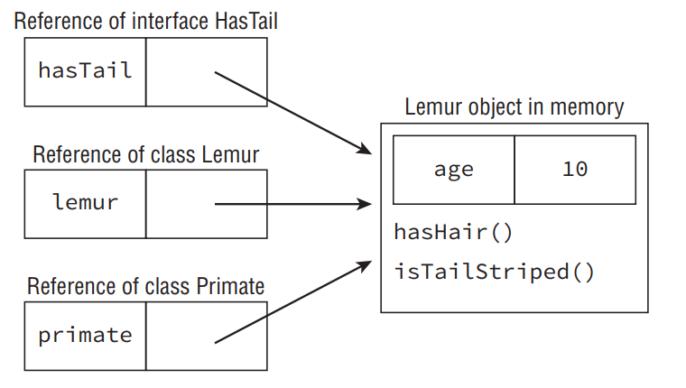

# Understanding Polymorphism

- Java supports polymorphism, the property of an object to take on many different forms. To put this more precisely, a Java object may be accessed using a reference with the same type as the object, a reference that is a superclass of the object, or a reference that defines an interface the object implements, either directly or through a superclass. Furthermore, a cast is not required if the object is being reassigned to a super type or interface of the object.

- Let’s illustrate this polymorphism property with the following example:

```java
public class Primate {
 public boolean hasHair() {
  return true;
 }
}
public interface HasTail {
 public boolean isTailStriped();
}
public class Lemur extends Primate implements HasTail {
 public boolean isTailStriped() {
  return false;
 }
 public int age = 10;
 public static void main(String[] args) {
  Lemur lemur = new Lemur();
  System.out.println(lemur.age);
  HasTail hasTail = lemur;
  System.out.println(hasTail.isTailStriped());
  Primate primate = lemur;
  System.out.println(primate.hasHair());
 }
}
```

- This code compiles and executes without issue and yields the following output:

```
10
false
true
```

- The most important thing to note about this example is that only one object, Lemur, is created and referenced. The ability of an instance of Lemur to be passed as an instance of an interface it implements, HasTail, as well as an instance of one of its superclasses, Primate, is the nature of polymorphism.

- Once the object has been assigned a new reference type, only the methods and variables available to that reference type are callable on the object without an explicit cast. For example, the following snippets of code will not compile:

```java
HasTail hasTail = lemur;
System.out.println(hasTail.age); // DOES NOT COMPILE
Primate primate = lemur;
System.out.println(primate.isTailStriped()); // DOES NOT COMPILE
```

- In this example, the reference hasTail has direct access only to methods defined with the HasTail interface; therefore, it doesn’t know the variable age is part of the object. Likewise, the reference primate has access only to methods defined in the Primate class, and it doesn’t have direct access to the isTailStriped() method.

## Object vs. Reference

- In Java, all objects are accessed by reference, so as a developer you never have direct access to the object itself. Conceptually, though, you should consider the object as the entity that exists in memory, allocated by the Java runtime environment. Regardless of the type of the reference you have for the object in memory, the object itself doesn’t change. For example, since all objects inherit java.lang.Object, they can all be reassigned to java.lang.Object, as shown in the following example:

```java
Lemur lemur = new Lemur();
Object lemurAsObject = lemur;
```

- Even though the Lemur object has been assigned a reference with a different type, the object itself has not changed and still exists as a Lemur object in memory. What has changed, then, is our ability to access methods within the Lemur class with the lemurAsObject reference. Without an explicit cast back to Lemur, as you’ll see in the next section, we no longer have access to the Lemur properties of the object.

- We can summarize this principle with the following two rules:
   - The type of the object determines which properties exist within the object in memory.
   - The type of the reference to the object determines which methods and variables are accessible to the Java program.

- It therefore follows that successfully changing a reference of an object to a new reference type may give you access to new properties of the object, but those properties existed before the reference change occurred.

- Let’s illustrate this property using the previous example in Figure below. As you can see in the figure, the same object exists in memory regardless of which reference is pointing to it. Depending on the type of the reference, we may only have access to certain methods. For example, the hasTail reference has access to the method isTailStriped() but doesn’t have access to the variable age defined in the Lemur class. As you’ll learn in the next section, it is possible to reclaim access to the variable age by explicitly casting the hasTail reference to a reference of type Lemur.

<div align="center">



</div>

## Casting Objects

- In the previous example, we created a single instance of a Lemur object and accessed it via superclass and interface references. Once we changed the reference type, though, we lost access to more specific methods defined in the subclass that still exist within the object. We can reclaim those references by casting the object back to the specific subclass it came from:

```java
Primate primate = lemur;
Lemur lemur2 = primate; // DOES NOT COMPILE
Lemur lemur3 = (Lemur)primate;
System.out.println(lemur3.age);
```

- In this example, we first try to convert the primate reference back to a lemur reference, lemur2, without an explicit cast. The result is that the code will not compile. In the second example, though, we explicitly cast the object to a subclass of the object Primate and we gain access to all the methods available to the Lemur class.

- Here are some basic rules to keep in mind when casting variables:
   - Casting an object from a subclass to a superclass doesn’t require an explicit cast.
   - Casting an object from a superclass to a subclass requires an explicit cast.
   - The compiler will not allow casts to unrelated types.
   - Even when the code compiles without issue, an exception may be thrown at runtime if the object being cast is not actually an instance of that class.

- The third rule is important; the exam may try to trick you with a cast that the compiler doesn’t allow. For example, we were able to cast a Primate reference to a Lemur reference, because Lemur is a subclass of Primate and therefore related.

- Consider this example:

```java
public class Bird {}
public class Fish {
 public static void main(String[] args) {
  Fish fish = new Fish();
  Bird bird = (Bird)fish; // DOES NOT COMPILE
 }
}
```

- In this example, the classes Fish and Bird are not related through any class hierarchy that the compiler is aware of; therefore, the code will not compile.

- Casting is not without its limitations. Even though two classes share a related hierarchy, that doesn’t mean an instance of one can automatically be cast to another. Here’s an example:

```java
public class Rodent {
}
public class Capybara extends Rodent {
 public static void main(String[] args) {
 Rodent rodent = new Rodent();
  Capybara capybara = (Capybara)rodent; // Throws ClassCastException at runtime
 }
}
```

- This code creates an instance of Rodent and then tries to cast it to a subclass of Rodent, Capybara. Although this code will compile without issue, it will throw a ClassCastException at runtime since the object being referenced is not an instance of the Capybara class. The thing to keep in mind in this example is the object that was created is not related to the Capybara class in any way.

- Although this topic is out of scope for the OCA exam, keep in mind that the instanceof operator can be used to check whether an object belongs to a particular class and to prevent ClassCastExceptions at runtime. Unlike the previous example, the following code snippet doesn’t throw an exception at runtime and performs the cast only if the instanceof operator returns true.

```java
if(rodent instanceof Capybara) {
 Capybara capybara = (Capybara)rodent;
}
```

- When reviewing a question on the exam that involves casting and polymorphism, be sure to remember what the instance of the object actually is. Then, focus on whether the compiler will allow the object to be referenced with or without explicit casts.

## Virtual Methods

- The most important feature of polymorphism—and one of the primary reasons we have class structure at all—is to support virtual methods. A virtual method is a method in which the specific implementation is not determined until runtime. In fact, all non-final, nonstatic, and non-private Java methods are considered virtual methods, since any of them can be overridden at runtime. What makes a virtual method special in Java is that if you call a method on an object that overrides a method, you get the overridden method, even if the call to the method is on a parent reference or within the parent class.

- We’ll illustrate this principle with the following example:

```java
public class Bird {
 public String getName() {
  return "Unknown";
 }
 public void displayInformation() {
  System.out.println("The bird name is: "+getName());
 }
}
public class Peacock extends Bird {
 public String getName() {
  return "Peacock";
 }
 public static void main(String[] args) {
  Bird bird = new Peacock();
  bird.displayInformation();
 }
} 
```

- This code compiles and executes without issue and outputs the following:

```
The bird name is: Peacock
```

- As you saw in similar examples in the section “Overriding a Method,” the method getName() is overridden in the child class Peacock. More importantly, though, the value of the getName() method at runtime in the displayInformation() method is replaced with the value of the implementation in the subclass Peacock.

- In other words, even though the parent class Bird defines its own version of getName() and doesn’t know anything about the Peacock class during compile-time, at runtime the instance uses the overridden version of the method, as defined on the instance of the object. We emphasize this point by using a reference to the Bird class in the main() method, although the result would have been the same if a reference to Peacock was used.

- You now know the true purpose of overriding a method and how it relates to polymorphism. The nature of the polymorphism is that an object can take on many different forms. By combining your understanding of polymorphism with method overriding, you see that objects may be interpreted in vastly different ways at runtime, especially in methods defined in the superclasses of the objects.