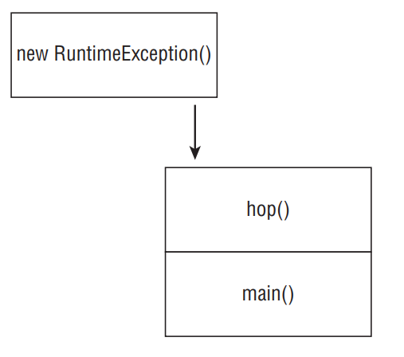

16. E
17. B
18. E. The code doesn’t compile because line 6 contains an incompatible override of the getNumberOfGills(int input) method defined in the Aquatic interface. In particular, int and String are not covariant returns types, since int is not a subclass of String. Note that line 5 compiles without issue; getNumberOfGills() is an overloaded method that is not related to the parent interface method that takes an int value.
19. A C F
20. A. The code compiles and runs without issue, so options C, D, and E are incorrect. The trick here is that the method fly() is marked as private in the parent class Bird, which means it may only be hidden, not overridden. With hidden methods, the specific method used depends on where it is referenced. Since it is referenced within the Bird class, the method declared on line 2 was used, and option A is correct. Alternatively, if the method was referenced within the Pelican class, or if the method in the parent class was marked as protected and overridden in the subclass, then the method on line 9 would have been used.

# Understanding Exceptions

- A program can fail for just about any reason. Here are just a few possibilities:
   - The code tries to connect to a website, but the Internet connection is down.
   - You made a coding mistake and tried to access an invalid index in an array.
   - One method calls another with a value that the method doesn’t support.

- As you can see, some of these are coding mistakes. Others are completely beyond your control. Your program can’t help it if the Internet connection goes down. What it can do is deal with the situation.

- First, we’ll look at the role of exceptions. Then we’ll cover the various types of exceptions, followed by an explanation of how to throw an exception in Java.

## The Role of Exceptions

- An exception is Java’s way of saying, “I give up. I don’t know what to do right now. You deal with it.” When you write a method, you can either deal with the exception or make it the calling code’s problem.

- As an example, think of Java as a child who visits the zoo. The happy path is when nothing goes wrong. The child continues to look at the animals until the program nicely ends. Nothing went wrong and there were no exceptions to deal with.

- This child’s younger sister doesn’t experience the happy path. In all the excitement she trips and falls. Luckily, it isn’t a bad fall. The little girl gets up and proceeds to look at more animals. She has handled the issue all by herself. Unfortunately, she falls again later in the day and starts crying. This time, she has declared she needs help by crying. The story ends well. Her daddy rubs her knee and gives her a hug. Then they go back to seeing more animals and enjoy the rest of the day.

- These are the two approaches Java uses when dealing with exceptions. A method can handle the exception case itself or make it the caller’s responsibility. You saw both in the trip to the zoo.

- You saw an exception in Chapter 1, “Java Building Blocks,” with a very simple Zoo example. You wrote a class that printed out the name of the zoo:

```java
1: public class Zoo {
2: public static void main(String[] args) {
3:  System.out.println(args[0]);
4:  System.out.println(args[1]);
5: } }
```

- Then you tried to call it without enough arguments:

```
$ javac Zoo.java
$ java Zoo Zoo
```

- On line 4, Java realized there’s only one element in the array and index 1 is not allowed. Java threw up its hands in defeat and threw an exception. It didn’t try to handle the exception. It just said, “I can’t deal with it” and the exception was displayed:

```
ZooException in thread "main"
java.lang.ArrayIndexOutOfBoundsException: 1
at mainmethod.Zoo.main(Zoo.java:7)
```

- Exceptions can and do occur all the time, even in solid program code. In our example, toddlers falling is a fact of life. When you write more advanced programs, you’ll need to deal with failures in accessing files, networks, and outside services. On the OCA exam, exceptions deal largely with mistakes in programs. For example, a program might try to access an invalid position in an array. The key point to remember is that exceptions alter the program flow.

- __Return Codes vs. Exceptions__: Exceptions are used when “something goes wrong.” However, the word “wrong” is subjective. The following code returns –1 instead of throwing an exception if no match is found:

```java
public int indexOf(String[] names, String name) {
 for (int i = 0; i < names.length; i++) {
  if (names[i].equals(name)) { return i; }
 }
 return -1;
}
```

- This approach is common when writing a method that does a search. For example, imagine being asked to find the name Joe in the array. It is perfectly reasonable that Joe might not appear in the array. When this happens, a special value is returned. An exception should be reserved for exceptional conditions like names being null.

- In general, try to avoid return codes. Return codes are commonly used in searches, so programmers are expecting them. In other methods, you will take your callers by surprise by returning a special value. An exception forces the program to deal with them or end with the exception if left unhandled, whereas a return code could be accidentally ignored and cause problems later in the program. An exception is like shouting, “Deal with me!”

## Understanding Exception Types

- As we’ve explained, an exception is an event that alters program flow. Java has a Throwable superclass for all objects that represent these events. Not all of them have the word exception in their classname, which can be confusing. Figure below shows the key subclasses of Throwable. 

<div align="center">


</div>

- Error means something went so horribly wrong that your program should not attempt to recover from it. For example, the disk drive “disappeared.” These are abnormal conditions that you aren’t likely to encounter.

- A runtime exception is defined as the RuntimeException class and its subclasses. Runtime exceptions tend to be unexpected but not necessarily fatal. For example, accessing an invalid array index is unexpected. Runtime exceptions are also known as unchecked exceptions.

- __Runtime vs. at the Time the Program is Run__: A runtime (unchecked) exception is a specific type of exception. All exceptions occur at the time that the program is run. (The alternative is compile time, which would be a compiler error.) People don’t refer to them as run time exceptions because that would be too easy to confuse with runtime! When you see runtime, it means unchecked.

- A checked exception includes Exception and all subclasses that do not extend RuntimeException. Checked exceptions tend to be more anticipated—for example, trying to read a file that doesn’t exist. 

- Checked exceptions? What are we checking? Java has a rule called the handle or declare rule. For checked exceptions, Java requires the code to either handle them or declare them in the method signature.

- For example, this method declares that it might throw an exception:

```java
void fall() throws Exception {
 throw new Exception();
}
```

- Notice that you’re using two different keywords here. throw tells Java that you want to throw an Exception. throws simply declares that the method might throw an Exception. It also might not. You will see the throws keyword more later in the chapter.

- Because checked exceptions tend to be anticipated, Java enforces that the programmer do something to show the exception was thought about. Maybe it was handled in the method. Or maybe the method declares that it can’t handle the exception and someone else should.

- An example of a runtime exception is a NullPointerException, which happens when you try to call a member on a null reference. This can occur in any method. If you had to declare runtime exceptions everywhere, every single method would have that clutter!

- __Checked vs. Unchecked (Runtime) Exceptions__: In the past, developers used checked exceptions more often than they do now. According to Oracle, they are intended for issues a programmer “might reasonably be expected to recover from.” Then developers started writing code where a chain of methods kept declaring the same exception and nobody actually handled it. Some libraries started using runtime exceptions for issues a programmer might reasonably be expected to recover from. Many programmers can hold a debate with you on which approach is better. For the OCA exam, you need to know the rules for how checked versus unchecked exceptions function. You don’t have to decide philosophically whether an exception should be checked or unchecked.

## Throwing an Exception

- Any Java code can throw an exception; this includes code you write. For the OCP exam, you’ll learn how to create your own exception classes. The OCA exam is limited to exceptions that someone else has created. Most likely, they will be exceptions that are provided with Java. You might encounter an exception that was made up for the exam. This is fine. The question will make it obvious that these are exceptions by having the classname end with exception. For example, “MyMadeUpException” is clearly an exception.

- On the exam, you will see two types of code that result in an exception. The first is code that’s wrong. For example:

```java
String[] animals = new String[0];
System.out.println(animals[0]);
```

- This code throws an ArrayIndexOutOfBoundsException. That means questions about exceptions can be hidden in questions that appear to be about something else.

- On the OCA exam, the vast majority of questions have a choice about not compiling and about throwing an exception. Pay special attention to code that calls a method on a null or that references an invalid array or ArrayList index. If you spot this, you know the correct answer is that the code throws an exception.

- The second way for code to result in an exception is to explicitly request Java to throw one. Java lets you write statements like these:

```java
throw new Exception();
throw new Exception("Ow! I fell.");
throw new RuntimeException();
throw new RuntimeException("Ow! I fell.");
```

- The throw keyword tells Java you want some other part of the code to deal with the exception. This is the same as the young girl crying for her daddy. Someone else needs to figure out what to do about the exception.

- When creating an exception, you can usually pass a String parameter with a message or you can pass no parameters and use the defaults. We say usually because this is a convention. Someone could create an exception class that does not have a constructor that takes a message. The first two examples create a new object of type Exception and throw it. The last two show that the code looks the same regardless of which type of exception you throw.

- These rules are very important. Be sure to closely study everything in Table below.

<div align="center">

| Type                | How to recognize                                   | Okay for program to catch? | Is program required to handle or declare? |
|---------------------|---------------------------------------------------|-----------------------------|-------------------------------------------|
| Runtime exception    | Subclass of RuntimeException                       | Yes                         | No                                        |
| Checked exception     | Subclass of Exception but not subclass of RuntimeException | Yes                         | Yes                                       |
| Error               | Subclass of Error                                  | No                          | No                                        |

</div>

# Using a try Statement

- Now that you know what exceptions are, let’s explore how to handle them. Java uses a try statement to separate the logic that might throw an exception from the logic to handle that exception. Figure below shows the syntax of a try statement.

<div align="center">


</div>

- The code in the try block is run normally. If any of the statements throw an exception that can be caught by the exception type listed in the catch block, the try block stops running and execution goes to the catch statement. If none of the statements in the try block throw an exception that can be caught, the catch clause is not run.

- You probably noticed the words “block” and “clause” used interchangeably. The exam does this as well, so we are getting you used to it. Both are correct. “Block” is correct because there are braces present. “Clause” is correct because they are part of a try statement.

- There aren’t a ton of syntax rules here. The curly braces are required for the try and catch blocks.

- In our example, the little girl gets up by herself the first time she falls. Here’s what this looks like:

```java
3: void explore() {
4:  try {
5:   fall();
6:   System.out.println("never get here");
7:  } catch (RuntimeException e) {
8:   getUp();
9:  }
10:  seeAnimals();
11: }
12: void fall() { throw new RuntimeException(); }
```

- First, line 5 calls the fall() method. Line 12 throws an exception. This means Java jumps straight to the catch block, skipping line 6. The girl gets up on line 8. Now the try statement is over and execution proceeds normally with line 10.

- Now let’s look at some invalid try statements that the exam might try to trick you with. Do you see what’s wrong with this one?

```java
try // DOES NOT COMPILE
 fall();
catch (Exception e)
 System.out.println("get up");
```

- The problem is that the braces are missing. It needs to look like this:

```java
try {
 fall();
} catch (Exception e) {
 System.out.println("get up");
}
```

- try statements are like methods in that the curly braces are required even if there is only one statement inside the code blocks. if statements and loops are special in this respect as they allow you to omit the curly braces.

```java
try {// DOES NOT COMPILE
 fall();
} 
```

- This code doesn’t compile because the try block doesn’t have anything after it. Remember, the point of a try statement is for something to happen if an exception is thrown. Without another clause, the try statement is lonely.

- Now that you know the basics, let’s start adding more features to exceptions. The following sections show you how to add a finally clause to a try statement and catch different types of exceptions and describe what happens if an exception is thrown in catch or finally.

## Adding a finally Block

- The try statement also lets you run code at the end with a finally clause regardless of whether an exception is thrown. Figure below shows the syntax of a try statement with this extra functionality.

<div align="center">


</div>

- There are two paths through code with both a catch and a finally. If an exception is thrown, the finally block is run after the catch block. If no exception is thrown, the finally block is run after the try block completes.

- Let’s go back to our young girl example, this time with finally:

```java
12: void explore() {
13:  try {
14:   seeAnimals();
15:   fall();
16:  } catch (Exception e) {
17:   getHugFromDaddy();
18:  } finally {
19:   seeMoreAnimals();
20:  }
21:  goHome();
22: }
```

- The girl falls on line 15. If she gets up by herself, the code goes on to the finally block and runs line 19. Then the try statement is over and the code proceeds on line 21. If the girl doesn’t get up by herself, she throws an exception. The catch block runs and she gets a hug on line 17. Then the try statement is over and the code proceeds on line 21. Either way, the ending is the same. The finally block is executed and the try statement ends.

- On the OCA exam, a try statement must have catch and/or finally. Having both is fine. Having neither is a problem. On the OCP exam, you’ll learn about a special syntax for a try statement called try-with-resources that allows neither a catch nor a finally block. On the OCA exam, you get to assume a try statement is just a regular try statement and not a try-with-resources statement.

- The exam will try to trick you with missing clauses or clauses in the wrong order. Do you see why the following do or do not compile?

```java
25: try { // DOES NOT COMPILE
26:  fall();
27: } finally {
28:  System.out.println("all better");
29: } catch (Exception e) {
30:  System.out.println("get up");
31: }
32:
33: try { // DOES NOT COMPILE
34:  fall();
35: }
36:
37: try {
38:  fall();
39: } finally {
40:  System.out.println("all better");
41: }
```

- The first example (lines 25–31) does not compile because the catch and finally blocks are in the wrong order. The second example (lines 33–35) does not compile because there must be a catch or finally block. The third example (lines 37–41) is just fine. catch is not required if finally is present.

- One problem with finally is that any realistic uses for it are out of the scope of the OCA exam. finally is typically used to close resources such as files or databases—both of which are topics on the OCP exam. This means most of the examples you encounter on the OCA exam with finally are going to look contrived. For example, you’ll get asked questions such as what this code outputs:

```java
String s = "";
try {
 s += "t";
} catch(Exception e) {
 s += "c";
} finally {
 s += "f";
}
s += "a";
System.out.print(s);
```

- The answer is tfa. The try block is executed. Since no exception is thrown, Java goes straight to the finally block. Then the code after the try statement is run. We know; this is a silly example. Expect to see examples like this on the OCA exam.

-__System.exit__: There is one exception to “the finally block always runs after the catch block” rule: Java defines a method that you call as System.exit(0);. The integer parameter is the error code that gets returned. System.exit tells Java, “Stop. End the program right now. Do not pass go. Do not collect $200.” When System.exit is called in the try or catch block, finally does not run.

## Catching Various Types of Exceptions

- So far, you have been catching only one type of exception. Now let’s see what happens when different types of exceptions can be thrown from the same method. 

- Creating your own exceptions is not on the OCA exam, but it is on the OCP exam. However, the OCA exam can define basic exceptions to show you the hierarchy. You only need to do two things with this information. First, you must be able to recognize if the exception is a checked or an unchecked exception. Second, you need to determine if any of the exceptions are subclasses of the others.

```java
class AnimalsOutForAWalk extends RuntimeException { }
class ExhibitClosed extends RuntimeException { }
class ExhibitClosedForLunch extends ExhibitClosed { }
```

- In this example, there are three custom exceptions. All are unchecked exceptions because they directly or indirectly extend RuntimeException. Now we catch both types of exceptions and handle them by printing out the appropriate message: 

```java
public void visitPorcupine() {
 try {
  seeAnimal();
 } catch (AnimalsOutForAWalk e) {// first catch block
 System.out.print("try back later");
 } catch (ExhibitClosed e) {// second catch block
 System.out.print("not today");
 }
}
```

- There are three possibilities for when this code is run. If seeAnimal() doesn’t throw an exception, nothing is printed out. If the animal is out for a walk, only the first catch block runs. If the exhibit is closed, only the second catch block runs.

- A rule exists for the order of the catch blocks. Java looks at them in the order they appear. If it is impossible for one of the catch blocks to be executed, a compiler error about unreachable code occurs. This happens when a superclass is caught before a subclass. Remember, we warned you to pay attention to any subclass exceptions.

- In the porcupine example, the order of the catch blocks could be reversed because the exceptions don’t inherit from each other. And yes, we have seen a porcupine be taken for a walk on a leash.

- The following example shows exception types that do inherit from each other: 

```java
public void visitMonkeys() {
 try {
  seeAnimal();
 } catch (ExhibitClosedForLunch e) {// subclass exception
  System.out.print("try back later");
 } catch (ExhibitClosed e) {// superclass exception
  System.out.print("not today");
 }
}
```

- If the more specific ExhibitClosedForLunch exception is thrown, the first catch block runs. If not, Java checks if the superclass ExhibitClosed exception is thrown and catches it. This time, the order of the catch blocks does matter. The reverse does not work.

```java
public void visitMonkeys() {
 try {
  seeAnimal();
 } catch (ExhibitClosed e) {
  System.out.print("not today");
 } catch (ExhibitClosedForLunch e) {// DOES NOT COMPILE
  System.out.print("try back later");
 }
}
```

- This time, if the more specific ExhibitClosedForLunch exception is thrown, the catch block for ExhibitClosed runs—which means there is no way for the second catch block to ever run. Java correctly tells us there is an unreachable catch block.

- Let’s try this one more time. Do you see why this code doesn’t compile?

```java
public void visitSnakes() {
 try {
  seeAnimal();
 } catch (RuntimeException e) {
  System.out.print("runtime exception");
 } catch (ExhibitClosed e) {// DOES NOT COMPILE
  System.out.print("not today");
 } catch (Exception e) {
  System.out.print("exception");
 }
}
```

- It’s the same problem. ExhibitClosed is a RuntimeException. If it is thrown, the first catch block takes care of it, making sure there no way to get to the second catch block.

- To review catching multiple exceptions, remember that at most one catch block will run and it will be the first catch block that can handle it.

## Throwing a Second Exception

- So far, we’ve limited ourselves to one try statement in each example. However, a catch or finally block can have any valid Java code in it—including another try statement.

- Even though the topic of reading files is on the OCP exam, the OCA exam may ask you about exception handling with those classes. This is actually a gift. When you see such a question, you know the problem has to be about basic Java syntax or exception handling!

- The following code tries to read a file:

```java
16: public static void main(String[] args) {
17:  FileReader reader = null;
18:  try {
19:   reader = read();
20:  } catch (IOException e) {
21:   try {
22:    if (reader != null) reader.close();
23:   } catch (IOException inner) {
24:   }
25:  }
26: }
27: private static FileReader read() throws IOException {
28: // CODE GOES HERE
29: }
```

- The easiest case is if line 28 doesn’t throw an exception. Then the entire catch block on lines 20–25 is skipped. Next, consider if line 28 throws a NullPointerException. That isn’t an IOException, so the catch block on lines 20–25 will still be skipped.

- If line 28 does throw an IOException, the catch block on lines 20–25 does get run. Line 22 tries to close the reader. If that goes well, the code completes and the main() method ends normally. If the close() method does throw an exception, Java looks for more catch blocks. There aren’t any, so the main method throws that new exception. Regardless, the exception on line 28 is handled. A different exception might be thrown, but the one from line 28 is done.

- Most of the examples you see with exception handling on the exam are abstract. They use letters or numbers to make sure you understand the flow. This one shows that only the last exception to be thrown matters. (This is true for the OCA exam. It will change a bit on the OCP exam.)

```java
26: try {
27:  throw new RuntimeException();
28: } catch (RuntimeException e) {
29:  throw new RuntimeException();
30: } finally {
31:  throw new Exception();
32: }
```

- Line 27 throws an exception, which is caught on line 28. The catch block then throws an exception on line 29. If there were no finally block, the exception from line 29 would be thrown. However, the finally block runs after the try block. Since the finally block throws an exception of its own on line 31, this one gets thrown. The exception from the catch block gets forgotten about. This is why you often see another try/catch inside a finally block—to make sure it doesn’t mask the exception from the catch block.

- Next we are going to show you the hardest example you can be asked related to exceptions. What do you think this method returns? Go slowly. It’s tricky.

```java
30: public String exceptions() {
31:  String result = "";
32:  String v = null;
33:  try {
34:   try {
35:    result += "before";
36:    v.length();
37:    result += "after";
38:   } catch (NullPointerException e) {
39:    result += "catch";
40:    throw new RuntimeException();
41:   } finally {
42:    result += "finally";
43:    throw new Exception();
44:   }
45:  } catch (Exception e) {
46:   result += "done";
47:  }
48:  return result;
49: }
```

- The correct answer is before catch finally done. Everything is normal up until line 35, when "before" is added. Line 36 throws a NullPointerException. Line 37 is skipped as Java goes straight to the catch block. Line 38 does catch the exception, and "catch" is added on line 39. Then line 40 throws a RuntimeException. The finally block runs after the catch regardless of whether an exception is thrown; it adds "finally" to result. At this point, we have completed the inner try statement that ran on lines 34–44. The outer catch block then sees an exception was thrown and catches it on line 45; it adds "done" to result.

# Recognizing Common Exception Types

- You need to recognize three types of exceptions for the OCA exam: runtime exceptions, checked exceptions, and errors. We’ll look at common examples of each type. For the exam, you’ll need to recognize which type of an exception it is and whether it’s thrown by the JVM or a programmer. So you can recognize them, we’ll show you some code examples for those exceptions.

## Runtime Exceptions

- Runtime exceptions extend RuntimeException. They don’t have to be handled or declared. They can be thrown by the programmer or by the JVM. Common runtime exceptions include the following:
   - __ArithmeticException__ Thrown by the JVM when code attempts to divide by zero
   - __ArrayIndexOutOfBoundsException__ Thrown by the JVM when code uses an illegal index to access an array
   - __ClassCastException__ Thrown by the JVM when an attempt is made to cast an exception to a subclass of which it is not an instance
   - __IllegalArgumentException__ Thrown by the programmer to indicate that a method has been passed an illegal or inappropriate argument
   - __NullPointerException__ Thrown by the JVM when there is a null reference where an object is required
   - __NumberFormatException__ Thrown by the programmer when an attempt is made to convert a string to a numeric type but the string doesn’t have an appropriate format

### ArithmeticException

- Trying to divide an int by zero gives an undefined result. When this occurs, the JVM will throw an ArithmeticException:

```java
int answer = 11 / 0;
```

- Running this code results in the following output:

```
Exception in thread "main" java.lang.ArithmeticException: / by zero
```

- Java doesn’t spell out the word “divide.” That’s okay, though, because we know that / is the division operator and that Java is trying to tell us division by zero occurred.

- The thread "main" is telling us the code was called directly or indirectly from a program with a main method. On the OCA exam, this is all the output we will see. Next comes the name of the exception, followed by extra information (if any) that goes with the exception.

### ArrayIndexOutOfBoundsException

- You know by now that array indexes start with 0 and go up to 1 less than the length of the array—which means this code will throw an ArrayIndexOutOfBoundsException:

```java
int[] countsOfMoose = new int[3];
System.out.println(countsOfMoose[-1]); 
```

- This is a problem because there’s no such thing as a negative array index. Running this code yields the following output:

```
Exception in thread "main" java.lang.ArrayIndexOutOfBoundsException: -1
```

- At least Java tells us what index was invalid. Can you see what’s wrong with this one?

```java
int total = 0;
int[] countsOfMoose = new int[3];
for (int i = 0; i <= countsOfMoose.length; i++)
 total += countsOfMoose[i]; 
```

- The problem is that the for loop should have < instead of <=. On the final iteration of the loop, Java tries to call countsOfMoose[3], which is invalid. The array includes only three elements, making 2 the largest possible index. The output looks like this:

```
Exception in thread "main" java.lang.ArrayIndexOutOfBoundsException: 3
```

### ClassCastException

- Java tries to protect you from impossible casts. This code doesn’t compile because Integer is not a subclass of String:

```java
String type = "moose";
Integer number = (Integer) type; // DOES NOT COMPILE
```

- More complicated code thwarts Java’s attempts to protect you. When the cast fails at runtime, Java will throw a ClassCastException:

```java
String type = "moose";
Object obj = type;
Integer number = (Integer) obj; 
```

- The compiler sees a cast from Object to Integer. This could be okay. The compiler doesn’t realize there’s a String in that Object. When the code runs, it yields the following output:

```
Exception in thread "main" java.lang.ClassCastException: java.lang.String cannot be cast to java.lang.Integer
```

- Java tells us both types that were involved in the problem, making it apparent what’s wrong.

### IllegalArgumentException

- IllegalArgumentException is a way for your program to protect itself. We first saw the following setter method in the Swan class in Chapter 4, “Methods and Encapsulation.”

```java
6: public void setNumberEggs(int numberEggs) {// setter
7:  if (numberEggs >= 0) // guard condition
8:   this.numberEggs = numberEggs;
9: }
```

- This code works, but we don’t really want to ignore the caller’s request when they tell us a Swan has –2 eggs. We want to tell the caller that something is wrong—preferably in a very obvious way that the caller can’t ignore so that the programmer will fix the problem. Exceptions are an efficient way to do this. Seeing the code end with an exception is a great reminder that something is wrong:

```java
public static void setNumberEggs(int numberEggs) {
 if (numberEggs < 0)
  throw new IllegalArgumentException("# eggs must not be negative");
 this.numberEggs = numberEggs;
}
```

- The program throws an exception when it’s not happy with the parameter values. The output looks like this:

```
Exception in thread "main" java.lang.IllegalArgumentException: # eggs must not be negative
```

- Clearly this is a problem that must be fixed if the programmer wants the program to do anything useful.

### NullPointerException

- Instance variables and methods must be called on a non-null reference. If the reference is null, the JVM will throw a NullPointerException. It’s usually subtle, such as this example, which checks whether you remember instance variable references default to null.

```java
String name;
public void printLength() throws NullPointerException {
 System.out.println(name.length());
}
```

- Running this code results in this output:

```
Exception in thread "main" java.lang.NullPointerException
```

### NumberFormatException

- Java provides methods to convert strings to numbers. When these are passed an invalid value, they throw a NumberFormatException. The idea is similar to IllegalArgumentException. Since this is a common problem, Java gives it a separate class. In fact, NumberFormatException is a subclass of IllegalArgumentException. Here’s an example of trying to convert something non-numeric into an int:

```java
Integer.parseInt("abc");
```

- The output looks like this:

```
Exception in thread "main" java.lang.NumberFormatException: For input string: "abc"
```

## Checked Exceptions

- Checked exceptions have Exception in their hierarchy but not RuntimeException. They must be handled or declared. They can be thrown by the programmer or by the JVM. Common runtime exceptions include the following:
   - __FileNotFoundException__ Thrown programmatically when code tries to reference a file that does not exist
   - __IOException__ Thrown programmatically when there’s a problem reading or writing a file

- For the OCA exam, you only need to know that these are checked exceptions. Also keep in mind that FileNotFoundException is a subclass of IOException, although the exam will remind you of that fact if it comes up. You’ll see these two exceptions in more detail on the OCP exam.

## Errors

- Errors extend the Error class. They are thrown by the JVM and should not be handled or declared. Errors are rare, but you might see these:
   - __ExceptionInInitializerError__ Thrown by the JVM when a static initializer throws an exception and doesn’t handle it
   - __StackOverflowError__ Thrown by the JVM when a method calls itself too many times (this is called infinite recursion because the method typically calls itself without end)
   - __NoClassDefFoundError__ Thrown by the JVM when a class that the code uses is available at compile time but not runtime

### ExceptionInInitializerError

- Java runs static initializers the first time a class is used. If one of the static initializers throws an exception, Java can’t start using the class. It declares defeat by throwing an ExceptionInInitializerError. This code shows an ArrayIndexOutOfBounds in a static initializer:

```java
static {
 int[] countsOfMoose = new int[3];
 int num = countsOfMoose[-1];
}
public static void main(String[] args) { }
```

- This code yields information about two exceptions:

```
Exception in thread "main" java.lang.ExceptionInInitializerError
Caused by: java.lang.ArrayIndexOutOfBoundsException: -1
```

- We get the ExceptionInInitializerError because the error happened in a static initializer. That information alone wouldn’t be particularly useful in fixing the problem. Therefore, Java also tells us the original cause of the problem: the ArrayIndexOutOfBoundsException that we need to fix.

- The ExceptionInInitializerError is an error because Java failed to load the whole class. This failure prevents Java from continuing.

### StackOverflowError

- When Java calls methods, it puts parameters and local variables on the stack. After doing this a very large number of times, the stack runs out of room and overflows. This is called a StackOverflowError. Most of the time, this error occurs when a method calls itself.

```java
public static void doNotCodeThis(int num) {
 doNotCodeThis(1);
}
```

- The output contains this line:

```
Exception in thread "main" java.lang.StackOverflowError
```

- Since the method calls itself, it will never end. Eventually, Java runs out of room on the stack and throws the error. This is called infinite recursion. It is better than an infinite loop because at least Java will catch it and throw the error. With an infinite loop, Java just uses all your CPU until you can kill it.

### NoClassDefFoundError

- This error won’t show up in code on the exam—you just need to know that it is an error. NoClassDefFoundError occurs when Java can’t find the class at runtime.

# Calling Methods That Throw Exceptions

- When you’re calling a method that throws an exception, the rules are the same as within a method. Do you see why the following doesn’t compile?

```java
class NoMoreCarrotsException extends Exception {}
public class Bunny {
 public static void main(String[] args) {
  eatCarrot();// DOES NOT COMPILE
 }
 private static void eatCarrot() throws NoMoreCarrotsException {
 }
}
```

- The problem is that NoMoreCarrotsException is a checked exception. Checked exceptions must be handled or declared. The code would compile if we changed the main() method to either of these:

```java
public static void main(String[] args)
 throws NoMoreCarrotsException {// declare exception
 eatCarrot();
}
public static void main(String[] args) {
 try {
  eatCarrot();
 } catch (NoMoreCarrotsException e ) {// handle exception
  System.out.print("sad rabbit");
 }
}
```

- You might have noticed that eatCarrot() didn’t actually throw an exception; it just declared that it could. This is enough for the compiler to require the caller to handle or declare the exception.

- The compiler is still on the lookout for unreachable code. Declaring an unused exception isn’t considered unreachable code. It gives the method the option to change the implementation to throw that exception in the future. Do you see the issue here?

```java
public void bad() {
 try {
  eatCarrot();
 } catch (NoMoreCarrotsException e ) {// DOES NOT COMPILE
  System.out.print("sad rabbit");
 }
}
public void good() throws NoMoreCarrotsException {
 eatCarrot();
}
private static void eatCarrot() { }
```

- Java knows that eatCarrot() can’t throw a checked exception—which means there’s no way for the catch block in bad() to be reached. In comparison, good() is free to declare other exceptions.

## Subclasses

- Now that you have a deeper understanding of exceptions, let’s look at overriding methods with exceptions in the method declaration. When a class overrides a method from a superclass or implements a method from an interface, it’s not allowed to add new checked exceptions to the method signature. For example, this code isn’t allowed:

```java
class CanNotHopException extends Exception { }
class Hopper {
 public void hop() { }
}
class Bunny extends Hopper {
 public void hop() throws CanNotHopException { } // DOES NOT COMPILE
}
```

- Java knows hop() isn’t allowed to throw any checked exceptions because the superclass Hopper doesn’t declare any. Imagine what would happen if subclasses could add checked exceptions—you could write code that calls Hopper’s hop() method and not handle any exceptions. Then if Bunny was used in its place, the code wouldn’t know to handle or declare CanNotHopException.

- A subclass is allowed to declare fewer exceptions than the superclass or interface. This is legal because callers are already handling them.

```java
class Hopper {
 public void hop() throws CanNotHopException { }
}
class Bunny extends Hopper {
 public void hop() { }
}
```

- A subclass not declaring an exception is similar to a method declaring it throws an exception that it never actually throws. This is perfectly legal. 

- Similarly, a class is allowed to declare a subclass of an exception type. The idea is the same. The superclass or interface has already taken care of a broader type. Here’s an example:

```java
class Hopper {
 public void hop() throws Exception { }
}
class Bunny extends Hopper {
 public void hop() throws CanNotHopException { }
}
```

- Bunny could declare that it throws Exception directly, or it could declare that it throws a more specific type of Exception. It could even declare that it throws nothing at all.

- This rule applies only to checked exceptions. The following code is legal because it has a runtime exception in the subclass’s version:

```java
class Hopper {
 public void hop() { }
}
class Bunny extends Hopper {
 public void hop() throws IllegalStateException { }
}
```

- The reason that it’s okay to declare new runtime exceptions in a subclass method is that the declaration is redundant. Methods are free to throw any runtime exceptions they want without mentioning them in the method declaration.

## Printing an Exception

- There are three ways to print an exception. You can let Java print it out, print just the message, or print where the stack trace comes from. This example shows all three approaches:

```java
5: public static void main(String[] args) {
6:  try {
7:   hop();
8:  } catch (Exception e) {
9:   System.out.println(e);
10:   System.out.println(e.getMessage());
11:   e.printStackTrace();
12:  }
13: }
14: private static void hop() {
15:  throw new RuntimeException("cannot hop");
16: }
```

- This code results in the following output:

```
java.lang.RuntimeException: cannot hop
cannot hop
java.lang.RuntimeException: cannot hop
at trycatch.Handling.hop(Handling.java:15)
at trycatch.Handling.main(Handling.java:7)
```

- The first line shows what Java prints out by default: the exception type and message. The second line shows just the message. The rest shows a stack trace.

- The stack trace is usually the most helpful one because it shows where the exception occurred in each method that it passed through. On the OCA exam, you will mostly see the first approach. This is because the exam often shows code snippets.

- The stack trace shows all the methods on the stack. Figure below shows what the stack looks like for this code. Every time you call a method, Java adds it to the stack until it completes. When an exception is thrown, it goes through the stack until it finds a method that can handle it or it runs out of stack.

<div align="center">



</div>

- __Why Swallowing Exception Is Bad__: Because checked exceptions require you to handle or declare them, there is a temptation to catch them so they “go away.” But doing so can cause problems. In the following code, there’s a problem reading in the file:


```java
public static void main(String[] args) {
 String textInFile = null;
 try {
  readInFile();
 } catch (IOException e) {
 // ignore exception
 }
 // imagine many lines of code here
 System.out.println(textInFile.replace(" ", ""));
}
private static void readInFile() throws IOException {
 throw new IOException();
}
```

- The code results in a NullPointerException. Java doesn’t tell you anything about the original IOException because it was handled. Granted, it was handled poorly, but it was handled.

- When writing your own code, print out a stack trace or at least a message when catching an exception. Also, consider whether continuing is the best course of action. In our example, the program can’t do anything after it fails to read in the file. It might as well have just thrown the IOException.

# Summary

- An exception indicates something unexpected happened. A method can handle an exception by catching it or declaring it for the caller to deal with. Many exceptions are thrown by Java libraries. You can throw your own exception with code such as throw new Exception().

- Subclasses of java.lang.Error are exceptions that a programmer should not attempt to handle. Subclasses of java.lang.RuntimeException are runtime (unchecked) exceptions. Subclasses of java.lang.Exception, but not java.lang.RuntimeException are checked exceptions. Java requires checked exceptions to be handled or declared.

- If a try statement has multiple catch blocks, at most one catch block can run. Java looks for an exception that can be caught by each catch block in the order they appear, and the first match is run. Then execution continues after the try statement. If both catch and finally throw an exception, the one from finally gets thrown.

- Common runtime exceptions include:
   - ArithmeticException
   - ArrayIndexOutOfBoundsException
   - ClassCastException
   - IllegalArgumentException
   - NullPointerException
   - NumberFormatException

- IllegalArgumentException and NumberFormatException are typically thrown by the programmer, whereas the others are typically thrown by the JVM.

- Common checked exceptions include:
   - IOException
   - FileNotFoundException

- Common errors include:
   - ExceptionInInitializerError
   - StackOverflowError
   - NoClassDefFoundError

- When a method overrides a method in a superclass or interface, it is not allowed to add checked exceptions. It is allowed to declare fewer exceptions or declare a subclass of a declared exception. Methods declare exceptions with the keyword throws.

# Exam Essentials

- Differentiate between checked and unchecked exceptions. Unchecked exceptions are also known as runtime exceptions and are subclasses of java.lang.RuntimeException. All other subclasses of java.lang.Exception are checked exceptions.

- Understand the flow of a try statement. A try statement must have a catch or a finally block. Multiple catch blocks are also allowed, provided no superclass exception type appears in an earlier catch block than its subclass. The finally block runs last regardless of whether an exception is thrown.

- Identify whether an exception is thrown by the programmer or the JVM. Illegal ArgumentException and NumberFormatException are commonly thrown by the programmer. Most of the other runtime exceptions are typically thrown by the JVM.

- Declare methods that declare exceptions. The throws keyword is used in a method declaration to indicate an exception might be thrown. When overriding a method, the method is allowed to throw fewer exceptions than the original version.

- Recognize when to use throw versus throws. The throw keyword is used when you actually want to throw an exception—for example, throw new RuntimeException(). The throws keyword is used in a method declaration.