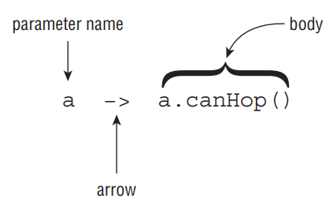
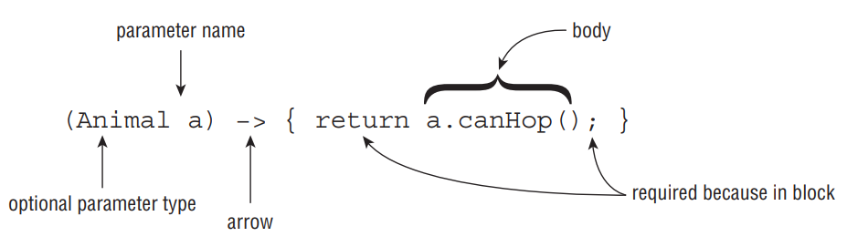

#### Understanding Lambda Syntax

The syntax of lambda expressions is tricky because many parts are optional. These two lines are equivalent and do the exact same thing:

```java
a -> a.canHop()
(Animal a) -> { return a.canHop(); }
```

Let’s look at what is going on here. The left side of the arrow operator -> indicates the input parameters for the lambda expression. It can be consumed by a functional interface whose abstract method has the same number of parameters and compatible data types. The right side is referred to as the body of the lambda expression. It can be consumed by a functional interface whose abstract method returns a compatible data type.

Since the syntax of these two expressions is a bit different, let’s look at them more closely. The first example, shown in Figure below, has three parts:
   - We specify a single parameter with the name a.
   - The arrow operator → separates the parameter from the body.
   - The body calls a single method and returns the result of that method.

<div align="center">



</div>

The second example also has three parts, as shown in Figure below; it’s just more verbose:
   - We specify a single parameter with the name a and state that the type is Animal, wrapping the input parameters in parentheses ().
   - The arrow operator −> separates the parameter from the body.
   - The body has one or more lines of code, including braces {}, a semicolon ;, and a return statement.

<div align="center">



</div>

The parentheses () can be omitted in a lambda expression if there is exactly one input parameter and the type is not explicitly stated in the expression. This means that expressions that have zero or more than one input parameter will still require parentheses. For example, the following are all valid lambda expressions, assuming that there are valid functional interfaces that can consume them:

```java
() -> new Duck()
d -> {return d.quack();}
(Duck d) -> d.quack()
(Animal a, Duck d) -> d.quack()
Duck d -> d.quack() // DOES NOT COMPILE
a,d -> d.quack() // DOES NOT COMPILE
Animal a, Duck d -> d.quack() // DOES NOT COMPILE
```

#### Spotting Invalid Lambdas

Next, you see that Figure above has a pair of statement braces {} around the body of the lambda expression. This allows you to write multiple lines of code in the body of the lambda expression, as you might do when working with an if statement or while loop. What’s tricky here is that when you add braces {}, you must explicitly terminate each statement in the body with a semicolon;.

In Figure above, we were able to omit the braces {}, semi‐colon;, and return statement, because this is a special shortcut that Java allows for single‐line lambda bodies. This special shortcut doesn’t work when you have two or more statements. At least this is consistent with using {} to create blocks of code elsewhere in Java. When using {} in the body of the lambda expression, you must use the return statement if the functional interface method that lambda implements returns a value. Alternatively, a return statement is optional when the return type of the method is void.

```java
() -> true // 0 parameters
a -> {return a.startsWith("test");} // 1 parameter
(String a) -> a.startsWith("test") // 1 parameter
(int x) -> {} // 1 parameter
(int y) -> {return;} // 1 parameter

(a, b) -> a.startsWith("test") // 2 parameters
(String a, String b) -> a.startsWith("test") // 2 parameters

a, b -> a.startsWith("test") // DOES NOT COMPILE
c -> return 10; // DOES NOT COMPILE
a -> { return a.startsWith("test") } // DOES NOT COMPILE

(a, b) -> a.startsWith("test")
c -> { return 10; }
a -> { return a.startsWith("test"); }

// When one parameter has a data type listed, though, all parameters must provide a data type

(int y, z) -> {int x=1; return y+10; } // DOES NOT COMPILE
(String s, z) -> { return s.length()+z; } // DOES NOT COMPILE
(a, Animal b, c) -> a.getName() // DOES NOT COMPILE

(y, z) -> {int x=1; return y+10; }
(String s, int z) -> { return s.length()+z; }
(a, b, c) -> a.getName()
```

There is one more issue you might see with lambdas. We’ve been defining an argument list in our lambda expressions. Since Java doesn’t allow us to re‐declare a local variable, the following is an issue:

```java
(a, b) -> { int a = 0; return 5;} // DOES NOT COMPILE
```

We tried to re‐declare a, which is not allowed. By contrast, the following line is permitted because it uses a different variable name:

```java
(a, b) -> { int c = 0; return 5;}
```

### Applying the Predicate Interface

```java
public interface CheckTrait {
    public boolean test(Animal a);
}

public interface Predicate<T> {
    public boolean test(T t);
}
```

That looks a lot like our method. The only difference is that it uses type T instead of Animal. As you may remember from your OCA studies, this is the syntax for an interface that uses a generic type. If you’re a bit out of practice with generics, don’t worry. We’ll be reviewing generics in more detail in Chapter 3.

The result of using Predicate is that we no longer need our own functional interface. The following is a rewrite of our program to use the Predicate class:

```java
import java.util.function.Predicate;
public class FindMatchingAnimals {
    private static void print(Animal animal, Predicate<Animal> trait) {
        if(trait.test(animal))
            System.out.println(animal);
    }
    public static void main(String[] args) {
        print(new Animal("fish", false, true), a -> a.canHop());
        print(new Animal("kangaroo", true, false), a -> a.canHop());
    }
}
```

This is very similar to our original program, except that we wrote it with one less interface. As you will see in Chapter 3 when we work with collections, as well as throughout the book, Java 8 integrates the Predicate interface into a variety of methods and APIs. In Chapter 4, we will be presenting lambda expressions based on interfaces that take other inputs and return other data types besides boolean.

## Implementing Polymorphism

Polymorphism is the ability of a single interface to support multiple underlying forms. In Java, this allows multiple types of objects to be passed to a single method or class.

```java
public interface LivesInOcean { public void makeSound(); }
public class Dolphin implements LivesInOcean {
    public void makeSound() { System.out.println("whistle"); }
}
public class Whale implements LivesInOcean {
    public void makeSound() { System.out.println("sing"); }
}
public class Oceanographer {
    public void checkSound(LivesInOcean animal) {
        animal.makeSound();
}
    public void main(String[] args) {
        Oceanographer o = new Oceanographer();
        o.checkSound(new Dolphin());
        o.checkSound(new Whale());
}
}
```

In this sample code, our Oceanographer class includes a method named checkSound() that is capable of accepting any object whose class implements the LivesInOcean interface. We can also create new objects, such as Fish or Lobster, that also implement the LivesInOcean interface and that would be compatible with our Oceanographer class.

Polymorphism also allows one object to take on many different forms. As you may remember from studying for the OCA exam, a Java object may be accessed using a reference with the same type as the object, a reference that is a superclass of the object, or a reference that defines an interface that the object implements, either directly or through a superclass. Furthermore, a cast is not required if the object is being reassigned to a supertype or interface of the object.

```java
public class Primate {
    public boolean hasHair() {
        return true;
    }
}

public interface HasTail {
    public boolean isTailStriped();
}

public class Lemur extends Primate implements HasTail {
    public int age = 10;

    public boolean isTailStriped() {
        return false;
    }

    public static void main(String[] args) {
        Lemur lemur = new Lemur();
        System.out.println(lemur.age);

        HasTail hasTail = lemur;
        System.out.println(hasTail.isTailStriped());

        Primate primate = lemur;
        System.out.println(primate.hasHair());
}
}
```

The most important thing to note about this example is that only one object, Lemur, is created and referenced. The ability of the Lemur object to be passed as an instance of an interface it implements, HasTail, as well as an instance of one of its superclasses, Primate, is the nature of polymorphism.

If you use a variable to refer to an object, then only the methods or variables that are part of the variable’s reference type can be called without an explicit cast. For example, the following snippets of code will not compile:

```java
HasTail hasTail = lemur;
System.out.println(hasTail.age); // DOES NOT COMPILE

Primate primate = lemur;
System.out.println(primate.isTailStriped()); // DOES NOT COMPILE
```

In this example, the reference hasTail has direct access only to methods defined with the HasTail interface; therefore, it doesn’t know that the variable age is part of the object. Likewise, the reference primate has access only to methods defined in the Primate class, and it doesn’t have direct access to the isTailStriped() method.