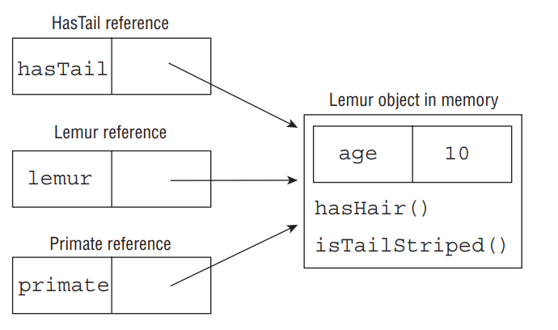

### Distinguishing between an Object and a Reference

In Java, all objects are accessed by reference, so as a developer you never have direct access to the memory of the object itself. Conceptually, though, you should consider the object as the entity that exists in memory, allocated by the Java runtime environment. Regardless of the type of the reference that you have for the object in memory, the object itself doesn’t change. For example, since all objects inherit java.lang.Object, they can all be reassigned to java.lang.Object, as shown in the following example:

```java
Lemur lemur = new Lemur();
Object lemurAsObject = lemur;
```

Even though the Lemur object has been assigned a reference with a different type, the object itself has not changed and still exists as a Lemur object in memory. What has changed, then, is our ability to access methods within the Lemur class with the lemurAsObject reference. Without an explicit cast back to Lemur, as you’ll see in the next section, we no longer have access to the Lemur properties of the object.

We can summarize this principle with the following two rules:
   - The type of the object determines which properties exist within the object in memory.
   - The type of the reference to the object determines which methods and variables are accessible to the Java program.

It therefore follows that successfully changing a reference of an object to a new reference type may give you access to new properties of the object, but those properties existed before the reference change occurred.

We illustrate this property using the previous example again, as shown in Figure below. As you can see in the figure, the same object exists in memory regardless of which reference is pointing to it. Depending on the type of the reference, we may have access only to certain methods. For example, the hasTail reference has access to the method isTailStriped(), but it doesn’t have access to the variable age defined in the Lemur class. As you’ll learn in the next section, it is possible to reclaim access to the variable age by explicitly casting the hasTail reference to a Lemur reference.

<div align="center">



</div>

### Casting Object References

In the previous example, we created a single instance of a Lemur object and accessed it via superclass and interface references. Once we changed the reference type, though, we lost access to more specific methods defined in the subclass that still exists within the object. We can reclaim those references by casting the object back to the specific subclass it came from:

```java
Primate primate = lemur;
Lemur lemur2 = primate; // DOES NOT COMPILE
Lemur lemur3 = (Lemur)primate;
System.out.println(lemur3.age);
```

In this example, we first try to convert the primate reference back to a lemur reference, lemur2, without an explicit cast. The result is that the code will not compile. In the second example, though, we explicitly cast the object to a subclass of the object Primate, and we gain access to all the methods available to the Lemur class.

Here are some basic rules to keep in mind when casting variables:
   - Casting an object from a subclass to a superclass doesn’t require an explicit cast.
   - Casting an object from a superclass to a subclass requires an explicit cast.
   - The compiler will not allow casts to unrelated types.
   - Even when the code compiles without issue, an exception may be thrown at runtime if the object being cast is not actually an instance of that class.

The third rule is important; the exam may try to trick you with a cast that the compiler doesn’t allow. For example, we were able to cast a Primate reference to a Lemur reference as Lemur is a subclass of Primate and therefore related.

```java
public class Bird {}

public class Fish {
    public static void main(String[] args) {
        Fish fish = new Fish();
        Bird bird = (Fish)bird; // DOES NOT COMPILE
    }
}
```

In this example, the classes Fish and Bird are not related through any class hierarchy; therefore, the code will not compile.

Casting is not without its limitations. Even though two classes share a related hierarchy, that doesn’t mean an instance of one can automatically be cast to another. Here’s an example:

```java
public class Rodent {
}

public class Capybara extends Rodent {
    public static void main(String[] args) {
        Rodent rodent = new Rodent();
        Capybara capybara = (Capybara)rodent; // Throws ClassCastException at runtime
    }
}
```

This code creates an instance of Rodent and then tries to cast it to a subclass of Rodent, Capybara. Although this code will compile without issue, it will throw a ClassCastException at runtime since the object being referenced is not an instance of the Capybara class. As you may recall from Chapter 1, you can use the instanceof operator prior to casting the object to avoid throwing ClassCastException at runtime:

```java
if(rodent instanceof Capybara) {
    Capybara capybara = (Capybara)rodent;
}
```

## Understanding Design Principles

A design principle is an established idea or best practice that facilitates the software design process. In this section, we will discuss design principles for creating Java classes and why those principles lead to better and more manageable code bases. In general, following good design principles leads to:
   - More logical code
   - Code that is easier to understand
   - Classes that are easier to reuse in other relationships and applications
   - Code that is easier to maintain and that adapts more readily to changes in the application requirements

Throughout this section, we will refer to the decision of how to structure class relationships as the underlying data model. In software development, a data model is the representation of our objects and their properties within our application and how they relate to items in the real world. For example, we compose numerous data models of zoo animals throughout this book, containing only the attributes with which we are concerned in our sample programs.

### Encapsulating Data

One fundamental principle of object‐oriented design is the concept of encapsulating data. In software development, encapsulation is the idea of combining fields and methods in a class such that the methods operate on the data, as opposed to the users of the class accessing the fields directly. In Java, it is commonly implemented with private instance members that have public methods to retrieve or modify the data, commonly referred to as getters and setters, respectively.

The underlying idea of encapsulation is that no actor other than the class itself should have direct access to its data. The class is said to encapsulate the data it contains and prevent anyone from directly accessing it.

With encapsulation, a class is able to maintain certain invariants about its internal data. An invariant is a property or truth that is maintained even after the data is modifi ed. For example, imagine that we are designing a new Animal class, and we have the following design requirements:
   - Each animal has a non‐null, non‐empty species field
   - Each animal has an age field that is greater than or equal to zero

The goal of designing our Animal class would be to make sure that we never arrive at an instance of Animal that violates one of these properties. By using private instance members along with getter and setter methods that validate the input data, we can ensure that these invariants remain true. In Chapter 6, “Exceptions and Assertions,” we will describe how to test these class invariants using assertions.

```java
public class Animal {
    public String species;
    public int age;
}
```

As the Animal class is defined, it’s easy to create an instance of Animal that violates both of our invariants:

```
Animal animal = new Animal();
animal.age = -100;
```

In this example, the first invariant is violated as soon as the object is created, with species defaulting to null. The user then sets the age field to -100, since this field is publically accessible, resulting in the second invariant being violated. This object may now be passed around to methods, with users unaware that both invariants have been violated.

How can we fix this problem using encapsulation? First we need to make instance variables private. This way, the class is the only one that can modify the data directly. Then we need to define constructors, getters, and setters that enforce these invariants. Here is an implementation that enforces the invariants using encapsulation:

```java
public class Animal {
    private String species;
    private int age;

    public Animal(String species) {
        this.setSpecies(species);
    }

    public String getSpecies() {
        return species;
    }

    public void setSpecies(String species) {
        if(species == null || species.trim().length()==0) {
            throw new IllegalArgumentException("Species is required");
        }
        this.species = species;
    }

    public int getAge() {
        return age;
    }

    public void setAge(int age) {
        if(age<0) {
            throw new IllegalArgumentException("Age cannot be a negative number");
        }
        this.age = age;
    }
}
```

As you can see in this example, species and age are both marked private, with public methods getSpecies() and getAge() to read the data. Next, our setSpecies() and setAge() methods now validate the input and throw an exception if one of our invariants is violated. Finally, a non‐default constructor has been added that requires a species value and uses the setter method to validate the input.

The advantage of this new implementation of the Animal class is that it uses encapsulation to enforce the design principles of the class. Anytime an instance of an Animal object is passed to a method, it can be used without requiring that its invariants be validated.

__Blocking Direct access to Private Class variables__: When you come across a getter or setter in practice, it is often generated and offers near‐direct access to its private variables, such as in the following example:

```java
private String name;

public String getName() {
    return name;
}

public void setName(String name) {
    this.name = name;
}
```

At first, this may look like poor encapsulation. After all, the name field can be changed without enforcing any rules. In actuality, this is still worlds better than allowing direct access to the private variable name. The advantage comes from the fact that the writers of the class can update the getter or setter method to have more complex rules without causing the users of the class to have to recompile their code. Suppose that we have a requirement to treat empty strings or those containing only whitespace characters as null values. Then setName() could be rewritten as this:

```java
public void setName(String name) {
    this.name = (name == null || name.trim().length()==0) ? null: name;
}
```

Since the method signature setName() did not change, the callers of this method would not have to modify and recompile their code.

What if the writer of the class had first allowed public access to the name field and later switched the field to be private and added a public getter and setter? This would result in all users of the class being forced to recompile their code, since the manner in which the name field is accessed has changed. Therefore, it is considered a good design practice always to encapsulate all variables in a class, even if there are no established data rules, as a way to protect the data when such rules may be added in the future.