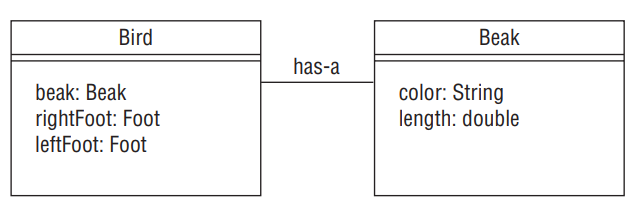

### Creating JavaBeans

Encapsulation is so prevalent in Java that there is a standard for creating classes that store data, called JavaBeans. A JavaBean is a design principle for encapsulating data in an object in Java. Table below lists the rules for naming JavaBeans.

| Rule Description                                                  | Example Code                                          |
|-------------------------------------------------------------------|------------------------------------------------------|
| Properties are private.                                           | `private int age;`                                   |
| Getter for non-boolean properties begins with `get`.             | `public int getAge() { return age; }`               |
| Getters for boolean properties may begin with `is` or `get`.     | `public boolean isBird() { return bird; }`          |
|                                                                   | `public boolean getBird() { return bird; }`         |
| Setter methods begin with `set`.                                  | `public void setAge(int age) { this.age = age; }`   |
| Method name must have a prefix of `set/get/is`, followed by the first letter of the property in uppercase, and then the rest of the property name. | `public void setNumChildren(int numChildren) { this.numChildren = numChildren; }` |

Although boolean values use is to start their getter method, the same does not apply to instances of the wrapper Boolean class, which use get.

### Applying the Is‐a Relationship

In Chapter 1, you were introduced to the instanceof operator and shown how it could be used to determine when an object is an instance of a particular class, superclass, or interface. In object‐oriented design, we describe the property of an object being an instance of a data type as having an is‐a relationship. The is‐a relationship is also known as the inheritance test.

The fundamental result of the is‐a principle is that if A is‐a B, then any instance of A can be treated like an instance of B. This holds true for a child that is a subclass of any parent, be it a direct subclass or a distant child. As we discussed with polymorphism, objects can take many different forms.

When constructing an inheritance‐based data model, it is important to apply the is‐a relationship regularly, so that you are designing classes that conceptually make sense.

### Applying the Has‐a Relationship

In object‐oriented design, we often want to test whether an object contains a particular property or value. We refer to the has‐a relationship as the property of an object having a named data object or primitive as a member. The has‐a relationship is also known as the object composition test.

<div align="center">



</div>

Inheritance goes one step further by allowing us to say that any child of Bird must also have a Beak. More generally, if a parent has‐a object as a protected or public member, then any child of the parent must also have that object as a member. Note that this does not hold true for private members defined in parent classes, because private members are not inherited in Java.

__Uncovering Problems with the Data model using is‐a and has‐a__: Sometimes relationships appear to pass the is‐a test but fail when combined with the has‐a test via inheritance. For example, take a look at the following code:

```java
public class Tail {}
public class Primate {
    protected Tail tail;
}

public class Monkey extends Primate { // Monkey has-a Tail since it is-a Primate
}
public class Chimpanzee extends Primate { // Chimpanzee has-a Tail since it is-a Primate
}
```

In this example, a Monkey is‐a Primate and a Chimpanzee is‐a Primate. The model also states that a Primate has‐a Tail, and through inheritance a Monkey has‐a Tail and a Chimpanzee has‐a Tail. Unfortunately, chimpanzees do not have tails in the real world, so the underlying data model is incorrect.

We saw that the model appeared to be correct when examined individually, but by using inheritance, we uncovered a flaw in the data model. The result is that we should remove the Tail property from the Primate class, since not all primates have tails.

### Composing Objects

In object‐oriented design, we refer to object composition as the property of constructing a class using references to other classes in order to reuse the functionality of the other classes. In particular, the class contains the other classes in the has‐a sense and may delegate methods to the other classes. Object composition should be thought of as an alternate to inheritance and is often used to simulate polymorphic behavior that cannot be achieved via single inheritance. 

One of the advantages of object composition over inheritance is that it tends to promote greater code reuse. By using object composition, you gain access to other classes and methods that would be difficult to obtain via Java’s single‐inheritance model.

In our previous example, the Flippers class can be reused in classes completely unrelated to a Penguin or a Bird, such as in a Dolphin or Turtle class. Alternatively, if the Flippers class had been inherited from the Penguin class, then using it in other unrelated classes would be difficult without breaking the class model or having the other class contain an instance of a Penguin. For example, it would be silly to say a Dolphin is inherited from a Penguin or has an instance of a Penguin class, just because a Dolphin has Flippers, and Flippers inherits from the Penguin class.

Object composition may seem more attractive than inheritance because of its reusable nature, but bear in mind that one of the strengths of Java is its powerful inheritance model. Object composition still requires you to explicitly expose the underlying methods and values manually, whereas inheritance includes protected and public members automatically. Also, using method overloading to determine dynamically which method to select at runtime is an extremely powerful tool for building intelligent classes. In other words, both object composition and inheritance have their proper place in developing good code, and in many cases it may be difficult to decide which path to choose.

## Working with Design Patterns

A design pattern is an established general solution to a commonly occurring software development problem. The purpose of a design pattern is to leverage the wealth of knowledge of developers who have come before you in order to solve old problems that you may encounter easily. It also gives developers a common vocabulary in which they can discuss common problems and solutions. For example, if you say that you wrote getters/ setters or implemented the singleton pattern, most developers will understand the structure of your code without having to get into the low‐level details.

In this chapter, we are primarily focused on creational patterns, a type of software design pattern that manages the creation of objects within an application. Obviously, you already know how to create objects in Java with the new keyword, as shown in the following code:

```java
Animal animal = new Camel();
```

The problem with object creation, though, lies in how you create and manage objects in more complex systems. In this example, we were required to know exactly which type of Animal object, in this case Camel, we wanted to create at compile time. But what if this is not known until runtime? Furthermore, what if we wanted to create a single Animal object in memory that is shared by all classes within our application? We will investigate these kinds of design creation problems and their associated patterns in this section.

One thing to keep in mind as you read this section is that under the covers, the new keyword is still used to create objects in memory. The creational patterns simply apply a level of indirection to object creation by creating the object in some other class, rather than creating the object directly in your application. Level of indirection is a general term for solving a software design problem by conceptually separating the task into multiple levels.

For the OCP 8 exam, you are required to know only the first two of the four design patterns that we present in this section: the singleton pattern and the immutable object pattern. Because of this, we will test you only on the first two patterns in any review questions in this book. That said, we suggest that you become familiar with all four of these patterns as they are used throughout the Java API, as well as in later chapters of this book.

### Applying the Singleton Pattern

__Problem__ How do we create an object in memory only once in an application and have it shared by multiple classes?

__Motivation__ There are times when we want only one instance of a particular type of object in memory. For example, we might want to manage the amount of hay available for food to the zoo animals across all classes that use it. We could pass the same shared HayManager object to every class and method that uses it, although this would create a lot of extra pointers and could be difficult to manage if the object is used throughout the application. By creating a singleton HayManager object, we centralize the data and remove the need to pass it around the application.

__Solution__ The singleton pattern is a creational pattern focused on creating only one instance of an object in memory within an application, sharable by all classes and threads within the application. The globally available object created by the singleton pattern is referred to as a singleton. Singletons may also improve performance by loading reusable
data that would otherwise be time consuming to store and reload each time it is needed.

```java
public class HayStorage {

    private int quantity = 0;
    private HayStorage() {}

    private static final HayStorage instance = new HayStorage();

    public static HayStorage getInstance() {
        return instance;
    }
    public synchronized void addHay(int amount) {
        quantity += amount;
    }
    public synchronized boolean removeHay (int amount) {
        if(quantity < amount) return false;
        quantity -= amount;
        return true;
    }
    public synchronized int getHayQuantity() {
        return quantity;
    }
}
```

As shown in the preceding code, singletons in Java are created as private static variables within the class, often with the name instance. They are accessed via a single public static method, often named getInstance(), which returns the reference to the singleton object. Finally, all constructors in a singleton class are marked private, which ensures that no other class is capable of instantiating another version of the class.

By marking the constructors private, we have implicitly marked the class final. Recall that every class requires at least one constructor, with the default no‐argument constructor being added if none are provided. Furthermore, the first line of any constructor is a call to a parent constructor with the super() command. If all of the constructors are declared private in the singleton class, then it is impossible to create a subclass with a valid constructor; therefore, the singleton class is effectively final.

You might have noticed that we added the modifier synchronized to addHay(), removeHay(), and getHayQuantity(). We will discuss these concepts in more detail in Chapter 7 , “Concurrency.” For now, however, you just need to know that they prevent two processes from running the same method at the exact same time.

Returning to our HayStorage example, a process that wants to use this singleton first calls getInstance() and then calls the appropriate public method:

```java
public class LlamaTrainer {
    public boolean feedLlamas(int numberOfLlamas) {
        int amountNeeded = 5 * numberOfLlamas;
        HayStorage hayStorage = HayStorage.getInstance();
        if(hayStorage.getHayQuantity() < amountNeeded) {
            hayStorage.addHay(amountNeeded + 10);
        }
        boolean fed = hayStorage.removeHay(amountNeeded);
        if(fed) System.out.println("Llamas have been fed");
        return fed;
    }
}
```

One thing to keep in mind is that there might be multiple llama trainers at the zoo but only one food storage location. Within our data model, this would amount to many LlamaTrainer instances but only a single instance of HayStorage. We also checked the return type of removeHay(), as it is possible that someone else could have taken the food that we just restocked before we had a chance to use it.

In our first HayStorage example, we instantiated the singleton object directly in the definition of the instance reference. We can also instantiate a singleton in two other ways. The following example creates a singleton using a static initialization block when the class is loaded. For simplicity, we skip defining the data methods on these classes and present only the creation and instance retrieval logic:

```java
// Instantiation using a static block
public class StaffRegister {
    private static final StaffRegister instance;
    static {
        instance = new StaffRegister();
        // Perform additional steps
    }
    private StaffRegister() {
    }
    public static StaffRegister getInstance() {
        return instance;
    }
    // Data access methods
}
```

Both the StaffRegister class and our previous HayStorage class instantiate the singleton at the time the class is loaded. Unlike the HayStorage class, though, the StaffRegister class instantiates the singleton as part of a static initialization block. Conceptually, these two implementations are equivalent, since both create the singleton when the class is loaded, although the static initialization block allows additional steps to be taken to set up the singleton after it has been created. It also allows us to handle cases in which the StaffRegister constructor throws an exception. Since the singleton is created when the class is loaded, we are able to mark the reference final, which guarantees only one instance will be created within our application.

Singletons are used in situations where we need access to a single set of data throughout an application. For example, application configuration data and reusable data caches are commonly implemented using singletons. Singletons may also be used to coordinate access to shared resources, such as coordinating write access to a file.