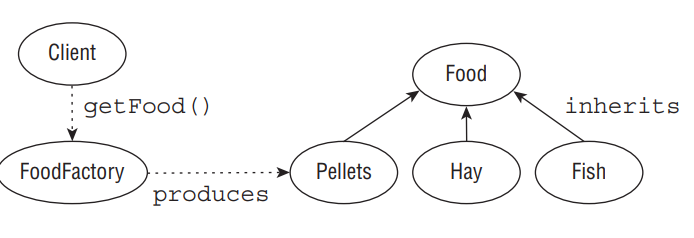

__Solution__ The builder pattern is a creational pattern in which parameters are passed to a builder object, often through method chaining, and an object is generated with a final build call. It is often used with immutable objects, since immutable objects do not have setter methods and must be created with all of their parameters set, although it can be used with mutable objects as well.

Notice that in the second Animal example, we never even save an instance to our builder object! Oftentimes, builder objects are used once and then discarded. Finally, we create our target object build method, usually named build(), allowing it to interact with the Animal’s constructor directly.

You might also notice that we never explicitly set the age in the second example. In this scenario, age may not be required, although we could certainly write our build() method to throw an exception if certain required fields are not set. Alternatively, the build() method may also set default values for anything the user failed to specify on the builder object.

The primary advantage of the builder pattern is that, over time, this approach leads to far more maintainable code. If a new optional field is added to the Animal class, then our code that creates objects using the AnimalBuilder class will not need to be changed. In practice, a builder object often supports dozens of parameters, only a handful of which may be set by users of the builder at a given time.

__Builder Pattern and Tightly Coupled Code__: As stated, the AnimalBuilder class looks a lot like our target Animal class. Furthermore, it requires direct knowledge of how to use the Animal constructor, mentioned earlier, which could grow to 50 or 60 parameters over time. In this manner, the builder class and target class are considered tightly coupled. Tight coupling is the practice of developing coupled classes that are highly dependent, such that a minor change in one class may greatly impact the other class. Alternatively, loose coupling is the practice of developing coupled classes with minimum dependencies on one another.

Although loose coupling is preferred in practice, tight coupling is required here so that callers of the AnimalBuilder class never have to use the Animal class constructor directly, 60 parameters and all.

In practice, a builder class is often packaged alongside its target class, either as a static inner class within the target class or within the same Java package. One advantage of packing them together is that if one is changed, then the other can be quickly updated. Another advantage is that writers of the target class can then choose to make the constructor a private or default package, forcing the user to rely on the builder object to obtain instances of the target class. For example, if the Animal class did not have a public constructor, programs calling it from other packages would be required to use the AnimalBuilder class to create instances of Animal.

### Creating Objects with the Factory Pattern

__Problem__ How do we write code that creates objects in which the precise type of the object may not be known until runtime?

__Motivation__ As you saw with the builder pattern, object creation can be quite complex. We’d like some way of encapsulating object creation to deal with the complexity of object creation, including selecting which subclass to use, as well as loosely coupling the underlying creation implementation.

__Solution__ The factory pattern, sometimes referred to as the factory method pattern, is a creational pattern based on the idea of using a factory class to produce instances of objects based on a set of input parameters. It is similar to the builder pattern, although it is focused on supporting class polymorphism.

Factory patterns are often, although not always, implemented using static methods that return objects and do not require a pointer to an instance of the factory class. It is also a good coding practice to postfix the class name with the word Factory, such as in AnimalFactory, ZooFactory, and so forth.

Now, let’s define a FoodFactory using the factory pattern that returns a food type based on some set of inputs, as shown in the following code and in Figure below. For simplicity, we will use a java.lang.String representing the animal name as input, although you could certainly expand the data model using a class type or set of input parameters.

<div align="center">



</div>

```java
public class FoodFactory {
    public static Food getFood(String animalName) {
        switch(animalName) {
            case "zebra": return new Hay(100);
            case "rabbit": return new Pellets(5);
            case "goat": return new Pellets(30);
            case "polar bear": return new Fish(10);
        }

        // Good practice to throw an exception if no matching subclass could be found
        throw new UnsupportedOperationException("Unsupported animal: "+animalName);
    }
}
public class ZooKeeper {
    public static void main(String[] args) {
        final Food food = FoodFactory.getFood("polar bear");
        food.consumed();
    }
}
```

Depending on the value of animalName, we return different types of food for use in our factory. The factory pattern gives us a number of features. First of all, different animals can share the same food, such as goat and rabbit both eating pellets but with varying quantities. Next, notice in our ZooKeeper method that we don’t care about the particular type of food that we get, as long as it implements the Food interface. This loose coupling of ZooKeeper and Food allows us to change the rules in the FoodFactory at a later date without requiring any code changes to our ZooKeeper class. Of course, the developer could cast the object to a particular subclass of Food after it is returned from the FoodFactory, although that practice is generally discouraged when using a factory pattern as it creates a tightly coupled solution.

__Factory Pattern and Default Class Constructors__: You may notice that in this example all of the Food class and subclass constructors are marked public. We obviously could not mark the constructors private, as this would prevent the FoodFactory class from creating any instances of Food classes. We could also not mark them protected, since the FoodFactory class is not a subclass of any of the Food classes, nor should it be.

The only problem with marking them public is that any class could bypass our factory pattern and create instances of the Food classes directly. If we wanted to tighten our access control, we could have declared these constructors with default or package‐level access in which there is no modifier.

The advantage of using default access is that it forces any class outside the package into using the FoodFactory class to create an instance of a Food object, thereby preventing it from instantiating a Food object directly. The only limitation is that our FoodFactory and all of our Food classes must be set in the same Java package. If a Food class exists in a different package than FoodFactory, and we want to use FoodFactory to create an instance of it, then it must provide a public method.

As an alternative to using a factory pattern, a developer could implement a set of Animal classes and define a getFood() method in each class that returns a Food object. The limitation in this solution is that it tightly couples what an animal is and what food an animal eats. For example, if a particular food were no longer available, all of the many classes that use that particular food would need to be changed. By using a factory pattern, we create loosely coupled code that is more resistant to changes in animal feeding behaviors.

__Design Patterns: Elements of Reusable Object‐Oriented Software__: If you have enjoyed this chapter on software design patterns, we recommend that you read the book Design Patterns (Addison‐Wesley Professional, 1994), whose authors Erich Gamma, Richard Helm, Ralph Johnson, and John Vlissides are often referred to humorously as the “Gang of Four.”

Design Patterns is considered one of the most influential software engineering books ever written, and it established the foundation of many of the design patterns that we use today. Although we have reviewed everything you need to know to answer questions about design patterns on the OCP exam, the value of the knowledge offered in Design Patterns on building better and more powerful software applications cannot be overstated.

## Summary

One of the primary goals of this chapter was to teach you how to write better code. We demonstrated techniques for designing class structures that scale naturally over time, integrate well with other applications, and are easy for other developers to read and understand.

We started off with a brief review of interfaces from your OCA studies showing how to declare, implement, and extend them. We then moved on to functional programming and reviewed the various syntax options available for defining functional interfaces and writing lambda expressions. Given the prevalence of lambda expressions throughout Java 8, you absolutely need to practice writing and using lambda expressions before taking the exam. We concluded the discussion with a review of the generics‐based Predicate interface and showed how it can be used in place of your own functional interface. We will return to lambdas and streams in Chapter 3 and Chapter 4 in much greater detail.

This chapter introduced the concept of polymorphism, which is central to the Java language, and showed how objects can be accessed in a variety of forms. Make sure that you understand when casts are needed for accessing objects, and be able to spot the difference between compile‐time and runtime cast problems.

In the design principles section, we taught you how to encapsulate your classes in Java properly, allowing you to enforce class invariants in your data model. We then described the is‐a and has‐a principles and showed how you can apply them to your data model. Finally, we introduced the technique of creating class structures using object composition that rely on the has‐a principle as an alternative to inheritance.

We completed this chapter by explaining what a design pattern is and presenting you with four well‐known design patterns. Design patterns provide you with a way to solve a problem that you encounter using solutions that other developers have already built and generalized. The singleton pattern is excellent for managing a single shared instance of an object within an application. The immutable object pattern is useful for creating read‐only objects that cannot be modified by other classes. The builder pattern solves the problem of how to create complex objects cleanly, and it is often used in conjunction with the immutable object pattern. Finally, the factory pattern is useful for creating various objects without exposing the underlying constructors and complex rules for selecting a particular object subtype.

## Exam Essentials

__Be able to write code that declares, implements, and/or extends interfaces.__ An interface is like an abstract class that defines a set of public abstract methods, which classes implementing the interface must provide. A class may implement multiple interfaces as well as extend classes that implement interfaces, allowing for limited multiple inheritance in Java. Interfaces may extend other interfaces, although they may not extend a class and vice versa. Interfaces may also contain public static final constant values, public static methods, and public default methods.

__Know how to create and recognize a functional interface.__ A functional interface is one that has exactly one abstract method. It is the primary manner in which lambda expressions are passed between methods. Java includes a Predicate interface for testing a generic type and returning a boolean expression.

__Be able to write valid lambda expressions.__ A lambda expression is like an anonymous method that can be passed to a method, relying on deferred execution to process the expression at a later time. It has various syntax options, both long and short. Lambda expressions are used throughout Java 8 and in numerous questions on the exam.

__Understand polymorphism.__ An object in Java may take on a variety of forms, in part depending on the reference used to access the object. The type of the object determines which properties exist within the object in memory, whereas the type of the reference to the object determines which methods and variables are accessible to the Java program. An instance can be automatically cast to a superclass or interface reference without an explicit cast. Alternatively, an explicit cast is required if the reference is being narrowed to a subclass of the object. The Java compiler doesn’t permit casting to unrelated types. Finally, you should be able to distinguish between compile‐time casting errors and those that will not occur until runtime, throwing a ClassCastException.

__Understand the importance of design principles and design patterns.__ A design principle is an established idea or best practice that facilitates the software design process. A design pattern is an established general solution to a commonly occurring software development problem.

__Know how to implement encapsulation.__ Encapsulation is based on the idea of combining fields and methods in a class such that the methods operate on the data, as opposed to users of the class accessing the fields directly. It can be used to prevent users from creating object states that violate class invariants. In Java, it is often implemented with JavaBeans, using the private access modifier on instance variables and public getter and setter methods.

__Be able to apply the is‐a and has‐a tests.__ The is‐a test is used to test whether an object is of a particular type, and it is used for both classes and interfaces. The has‐a test is used to determine whether an object contains a reference to another object as an instance property.

__Be able to apply object composition and distinguish it from inheritance.__ Object composition is the idea of creating a class by connecting other classes as members using the has‐a principle. Inheritance is the idea of creating a class that inherits all of its reusable methods and objects from a parent class. Both are used to create complex data models, each with its own advantages and disadvantages.

__Be able to apply creational patterns including the singleton pattern and the immutable object pattern.__ The singleton and immutable object patterns are both types of creational patterns, which are design patterns that facilitate the creation of objects with an application. The singleton pattern solves the problem of how to create a single instance of an object in memory that multiple classes can share by centralizing the object‐creation mechanisms. The immutable object pattern is used to create read‐only objects that cannot be modified by other classes. Although immutable objects cannot be modified, they can be copied to new immutable objects with the updated information.