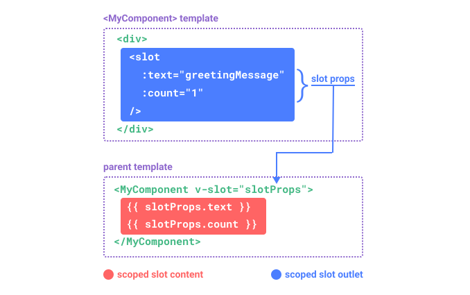

# Slot Content and Outlet
​
- We have learned that components can accept props, which can be JavaScript values of any type. But how about template content? In some cases, we may want to pass a template fragment to a child component, and let the child component render the fragment within its own template.

- For example, we may have a `<FancyButton>` component that supports usage like this:
```
<FancyButton>
  Click me! <!-- slot content -->
</FancyButton>
```

- The template of `<FancyButton>` looks like this:
```
<button class="fancy-btn">
  <slot></slot> <!-- slot outlet -->
</button>
```

- The `<slot>` element is a slot outlet that indicates where the parent-provided slot content should be rendered.

<div align="center">


</div>

- And the final rendered DOM:
```
<button class="fancy-btn">Click me!</button>
```

- With slots, the `<FancyButton>` is responsible for rendering the outer `<button>` (and its fancy styling), while the inner content is provided by the parent component.

- Another way to understand slots is by comparing them to JavaScript functions:
```js
// parent component passing slot content
FancyButton('Click me!')

// FancyButton renders slot content in its own template
function FancyButton(slotContent) {
  return `<button class="fancy-btn">
      ${slotContent}
    </button>`
}
```

- Slot content is not just limited to text. It can be any valid template content. For example, we can pass in multiple elements, or even other components:
<FancyButton>
  <span style="color:red">Click me!</span>
  <AwesomeIcon name="plus" />
</FancyButton>

# Render Scope
​
- Slot content has access to the data scope of the parent component, because it is defined in the parent. For example:
```template
<span>{{ message }}</span>
<FancyButton>{{ message }}</FancyButton>
```

- Slot content does not have access to the child component's data. Expressions in Vue templates can only access the scope it is defined in, consistent with JavaScript's lexical scoping. In other words:
```
Expressions in the parent template only have access to the parent scope; expressions in the child template only have access to the child scope.
```

# Fallback Content
​
- There are cases when it's useful to specify fallback (i.e. default) content for a slot, to be rendered only when no content is provided. For example, in a `<SubmitButton>` component:
```
<button type="submit">
  <slot></slot>
</button>
```

- We might want the text "Submit" to be rendered inside the `<button>` if the parent didn't provide any slot content. To make "Submit" the fallback content, we can place it in between the `<slot>` tags:
```template
<button type="submit">
  <slot>
    Submit <!-- fallback content -->
  </slot>
</button>
```

- Now when we use `<SubmitButton>` in a parent component, providing no content for the slot:

- This will render the fallback content, "Submit":
```
<button type="submit">Submit</button>
```

- But if we provide content:
```
<SubmitButton>Save</SubmitButton>
```

- Then the provided content will be rendered instead:
```
<button type="submit">Save</button>
```

# Named Slots
​
- There are times when it's useful to have multiple slot outlets in a single component. For example, in a `<BaseLayout>` component with the following template:
```
<div class="container">
  <header>
    <!-- We want header content here -->
  </header>
  <main>
    <!-- We want main content here -->
  </main>
  <footer>
    <!-- We want footer content here -->
  </footer>
</div>
```

- For these cases, the `<slot>` element has a special attribute, name, which can be used to assign a unique ID to different slots so you can determine where content should be rendered:
```
<div class="container">
  <header>
    <slot name="header"></slot>
  </header>
  <main>
    <slot></slot>
  </main>
  <footer>
    <slot name="footer"></slot>
  </footer>
</div>
```

- A `<slot>` outlet without name implicitly has the name "default".

- In a parent component using `<BaseLayout>`, we need a way to pass multiple slot content fragments, each targeting a different slot outlet. This is where named slots come in.

- To pass a named slot, we need to use a `<template>` element with the v-slot directive, and then pass the name of the slot as an argument to v-slot:
```
<BaseLayout>
  <template v-slot:header>
    <!-- content for the header slot -->
  </template>
</BaseLayout>
```

- v-slot has a dedicated shorthand #, so `<template v-slot:header>` can be shortened to just `<template #header>`. Think of it as "render this template fragment in the child component's 'header' slot".

<div align="center">


</div>

- Here's the code passing content for all three slots to `<BaseLayout>` using the shorthand syntax:
```
<BaseLayout>
  <template #header>
    <h1>Here might be a page title</h1>
  </template>

  <template #default>
    <p>A paragraph for the main content.</p>
    <p>And another one.</p>
  </template>

  <template #footer>
    <p>Here's some contact info</p>
  </template>
</BaseLayout>
```

- When a component accepts both a default slot and named slots, all top-level non-`<template>` nodes are implicitly treated as content for the default slot. So the above can also be written as:
```
<BaseLayout>
  <template #header>
    <h1>Here might be a page title</h1>
  </template>

  <!-- implicit default slot -->
  <p>A paragraph for the main content.</p>
  <p>And another one.</p>

  <template #footer>
    <p>Here's some contact info</p>
  </template>
</BaseLayout>
```

- Again, it may help you understand named slots better using the JavaScript function analogy:
```
// passing multiple slot fragments with different names
BaseLayout({
  header: `...`,
  default: `...`,
  footer: `...`
})

// <BaseLayout> renders them in different places
function BaseLayout(slots) {
  return `<div class="container">
      <header>${slots.header}</header>
      <main>${slots.default}</main>
      <footer>${slots.footer}</footer>
    </div>`
}
```

# Conditional Slots
​
- Sometimes you want to render something based on whether or not content has been passed to a slot.

- You can use the $slots property in combination with a v-if to achieve this.

- In the example below we define a Card component with three conditional slots: header, footer and the default one. When content for the header / footer / default is present, we want to wrap it to provide additional styling:
```
<template>
  <div class="card">
    <div v-if="$slots.header" class="card-header">
      <slot name="header" />
    </div>
    
    <div v-if="$slots.default" class="card-content">
      <slot />
    </div>
    
    <div v-if="$slots.footer" class="card-footer">
      <slot name="footer" />
    </div>
  </div>
</template>
```

# Dynamic Slot Names
​
- Dynamic directive arguments also work on v-slot, allowing the definition of dynamic slot names:

```
<base-layout>
  <template v-slot:[dynamicSlotName]>
    ...
  </template>

  <!-- with shorthand -->
  <template #[dynamicSlotName]>
    ...
  </template>
</base-layout>
```

# Scoped Slots
​
- As discussed in Render Scope, slot content does not have access to state in the child component.

- However, there are cases where it could be useful if a slot's content can make use of data from both the parent scope and the child scope. To achieve that, we need a way for the child to pass data to a slot when rendering it.

- In fact, we can do exactly that - we can pass attributes to a slot outlet just like passing props to a component:
```
<!-- <MyComponent> template -->
<div>
  <slot :text="greetingMessage" :count="1"></slot>
</div>
```

- Receiving the slot props is a bit different when using a single default slot vs. using named slots. We are going to show how to receive props using a single default slot first, by using v-slot directly on the child component tag:
```
<MyComponent v-slot="slotProps">
  {{ slotProps.text }} {{ slotProps.count }}
</MyComponent>
```

<div align="center">



</div>

- The props passed to the slot by the child are available as the value of the corresponding v-slot directive, which can be accessed by expressions inside the slot.

- You can think of a scoped slot as a function being passed into the child component. The child component then calls it, passing props as arguments:
```js
MyComponent({
  // passing the default slot, but as a function
  default: (slotProps) => {
    return `${slotProps.text} ${slotProps.count}`
  }
})

function MyComponent(slots) {
  const greetingMessage = 'hello'
  return `<div>${
    // call the slot function with props!
    slots.default({ text: greetingMessage, count: 1 })
  }</div>`
}
```

- In fact, this is very close to how scoped slots are compiled, and how you would use scoped slots in manual render functions.

- Notice how v-slot="slotProps" matches the slot function signature. Just like with function arguments, we can use destructuring in v-slot:
```
<MyComponent v-slot="{ text, count }">
  {{ text }} {{ count }}
</MyComponent>
```

- __Named Scoped Slots__: Named scoped slots work similarly - slot props are accessible as the value of the v-slot directive: v-slot:name="slotProps". When using the shorthand, it looks like this:
```
<MyComponent>
  <template #header="headerProps">
    {{ headerProps }}
  </template>

  <template #default="defaultProps">
    {{ defaultProps }}
  </template>

  <template #footer="footerProps">
    {{ footerProps }}
  </template>
</MyComponent>
```

- Passing props to a named slot:
```
<slot name="header" message="hello"></slot>
```

- Note the name of a slot won't be included in the props because it is reserved - so the resulting headerProps would be { message: 'hello' }.

- If you are mixing named slots with the default scoped slot, you need to use an explicit `<template>` tag for the default slot. Attempting to place the v-slot directive directly on the component will result in a compilation error. This is to avoid any ambiguity about the scope of the props of the default slot. For example:
```
<!-- <MyComponent> template -->
<div>
  <slot :message="hello"></slot>
  <slot name="footer" />
</div>
```
```
<!-- This template won't compile -->
<MyComponent v-slot="{ message }">
  <p>{{ message }}</p>
  <template #footer>
    <!-- message belongs to the default slot, and is not available here -->
    <p>{{ message }}</p>
  </template>
</MyComponent>
```

- Using an explicit `<template>` tag for the default slot helps to make it clear that the message prop is not available inside the other slot:
```
<MyComponent>
  <!-- Use explicit default slot -->
  <template #default="{ message }">
    <p>{{ message }}</p>
  </template>

  <template #footer>
    <p>Here's some contact info</p>
  </template>
</MyComponent>
```

- __Fancy List Example__: You may be wondering what would be a good use case for scoped slots. Here's an example: imagine a `<FancyList>` component that renders a list of items - it may encapsulate the logic for loading remote data, using the data to display a list, or even advanced features like pagination or infinite scrolling. However, we want it to be flexible with how each item looks and leave the styling of each item to the parent component consuming it. So the desired usage may look like this:
```
<FancyList :api-url="url" :per-page="10">
  <template #item="{ body, username, likes }">
    <div class="item">
      <p>{{ body }}</p>
      <p>by {{ username }} | {{ likes }} likes</p>
    </div>
  </template>
</FancyList>
```

- Inside `<FancyList>`, we can render the same `<slot>` multiple times with different item data (notice we are using v-bind to pass an object as slot props):
```
<ul>
  <li v-for="item in items">
    <slot name="item" v-bind="item"></slot>
  </li>
</ul>
```

- __Renderless Components__: The `<FancyList>` use case we discussed above encapsulates both reusable logic (data fetching, pagination etc.) and visual output, while delegating part of the visual output to the consumer component via scoped slots.

- If we push this concept a bit further, we can come up with components that only encapsulate logic and do not render anything by themselves - visual output is fully delegated to the consumer component with scoped slots. We call this type of component a Renderless Component.

- An example renderless component could be one that encapsulates the logic of tracking the current mouse position:
```
<MouseTracker v-slot="{ x, y }">
  Mouse is at: {{ x }}, {{ y }}
</MouseTracker>
```

- While an interesting pattern, most of what can be achieved with Renderless Components can be achieved in a more efficient fashion with Composition API, without incurring the overhead of extra component nesting. Later, we will see how we can implement the same mouse tracking functionality as a Composable.

- That said, scoped slots are still useful in cases where we need to both encapsulate logic and compose visual output, like in the `<FancyList>` example.