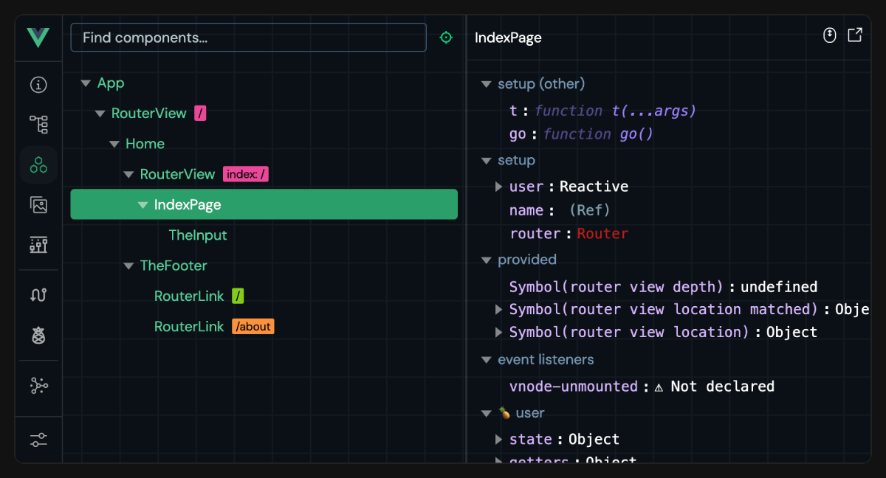

# Tooling

## Project Scaffolding

### Vite

Vite is a lightweight and fast build tool with first-class Vue SFC support. It is created by Evan You, who is also the author of Vue!

```sh
npm create vue@latest
```

This command will install and execute create-vue, the official Vue project scaffolding tool.
   - To learn more about Vite, check out the Vite docs.
   - To configure Vue-specific behavior in a Vite project, for example passing options to the Vue compiler, check out the docs for @vitejs/plugin-vue.

### Vue CLI

Vue CLI is the official webpack-based toolchain for Vue. It is now in maintenance mode and we recommend starting new projects with Vite unless you rely on specific webpack-only features. Vite will provide superior developer experience in most cases.

### Note on In-Browser Template Compilation

When using Vue without a build step, component templates are written either directly in the page's HTML or as inlined JavaScript strings. In such cases, Vue needs to ship the template compiler to the browser in order to perform on-the-fly template compilation. On the other hand, the compiler would be unnecessary if we pre-compile the templates with a build step. To reduce client bundle size, Vue provides different "builds" optimized for different use cases.
   - Build files that start with vue.runtime.* are runtime-only builds: they do not include the compiler. When using these builds, all templates must be pre-compiled via a build step.
   - Build files that do not include .runtime are full builds: they include the compiler and support compiling templates directly in the browser. However, they will increase the payload by ~14kb.

Our default tooling setups use the runtime-only build since all templates in SFCs are pre-compiled. If, for some reason, you need in-browser template compilation even with a build step, you can do so by configuring the build tool to alias vue to vue/dist/vue.esm-bundler.js instead.

## Browser Devtools

The Vue browser devtools extension allows you to explore a Vue app's component tree, inspect the state of individual components, track state management events, and profile performance.

<div align="center">



</div>

## Testing

Cypress is recommended for E2E tests. It can also be used for component testing for Vue SFCs via the Cypress Component Test Runner.

Vitest is a test runner created by Vue / Vite team members that focuses on speed. It is specifically designed for Vite-based applications to provide the same instant feedback loop for unit / component testing.

Jest can be made to work with Vite via vite-jest. However, this is only recommended if you have existing Jest-based test suites that you need to migrate over to a Vite-based setup, as Vitest provides similar functionalities with a much more efficient integration.